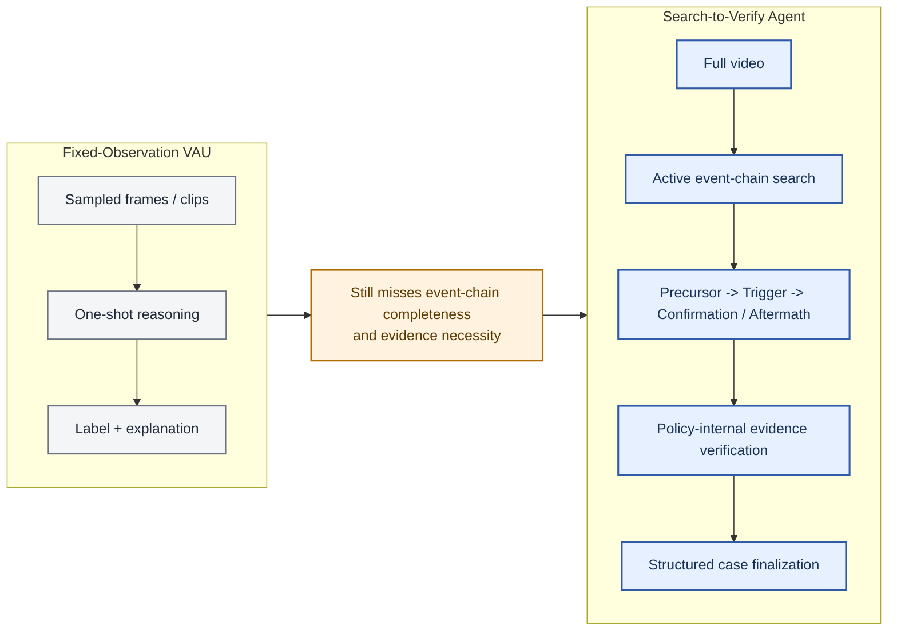
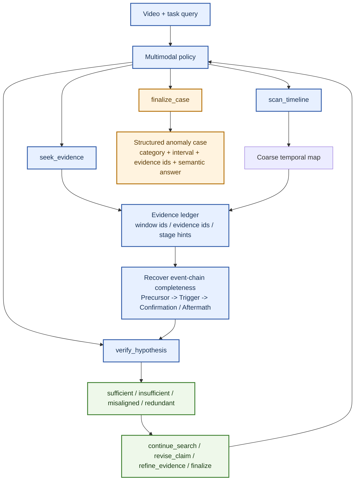

# From Search to Verify: Agentic Event-Chain Search and Counterfactual Evidence Verification for Video Anomaly Understanding

## Teaser Figure

*Figure 1. Teaser: instead of predicting from a fixed observation bundle, S2V-Agent treats VAU as a budgeted interaction loop that searches for missing stages of an anomaly chain and verifies whether the currently selected evidence is sufficient to close the case.*

## Abstract

Video anomaly understanding (VAU) has moved beyond binary anomaly scoring toward temporally grounded semantic reasoning. Yet most existing systems still operate on **fixed observations** such as sampled frames, preselected clips, or pre-segmented events, and then decode a final judgment from that observation bundle. This mismatch matters because many anomalies are defined not by a single salient frame, but by the completeness of an event chain that links **precursor** cues to a **trigger** and then to **confirmation or aftermath**. We therefore formulate VAU as an explicit **search-to-verify** decision process. We present **Search-to-Verify Agent (S2V-Agent)**, a tool-using policy that interleaves `scan_timeline`, `seek_evidence`, `verify_hypothesis`, and `finalize_case` to actively recover missing evidence, test whether the current evidence subset is sufficient and necessary, and expose whether the case is ready for finalization. Our contribution is thus not merely richer explanation, but a shift from fixed-observation reasoning to **event-chain-oriented active inference**. In the current main pipeline, teacher-judge-rewritten supervision initializes this behavior for SFT, and FECV-grounded reinforcement learning further shapes it with rewards centered on answer correctness, evidence faithfulness, and protocol-consistent finalization. We correspondingly evaluate not only final anomaly prediction, but also temporal grounding, event-chain recovery, verification quality, and verify-to-finalize behavior. This formulation sharpens VAU into a concrete and testable agentic problem: not just recognizing anomalies, but searching for and verifying the evidence chain that supports them.

## 1. Introduction

Video anomaly understanding is no longer just a detection problem. In realistic surveillance, industrial monitoring, and long-horizon event auditing settings, users do not merely need an anomaly score; they need a temporally grounded account of what happened, why it is anomalous, and which evidence supports that conclusion [1, 2, 3, 4, 5]. This is why recent work has pushed VAU from frame-level scoring toward richer semantic reasoning.

However, most current VAU systems still retain a passive observation protocol. Even when they improve causation understanding, open-world interpretation, verbalized explanation, prompted anomaly explanation, or reflection-aware reasoning, the dominant template remains the same: first prepare a fixed bundle of frames, clips, or segments, and then ask the model to decode a final anomaly judgment or explanation from that bundle [1, 2, 3, 4, 5, 6, 7, 8, 14]. This makes current systems semantically richer than classical VAD, but it does not yet make them agentic. The policy is usually not responsible for deciding what to inspect next, whether the current evidence is sufficient, or whether some selected evidence is redundant or misaligned.

We argue that this limitation becomes structural once anomaly understanding is viewed through the lens of **event-chain completeness**. Many anomalies are not best characterized by one peak frame or even one short event clip. They are better understood as short temporal processes whose meaning depends on whether the system can recover a coherent chain from **precursor** cues to a **trigger**, and then to **confirmation or aftermath**. This is precisely where much of the current “multi-granularity” framing still falls short: more temporal scales do not by themselves guarantee that the model actively searches for the missing stages of an anomaly case.

This paper takes the next step and formulates VAU as an explicit **search-to-verify** decision process. We introduce **Search-to-Verify Agent (S2V-Agent)**, a constrained tool-using policy that alternates among four executable actions, `scan_timeline`, `seek_evidence`, `verify_hypothesis`, and `finalize_case`. Search is part of the policy rather than an offline preprocessing assumption. Verification is a policy action rather than an external afterthought. Finalization is a structured case report rather than a loose free-form answer. To the best of our knowledge, among mainstream VAU literature available up to **April 12, 2026**, prior work has not unified structured tool use, active event-chain search, policy-internal counterfactual verification, and structured case finalization into one trainable pipeline.

The resulting shift is conceptual as well as algorithmic. Conceptually, we move the target of reasoning from isolated event snippets to the completeness and validity of a recovered anomaly chain. Algorithmically, we instantiate this view in the current main pipeline through teacher-judge-rewritten step supervision for SFT and `rollout -> FECV -> reward -> GRPO` reinforcement learning, where the default `timesearch_v2` reward is centered on final-answer accuracy, evidence faithfulness, and protocol-consistent finalization. In other words, the policy is optimized not only to answer correctly, but to answer **for evidence-faithful reasons**.

Our paper makes three claims. First, VAU should be reframed as **agentic event-chain search** rather than fixed-observation reasoning. Second, **policy-internal counterfactual evidence verification** is the right mechanism for deciding when a case is actually ready to finalize. Third, **FECV-grounded learning** turns evidence faithfulness into a first-class optimization target rather than a post-hoc diagnostic. These claims define a sharper paper story for a NeurIPS-style main paper: the field should move from analyzing event frames to recovering complete event chains, and from passively explaining observations to actively searching and verifying them.

## 2. Related Work

### 2.1 Mainstream VAU Still Largely Uses Fixed Observations

Recent top-tier work has clearly pushed anomaly analysis beyond frame-level scores. CUVA emphasizes causation-oriented anomaly understanding and explicitly asks what happened, why it happened, and how it unfolds [1]. AnomalyRuler highlights rule-based reasoning for VAD with LLMs [2]. HAWK studies open-world anomaly understanding with large multimodal models [3]. Holmes-VAU broadens the task to long videos and multiple temporal granularities [4]. VERA shows that verbalized learning can improve explainable anomaly detection without model finetuning [5], and AssistPDA further strengthens prompted anomaly explanation with large language models [18]. These works substantially enrich the semantic scope of anomaly analysis, but they still predominantly reason over **fixed observations**. The model typically receives a prepared bundle of clips, frames, or hierarchical segments and then predicts an answer from that bundle.

This matters because richer supervision does not by itself make a system agentic. A multi-granular or explanation-oriented model may still be passive if it never decides what to inspect next, never maintains an explicit evidence ledger, and never verifies whether the currently selected evidence is actually necessary. Our paper therefore does not argue against these works; instead, it argues that they reveal the next missing step. Once VAU is asked to recover complete anomaly chains, the policy should become an active search-and-verification process rather than a stronger one-shot decoder.

### 2.2 Reasoning and Reflection Are Progress, But Not Yet Search-to-Verify

A second line of work strengthens reasoning, reflection, or anomaly-oriented QA on top of VAU. VAU-R1 studies reinforcement fine-tuning for anomaly understanding [6]. SRVAU-R1 introduces reflection-aware learning [7]. PrismVAU explores prompt-refined inference for multimodal VAU [8]. More recent work pushes further toward explicit anomaly reasoning or causal interpretation, including Vad-R1 [15], VADER [16], and the adaptive multi-stage VAR setting of Vad-R1-Plus [17]. These papers are important because they acknowledge that anomaly understanding requires more than a single label. However, the dominant pattern is still to reason *about* a prepared observation, not to actively *acquire* missing evidence under a structured tool protocol. Stronger reasoning is progress, but without explicit search, evidence bookkeeping, and verification-to-finalize control, it still stops short of the search-to-verify view advanced here.

### 2.3 Adjacent Agentic Anomaly Papers Indicate the Frontier, But Not the Mainstream VAU Center

The neighboring frontier is beginning to move toward agentic anomaly analysis. PANDA frames generalist VAD around agentic AI engineering [9], and QVAD studies a question-centric agentic framework for training-free VAD [10]. These are important adjacent signals, and they are precisely why our novelty claim is carefully scoped. We do **not** claim that no neighboring anomaly paper explores any agentic idea. Instead, we claim that mainstream VAU literature has not yet converged on an explicit formulation that combines structured tool use, active event-chain search, policy-internal counterfactual verification, and structured case finalization. That scoped claim remains defensible against the current literature landscape.

### 2.4 Our Position Relative to Prior Work

The cleanest way to understand our contribution is to compare the *unit of reasoning* in prior work against ours.

| Paradigm | Representative works | Primary unit of reasoning | Active search policy | Policy-internal verification | Explicit event-chain completeness | Structured finalize protocol |
| --- | --- | --- | --- | --- | --- | --- |
| Fixed-observation VAU | CUVA, AnomalyRuler, HAWK, Holmes-VAU, VERA | sampled frames, clips, or pre-built segments | No | No | Partial at best | Usually no |
| Reasoning / reflection VAU | VAU-R1, SRVAU-R1, PrismVAU | prepared observation plus stronger reasoning | No | Limited / implicit | Not central | Usually no |
| Adjacent agentic VAD | PANDA, QVAD | anomaly search or question-driven inspection | Partial | Limited | Not the main objective | Limited |
| **Search-to-Verify Agent** | **ours** | **recovered event chain over precursor -> trigger -> confirmation/aftermath** | **Yes** | **Yes** | **Yes** | **Yes** |

Our argument is therefore not that previous VAU papers are unimportant. It is that the field has so far remained mostly within a fixed-observation regime, even when it became semantically richer. S2V-Agent pushes the field to the next operational regime: **agentic VAU**.

## 3. Problem Formulation

We consider a video anomaly understanding episode consisting of a video `V`, a task query `q`, and a structured target anomaly case `y`. The target case is not only a category label. It includes anomaly existence, category, a temporally grounded interval, evidence moments, and a semantic explanation. In our implementation, these fields are materialized inside runtime episodes that support both supervised replay and online rollout.

At step `t`, the policy maintains a state `s_t` containing the dialogue history, the current evidence ledger `E_t`, and previously emitted tool outputs. The action space is restricted to four executable actions:

1. `scan_timeline`, which performs broad coverage and localization over the video timeline.
2. `seek_evidence`, which retrieves more targeted candidate evidence for the current hypothesis.
3. `verify_hypothesis`, which tests whether the selected evidence subset is sufficient, insufficient, misaligned, or redundant.
4. `finalize_case`, which emits the structured anomaly decision.

A crucial semantic rule of the implementation is that `scan_timeline` is **not** itself evidence. It is a broad search operation. The evidence ledger is populated by `seek_evidence`, because only retrieved evidence items are allowed to support verification and finalization. This distinction matters both for training and for evaluation: otherwise a model could blur the difference between coarse scanning and actual evidential commitment.

The core task objective is to recover a coherent anomaly event chain. Let the recovered chain be represented as three ordered stage sets,

`C = {C_pre, C_trg, C_conf}`,

where `C_pre` denotes precursor evidence, `C_trg` denotes trigger evidence, and `C_conf` denotes confirmation or aftermath evidence. Event-chain completeness means that the final decision is not only category-correct, but also supported by a chain whose stage coverage is appropriate for the target anomaly. In practice, some videos may not require the same stage density, but the policy should at least be able to search for the missing stages rather than implicitly assuming they are already present in a fixed observation bundle.

The policy is successful only if it satisfies two conditions simultaneously. First, it must be **decision-correct**, meaning that the final case matches the target anomaly in existence, category, timing, and semantics. Second, it must be **evidence-faithful**, meaning that the selected evidence subset is actually necessary and sufficient under counterfactual verification. This is the reason verification is part of the action space rather than an afterthought. A system that predicts the right label from the wrong or redundant evidence has not fully solved anomaly understanding.

## 4. Search-to-Verify Agent

S2V-Agent is a constrained tool-using policy for video anomaly understanding. At each turn, the policy reasons over the dialogue state, the current evidence ledger, and previously observed temporal context, and then chooses one of four executable actions: `scan_timeline`, `seek_evidence`, `verify_hypothesis`, or `finalize_case`. This action design is the method’s central abstraction. It forces the policy to separate broad temporal coverage from evidential commitment, to expose when it believes the case is or is not ready, and to expose whether the case appears ready before producing a structured anomaly report.

### 4.1 Agentic Event-Chain Search

The first design choice is to make search internal to the policy. `scan_timeline` performs broad temporal coverage and coarse localization, while `seek_evidence` gathers more targeted evidence for the current hypothesis. This distinction is deliberate: `scan_timeline` is not treated as evidence, because broad scanning should not be conflated with evidential commitment. When feature cache and proposal runtime are mounted, `seek_evidence` becomes query-guided and can actively retrieve the missing stages of the anomaly chain rather than relying on a fixed observation bundle.

This changes how the observation budget is used. In fixed-observation VAU, the budget is spent before reasoning begins. In S2V-Agent, the budget is spent during reasoning. If the current context reveals a trigger but not a precursor, the policy can search backward; if aftermath evidence is still missing, it can search forward. Event-chain completeness therefore acts as a rollout-time objective rather than just an annotation schema.

### 4.2 Policy-Internal Counterfactual Evidence Verification

The second design choice is to make verification an explicit policy action. `verify_hypothesis` takes a claim together with selected windows, evidence ids, and structured evidence moments, and returns a structured verdict such as `sufficient`, `insufficient`, `misaligned`, or `redundant`, along with the recommended next step. This compact verification interface turns the policy into a system that can say not only “what I think happened,” but also “whether my current evidence is ready for finalization.”

This is where the method departs most sharply from prior fixed-observation reasoning. A policy that only accumulates support will tend to over-collect and over-explain. By contrast, policy-internal verification asks whether the selected evidence is actually necessary, whether a smaller subset is already enough, and whether off-target evidence should invalidate the current claim. In our framing, these checks are not optional diagnostics. They are part of what it means to understand an anomaly case faithfully.

### 4.3 FECV-Grounded Learning

The training objective follows the same logic. In the current main pipeline, SFT does not directly imitate raw oracle skeletons; instead, teacher judge rewrites them into `teacher_rollout_primary` step supervision, which teaches a cleaner and more protocol-consistent search-verify-finalize interaction pattern. Reinforcement learning then follows the repository main path `rollout -> FECV -> reward -> GRPO`.

Under the default `timesearch_v2` configuration, the primary reward components are `accuracy_reward`, `fecv_evidence_faithfulness_reward`, and `protocol_finalize_reward`. Optional local routing signals such as `search_local`, `evidence_local`, `query_local`, `stage_local`, and `teacher_local` remain auxiliary rather than central. The main optimization target is simple: a trajectory should be rewarded not only for being correct, but for being correct **for evidence-faithful reasons**.

```mermaid
flowchart LR
    accTitle: FECV-grounded learning flow
    accDescr: The training path combines teacher-judge-rewritten SFT and FECV-grounded reinforcement learning.

    runtime["Runtime episodes"] --> oracle["Oracle skeleton"]
    oracle --> teacher["Teacher judge rewrite\nteacher_rollout_primary"]
    teacher --> sft["Step-level SFT"]
    sft --> rollout["Policy rollout"]
    rollout --> fecv["FECV profile\nfaithfulness + verification diagnostics"]
    fecv --> reward["Reward aggregation\naccuracy + FECV + finalize protocol"]
    reward --> grpo["GRPO update"]

    reward --> local["Optional local routing\nsearch / evidence / query / stage / teacher"]
    local --> grpo

    classDef data fill:#e8f1fb,stroke:#35608f,stroke-width:1.5px,color:#1d3557
    classDef train fill:#eef8e6,stroke:#4f772d,stroke-width:1.5px,color:#31572c
    classDef rewardbox fill:#fff4d6,stroke:#b7791f,stroke-width:1.5px,color:#7c2d12

    class runtime,oracle,teacher data
    class sft,rollout,grpo train
    class fecv,reward,local rewardbox
```

## 5. Experimental Protocol

### 5.1 Scientific Questions

Our experiments should answer more than whether the final anomaly label is correct. They should establish four claims. First, active search should outperform fixed-observation reasoning for anomaly understanding. Second, modeling **event-chain completeness** should outperform event-centric reasoning that focuses primarily on the trigger segment. Third, policy-internal verification should improve evidence-faithful finalization. Fourth, FECV-grounded learning should improve grounded behavior rather than only end-task accuracy. This framing is important because the scientific contribution of the paper is fundamentally behavioral and procedural: it concerns how the policy searches, verifies, and finalizes, not only the label it emits at the end.

### 5.2 Data and Training Pipeline

Our implementation instantiates S2V-Agent on an MSAD-derived structured VAU benchmark. The runtime train split contains 480 video-level episodes and the runtime test split contains 240 video-level episodes. Each runtime row contains video metadata, structured anomaly targets, temporal intervals, evidence moments, question-answer annotations, and agent task context. The full pipeline first converts source annotations into runtime episodes, then bootstraps oracle skeletons, then rewrites them with the teacher judge into `teacher_rollout_primary` step supervision, and finally performs SFT on that teacher-rewritten target. RL is subsequently run on runtime episodes with FECV-driven rollout scoring and trainer-native GRPO updates.

This pipeline matters for the paper story. The supervised stage is not learning to imitate raw oracle skeletons; it is learning a teacher-corrected interaction protocol. The RL stage then shapes the policy using counterfactual evidence-faithfulness diagnostics rather than pure final-answer reward. From data construction to rollout optimization, the implementation is aligned with the search-to-verify thesis.

### 5.3 Baselines

We recommend grouping baselines by paradigm rather than by chronology. The first group should contain **fixed-observation VAU baselines**, including CUVA, Holmes-VAU, and VERA-style systems [1, 4, 5]. The second group should contain **reasoning-enhanced or reflection-enhanced baselines**, including AnomalyRuler, VAU-R1, SRVAU-R1, and PrismVAU [2, 6, 7, 8]. The third group should contain **adjacent agentic anomaly baselines**, such as PANDA and QVAD [9, 10], not because they are identical tasks, but because they represent the nearest neighboring frontier. The final group should contain **internal ablations** of S2V-Agent that isolate active search, policy-internal verification, event-chain completeness, and FECV-grounded reward shaping.

### 5.4 Metrics

The evaluation protocol should explicitly reflect our task redefinition. Structured anomaly prediction quality includes existence accuracy and category macro-F1. Temporal grounding quality includes temporal mIoU and precursor mIoU. Evidence quality includes evidence precision, recall, and F1 at top-k. Event-chain quality includes stage coverage and event-chain F1. Verification quality includes FECV decision sufficiency, minimal-subset sufficiency, negative specificity, and stage-specific drop effects. Process quality includes protocol compliance, verify coverage, verify-finalize followthrough, average inspected clip ratio, and mean number of turns. Together, these metrics evaluate whether the policy recovered and validated a coherent anomaly chain, rather than merely predicting an anomaly category.

### 5.5 Main Tables

Table 1 is the main benchmark comparison. It should be filled after the current large-scale runs stabilize.

| Method | Existence Acc. | Category Macro-F1 | Temporal mIoU | Evidence F1@3 | Event-Chain F1 | Protocol Compliance | Verify-Finalize Followthrough |
| --- | --- | --- | --- | --- | --- | --- | --- |
| CUVA-style baseline | [TBD] | [TBD] | [TBD] | [TBD] | [TBD] | [TBD] | [TBD] |
| AnomalyRuler-style baseline | [TBD] | [TBD] | [TBD] | [TBD] | [TBD] | [TBD] | [TBD] |
| Holmes-VAU-style baseline | [TBD] | [TBD] | [TBD] | [TBD] | [TBD] | [TBD] | [TBD] |
| VERA-style baseline | [TBD] | [TBD] | [TBD] | [TBD] | [TBD] | [TBD] | [TBD] |
| VAU-R1 / SRVAU-R1 / PrismVAU-style baseline | [TBD] | [TBD] | [TBD] | [TBD] | [TBD] | [TBD] | [TBD] |
| Adjacent agentic anomaly baseline | [TBD] | [TBD] | [TBD] | [TBD] | [TBD] | [TBD] | [TBD] |
| **S2V-Agent (ours)** | **[TBD]** | **[TBD]** | **[TBD]** | **[TBD]** | **[TBD]** | **[TBD]** | **[TBD]** |

Table 2 is the key event-chain completeness ablation. It directly tests the claim that reasoning over the full anomaly chain is more appropriate than focusing only on the trigger or peak segment.

| Event Modeling Variant | Category Macro-F1 | Temporal mIoU | Evidence F1@3 | Event-Chain F1 | Verify Coverage |
| --- | --- | --- | --- | --- | --- |
| Trigger-only event-centric reasoning | [TBD] | [TBD] | [TBD] | [TBD] | [TBD] |
| Precursor + Trigger | [TBD] | [TBD] | [TBD] | [TBD] | [TBD] |
| **Precursor + Trigger + Confirmation / Aftermath** | **[TBD]** | **[TBD]** | **[TBD]** | **[TBD]** | **[TBD]** |

Table 3 is the core method ablation table.

| Variant | Category Macro-F1 | Evidence F1@3 | Event-Chain F1 | FECV Sufficiency | Protocol Compliance |
| --- | --- | --- | --- | --- | --- |
| Full S2V-Agent | [TBD] | [TBD] | [TBD] | [TBD] | [TBD] |
| w/o active search | [TBD] | [TBD] | [TBD] | [TBD] | [TBD] |
| w/o event-chain completeness target | [TBD] | [TBD] | [TBD] | [TBD] | [TBD] |
| w/o policy-internal verification | [TBD] | [TBD] | [TBD] | [TBD] | [TBD] |
| w/o FECV reward | [TBD] | [TBD] | [TBD] | [TBD] | [TBD] |
| w/o optional local routing | [TBD] | [TBD] | [TBD] | [TBD] | [TBD] |

### 5.6 Qualitative Studies

The paper should include at least three qualitative studies. The first should show a successful case in which the policy explicitly searches backward for precursor evidence before finalization. The second should show a failure of trigger-only reasoning that is corrected once confirmation or aftermath evidence is retrieved. The third should visualize a counterfactual verification case in which dropping a selected evidence item changes the verification outcome and therefore changes the recommended action. These cases are essential because the most convincing evidence for agentic VAU is not only numerical improvement, but visibly different policy behavior.

## 6. Discussion

The conceptual shift of Search-to-Verify is that it changes both the **unit of reasoning** and the **unit of optimization**. Prior systems mostly reason over fixed event observations. Our framework reasons over the completeness of an evolving event chain. Prior systems are often optimized for end-task accuracy or explanation fluency. Our framework explicitly rewards evidence faithfulness under counterfactual verification. These differences are not cosmetic. They change what the model must do in order to succeed.

This also clarifies our relationship to long-term and multi-granularity VAU. Holmes-VAU and related work expand the temporal granularity of understanding [4]. We see our contribution as orthogonal but deeper in operational semantics. Finer granularity still does not force the model to become an agent that searches for missing stages, verifies whether its evidence is sufficient, and finalizes only after verification. Our argument is therefore not merely that anomaly understanding needs more temporal levels. It is that anomaly understanding needs a different **interaction protocol**.

Another important distinction is between scientific novelty and engineering infrastructure. The repository includes frame caches, feature caches, lazy datasets, distributed rollout, and large-model serving logic. These are important for making the system practical, but they are not the scientific center of the paper. The scientific center is the search-to-verify formulation itself: agentic event-chain search, policy-internal counterfactual evidence verification, and FECV-grounded evidence-faithfulness learning.

## 7. Limitations and Broader Impact

Our claims should be interpreted with clear boundaries. First, the strongest novelty claim is intentionally restricted to **mainstream VAU literature** as of April 12, 2026. We do not claim that no neighboring anomaly-analysis paper explores agentic reasoning; indeed, adjacent VAD work such as PANDA and QVAD indicates that the frontier is moving in a similar direction [9, 10]. Second, the current benchmark instantiation is still dataset-derived and therefore inherits category coverage limits, annotation noise, and dataset bias. Third, although S2V-Agent is designed for richer agentic behavior, practical runs remain constrained by image budget, turn budget, and context length. Fourth, FECV diagnostics are only as good as the available structured evidence and counterfactual branch definitions.

From a broader-impact perspective, stronger anomaly understanding can support more transparent safety auditing and more inspectable automated monitoring. At the same time, it can also intensify surveillance applications. For this reason, we argue that anomaly systems should expose insufficiency states and evidence-faithfulness diagnostics rather than forcing a confident answer for every video. A principled `continue_search` or `not_ready_to_finalize` state is safer than a fluent but unsupported anomaly explanation.

## 8. Conclusion

We present Search-to-Verify Agent, a framework that shifts video anomaly understanding from fixed-observation decoding to an **agentic search-to-verify process**. The central change is conceptual as much as technical: the target of reasoning is no longer an isolated anomalous snippet, but the recovery and validation of an **event chain** spanning `precursor -> trigger -> confirmation/aftermath`. By unifying structured tool use, active evidence search, policy-internal counterfactual verification, and evidence-faithful learning, S2V-Agent offers a concrete path toward anomaly understanding systems that are not only accurate, but also temporally grounded and evidentially accountable. We hope this perspective helps move VAU from passive explanation toward active, verifiable anomaly analysis.

## References

[1] *Uncovering What, Why and How: A Comprehensive Benchmark for Causation Understanding of Video Anomaly*. CVPR 2024. https://openaccess.thecvf.com/content/CVPR2024/html/Du_Uncovering_What_Why_and_How_A_Comprehensive_Benchmark_for_Causation_CVPR_2024_paper.html

[2] *Follow the Rules: Reasoning for Video Anomaly Detection with Large Language Models*. ECCV 2024. https://www.ecva.net/papers/eccv_2024/papers_ECCV/html/10568_ECCV_2024_paper.php

[3] *HAWK: Learning to Understand Open-World Video Anomalies*. NeurIPS 2024. https://openreview.net/forum?id=vBKoEZ1PG3

[4] *Holmes-VAU: Towards Long-term Video Anomaly Understanding at Any Granularity*. CVPR 2025. https://openaccess.thecvf.com/content/CVPR2025/html/Zhang_Holmes-VAU_Towards_Long-term_Video_Anomaly_Understanding_at_Any_Granularity_CVPR_2025_paper.html

[5] *VERA: Explainable Video Anomaly Detection via Verbalized Learning of Vision-Language Models*. CVPR 2025. https://openaccess.thecvf.com/content/CVPR2025/html/Ye_VERA_Explainable_Video_Anomaly_Detection_via_Verbalized_Learning_of_Vision-Language_Models_CVPR_2025_paper.html

[6] *VAU-R1: Advancing Video Anomaly Understanding via Reinforcement Fine-Tuning*. arXiv 2025. https://arxiv.org/abs/2505.23504

[7] *SRVAU-R1: Enhancing Video Anomaly Understanding via Reflection-Aware Learning*. arXiv 2026. https://arxiv.org/abs/2602.01004

[8] *PrismVAU: Prompt-Refined Inference System for Multimodal Video Anomaly Understanding*. arXiv 2026. https://arxiv.org/abs/2601.02927

[9] *PANDA: Towards Generalist Video Anomaly Detection via Agentic AI Engineer*. arXiv 2025. https://arxiv.org/abs/2509.26386

[10] *QVAD: A Question-Centric Agentic Framework for Efficient and Training-Free Video Anomaly Detection*. arXiv 2026. https://arxiv.org/abs/2604.03040

[11] *ReAct: Synergizing Reasoning and Acting in Language Models*. arXiv 2022. https://arxiv.org/abs/2210.03629

[12] *Proximal Policy Optimization Algorithms*. arXiv 2017. https://arxiv.org/abs/1707.06347

[13] *DeepSeekMath: Pushing the Limits of Mathematical Reasoning in Open Language Models*. arXiv 2024. https://arxiv.org/abs/2402.03300

[14] *Towards Zero-Shot Anomaly Detection and Reasoning with Multimodal Large Language Models*. CVPR 2025. https://openaccess.thecvf.com/content/CVPR2025/html/Xu_Towards_Zero-Shot_Anomaly_Detection_and_Reasoning_with_Multimodal_Large_Language_CVPR_2025_paper.html

[15] *Vad-R1: Towards Video Anomaly Reasoning via Perception-to-Cognition Chain-of-Thought*. NeurIPS 2025. https://arxiv.org/abs/2505.19877

[16] *VADER: Towards Causal Video Anomaly Understanding with Relation-Aware Large Language Models*. WACV 2026. https://arxiv.org/abs/2511.07299

[17] *Advancing Adaptive Multi-Stage Video Anomaly Reasoning: A Benchmark Dataset and Method*. arXiv 2026. https://arxiv.org/abs/2601.10165

[18] *AssistPDA: Prompting Large Language Models to Think and Feel the Video for Anomaly Detection and Explanation*. arXiv 2025. https://arxiv.org/abs/2503.21907
