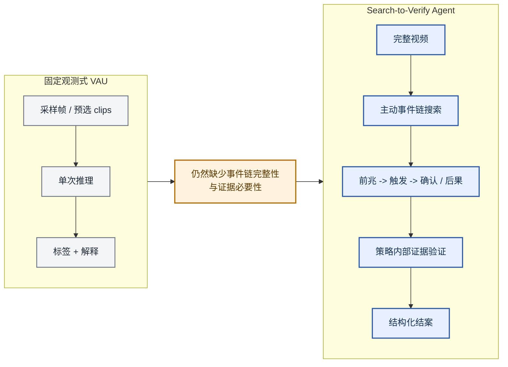
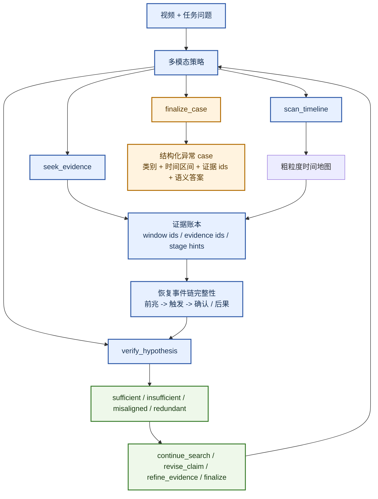

# 从搜索到验证：面向视频异常理解的 Agentic 事件链搜索与反事实证据验证

## 预告图

*图 1. 预告图：S2V-Agent 不再从固定观测包中直接解码结果，而是把 VAU 建模为一个预算受限的交互闭环，主动搜索异常链中缺失的阶段，并验证当前证据是否足以结案。*

## 摘要

视频异常理解（VAU）已经明显超越了二分类异常检测，开始走向时间上可落地的语义推理。然而，现有系统大多仍然建立在**固定观测**之上，例如采样帧、预选 clips 或预分段事件，然后再从这个观测包中一次性解码最终异常判断。这种设定与真正可靠的异常理解之间仍然存在结构性错位，因为大量异常并不是由单个显著帧定义的，而是由一条完整事件链定义的：风险**前兆**如何发展为**触发**，以及触发之后是否出现了**确认或后果**。基于这一观察，本文将 VAU 明确表述为一个 **search-to-verify** 决策过程。我们提出 **Search-to-Verify Agent (S2V-Agent)**，它通过 `scan_timeline`、`seek_evidence`、`verify_hypothesis` 和 `finalize_case` 四个可执行动作，主动恢复缺失证据，测试当前证据子集是否充分且必要，并显式暴露当前 case 是否已经适合进入 finalization。本文的贡献因此并不只是“解释更长”，而是把异常理解从固定观测推理转向围绕**事件链完整性**的主动推理。在当前主路径中，teacher-judge 改写的监督首先通过 SFT 初始化这种行为，而以 FECV 为基础的强化学习则进一步通过答案正确性、证据忠实性与协议化结案奖励来塑形策略。因此，我们的评测也不再只看最终异常预测，而是同时衡量时间定位、事件链恢复、验证质量以及 verify-to-finalize 行为。这个表述把 VAU 收紧成了一个更具体、也更可检验的 agentic 问题：系统不仅要识别异常，更要主动搜索并验证支撑该结论的证据链。

## 1. 引言

视频异常理解已经不再只是一个检测问题。在真实监控、工业巡检与长时事件审计场景中，用户需要的并不只是一个异常分数，而是一份时间上可落地的说明：到底发生了什么、为什么异常、何时变得可行动，以及哪些证据支撑这一结论 [1, 2, 3, 4, 5]。这正是近期 VAU 工作不断从帧级打分走向语义推理的根本原因。

然而，大多数现有 VAU 系统仍然保留了被动式观测协议。即便它们已经提升了因果理解、开放世界异常解释、verbalized explanation、prompted anomaly explanation 或 reflection-aware reasoning，主流流程依然通常是：先准备一组固定的帧、clips 或片段，再让模型从这个观测包中解码最终异常判断或解释 [1, 2, 3, 4, 5, 6, 7, 8, 14]。这让当前系统在语义上明显强于传统 VAD，但还没有真正进入 agentic 范式。策略本身通常并不负责决定“下一步看哪里”“当前证据是否已经足够”，也不会显式判断某些已选证据究竟是冗余还是错位。

本文认为，一旦把异常理解放到**事件链完整性**的视角下，这种局限就会变成结构性问题。许多异常并不能被一个 peak frame，甚至一个短 event clip 充分刻画。它们更像是一个短时但有结构的过程，其语义是否成立，取决于系统能否恢复一条连贯的链：从**precursor** 到 **trigger**，再到 **confirmation 或 aftermath**。这也正是许多“多粒度”分析依然不够的地方：时间尺度变多，并不自动意味着模型会主动去搜索异常 case 中缺失的阶段。

基于这一观察，本文将 VAU 明确表述为一个 **search-to-verify** 决策过程。我们提出 **Search-to-Verify Agent (S2V-Agent)**，它在 `scan_timeline`、`seek_evidence`、`verify_hypothesis` 和 `finalize_case` 四个动作之间交替运行。搜索不再是离线预处理假设，而是策略本身的一部分；验证不再是外接诊断器，而是策略动作本身；结案也不再是松散自由文本，而是结构化的 case report。据我们所知，在截至 **2026 年 4 月 12 日** 的主流 VAU 文献中，现有工作尚未把结构化工具使用、主动事件链搜索、策略内部反事实验证以及结构化结案统一到一个可训练的完整 pipeline 中。

这一变化既是概念性的，也是算法性的。概念上，我们把推理目标从孤立的事件片段转向一条异常链的完整性与有效性。算法上，当前主路径通过 teacher-judge 改写的 step supervision 来完成 SFT 初始化，并通过 `rollout -> FECV -> reward -> GRPO` 强化学习来继续塑形，其中默认 `timesearch_v2` reward 的中心是最终答案准确率、证据忠实性以及协议化结案。换句话说，策略优化的目标不只是“答对”，而是“基于忠实证据答对”。

整篇论文围绕三条主张展开。第一，VAU 应从固定观测推理重构为 **agentic 事件链搜索** 问题。第二，**策略内部的反事实证据验证** 应成为决定何时可以结案的核心机制。第三，**以 FECV 为基础的学习** 应把证据忠实性提升为一等优化目标，而不是事后诊断指标。这样的论文主线更贴近 NeurIPS 主文风格：它强调的不是局部技巧堆叠，而是一种新的任务操作语义，即该领域应从“分析事件帧”走向“恢复完整事件链”，并从“被动解释观测”走向“主动搜索并验证证据”。

## 2. 相关工作

### 2.1 主流 VAU 仍然以固定观测为主

近两年的顶会工作已经明显推动异常分析超越了帧级分数。CUVA 强调面向因果的异常理解，要求模型同时回答 what、why 和 how [1]。AnomalyRuler 研究了 LLM 驱动的异常推理 [2]。HAWK 关注开放世界视频异常理解 [3]。Holmes-VAU 将任务扩展到长视频与多粒度时间层次 [4]。VERA 说明 verbalized learning 可以改善可解释异常检测 [5]，AssistPDA 则进一步用大语言模型强化了 prompted anomaly explanation [18]。这些工作显著丰富了异常分析的语义空间，但它们依然主要建立在 **固定观测** 之上：模型拿到的是预先准备好的 clips、frames 或层级片段，再在其上做最终判断。

这正是问题所在。监督更丰富，并不自动意味着系统已经变成 agent。一个多粒度或解释导向的模型，如果从不决定下一步看哪里、从不维护显式证据账本、也从不验证当前证据是否真正必要，那么它在本质上仍然是被动系统。本文并不是反对这些工作，而是认为它们实际上揭示了该领域的下一个缺口：当 VAU 需要恢复完整异常链时，策略本身就应该从“更强的一次性解码器”转变为“搜索并验证的 agent”。

### 2.2 推理与反思强化了 VAU，但还不是 Search-to-Verify

第二类工作试图在 VAU 之上叠加更强推理、反思或异常问答。VAU-R1 使用强化微调改进异常理解 [6]。SRVAU-R1 引入 reflection-aware learning [7]。PrismVAU 探索 prompt-refined inference 的多模态 VAU 方案 [8]。更新近的工作则进一步推进到显式异常推理或因果解释，例如 Vad-R1 [15]、VADER [16]，以及以 Vad-R1-Plus 为代表的自适应多阶段 VAR 设定 [17]。这些论文很重要，因为它们已经明确承认：异常理解不只是一个分类标签问题。然而，这条路线的主模式依然是“对已有观测做更强推理”，而不是“在结构化工具协议下主动获取缺失证据”。更强的 reasoning 确实是进步，但如果没有显式搜索、证据账本和 verify-to-finalize 控制，它仍然没有真正进入本文提出的 search-to-verify 范式。

### 2.3 相邻的 Agentic 异常工作正在出现，但尚未成为主流 VAU 中心

相邻方向已经开始出现 agentic 异常分析。PANDA 把通用视频异常检测表述为 agentic AI engineer 问题 [9]，QVAD 则研究了 question-centric 的 training-free agentic VAD 框架 [10]。这些工作很重要，也正因为如此，本文对创新性的表述保持了严格边界。我们 **并不声称** 相邻异常分析方向从未出现 agentic 思想。我们真正主张的是：截至目前，主流 VAU 论文仍然没有收敛到一个同时包含结构化工具使用、主动事件链搜索、策略内部反事实验证和结构化结案的统一范式。这个限定后的创新性主张，在现有文献格局下是成立的。

### 2.4 我们与既有工作的核心区别

理解本文贡献的最清晰方式，是比较不同方法的 **推理单元**。

| 范式 | 代表工作 | 主要推理单元 | 主动搜索策略 | 策略内部验证 | 显式事件链完整性 | 结构化结案协议 |
| --- | --- | --- | --- | --- | --- | --- |
| 固定观测式 VAU | CUVA, AnomalyRuler, HAWK, Holmes-VAU, VERA | 采样帧、clips 或预构建片段 | 否 | 否 | 部分具备 | 通常没有 |
| 推理 / 反思增强 VAU | VAU-R1, SRVAU-R1, PrismVAU | 给定观测之上的更强推理 | 否 | 有限或隐式 | 不是中心目标 | 通常没有 |
| 相邻 agentic VAD | PANDA, QVAD | 异常搜索或问题驱动检查 | 部分具备 | 有限 | 不是中心目标 | 有限 |
| **Search-to-Verify Agent** | **本文** | **恢复出的 precursor -> trigger -> confirmation/aftermath 事件链** | **是** | **是** | **是** | **是** |

因此，本文并不是要否定既有 VAU 工作，而是指出：该领域虽然已经变得语义更丰富，但大多数方法仍然停留在固定观测范式中。S2V-Agent 试图把它推进到下一个操作层级，也就是 **agentic VAU**。

## 3. 问题定义

我们把一个视频异常理解 episode 表述为视频 `V`、任务问题 `q` 与结构化目标异常 case `y` 的组合。这里的目标 case 不只是一个类别标签，还包含异常存在性、类别、时间区间、证据 moment 以及语义解释。在当前仓库中，这些字段都被物化到 runtime episodes 里，以便同时支持监督重放与在线 rollout。

在第 `t` 步，策略维护一个状态 `s_t`，其中包括对话历史、当前证据账本 `E_t` 以及之前工具调用返回的中间结果。动作空间被限制为四个可执行动作：

1. `scan_timeline`，负责全局时间轴扫描与粗定位。
2. `seek_evidence`，负责根据当前假设检索更有针对性的证据。
3. `verify_hypothesis`，负责判断当前证据子集是充分、不足、错位还是冗余。
4. `finalize_case`，负责输出最终结构化异常结论。

当前实现中有一个非常关键的语义约束：`scan_timeline` **不是 evidence**。它只承担宽覆盖搜索的角色。真正进入证据账本的是 `seek_evidence` 返回的候选项，因为只有这些被检索并承诺的证据，才允许进入验证与结案。这一规则同时影响训练与评测；否则模型就会把粗扫描与真实证据混为一谈。

任务的核心目标是恢复一条连贯的异常事件链。设恢复出的事件链由三个有序阶段集合表示为

`C = {C_pre, C_trg, C_conf}`，

其中 `C_pre` 表示 precursor 证据，`C_trg` 表示 trigger 证据，`C_conf` 表示 confirmation 或 aftermath 证据。所谓事件链完整性，并不意味着每个视频都必须拥有完全相同的阶段密度，而是指：策略至少应当能够主动搜索缺失阶段，而不是在固定观测包中被动假设这些阶段已经存在。

一个成功的策略必须同时满足两个条件。第一，它在最终结论上必须 **决策正确**，也就是在异常存在性、类别、时间和语义上与目标 case 保持一致。第二，它在证据上必须 **忠实**，也就是当前选中的证据子集在反事实验证下确实是必要且充分的。正因为如此，验证必须成为动作空间的一部分，而不是事后的附加检查。一个靠错误证据或冗余证据答对类别的系统，并没有真正完成异常理解。

## 4. Search-to-Verify Agent

S2V-Agent 是一个受约束的工具使用策略，用于视频异常理解。在每一个 turn，策略都会基于当前对话状态、证据账本以及已观察到的时间上下文，选择四个可执行动作之一：`scan_timeline`、`seek_evidence`、`verify_hypothesis` 或 `finalize_case`。这一动作设计就是方法的核心抽象。它迫使策略把宽覆盖搜索与证据承诺区分开来，显式暴露“当前 case 是否已经准备好”，并显式暴露当前 case 是否已经接近可结案状态。

### 4.1 Agentic 事件链搜索

第一个设计选择，是让“搜索”成为策略内部的一部分。`scan_timeline` 负责宽覆盖时间扫描与粗定位，而 `seek_evidence` 则根据当前假设收集更有针对性的证据。这一区分是刻意设计的：`scan_timeline` 不被视为 evidence，因为宽扫描不应与真正的证据承诺混为一谈。当 feature cache 与 proposal runtime 被挂载时，`seek_evidence` 就会变成 query-guided 的主动检索，从而能够主动补齐异常链中缺失的阶段，而不是依赖一个预先固定好的观测包。

这会直接改变观测预算的使用方式。在固定观测式 VAU 中，预算在推理开始前就已经被花掉；而在 S2V-Agent 中，预算是在推理过程中被动态花费的。如果当前上下文已经出现 trigger 却没有 precursor，策略可以向前回搜；如果 confirmation 仍然缺失，策略则可以继续向后搜索。因此，事件链完整性不再只是一个标注结构，而是 rollout 过程中真实驱动搜索行为的目标。

### 4.2 策略内部的反事实证据验证

第二个设计选择，是把验证做成显式策略动作。`verify_hypothesis` 会接收当前 claim、已选窗口、evidence ids 以及结构化 evidence moments，并返回 `sufficient`、`insufficient`、`misaligned` 或 `redundant` 这类结构化 verdict，同时给出下一步推荐动作。这个紧凑的验证接口让策略不仅能说出“我认为发生了什么”，还必须回答“我当前的证据是否已经足够结案”。

这也是方法与固定观测推理最本质的分叉点。一个只会累积支持片段的策略，往往会过度搜集、过度解释。相比之下，策略内部验证会显式追问：当前证据是否真的必要？更小的子集是否已经足够？某些负证据或错位证据是否应该推翻当前假设？在本文框架下，这些检查不是附加诊断项，而是“是否真正理解了一个异常 case”本身的一部分。

### 4.3 以 FECV 为基础的学习

训练目标遵循同样的逻辑。在当前主路径中，SFT 并不是直接模仿原始 oracle skeleton；相反，teacher judge 会先把它们改写为 `teacher_rollout_primary` step 级监督，从而教给模型一套更干净、也更协议化的 search-verify-finalize 交互模式。随后的强化学习则沿着仓库主路径 `rollout -> FECV -> reward -> GRPO` 进行。

在默认 `timesearch_v2` 配置下，主奖励组件是 `accuracy_reward`、`fecv_evidence_faithfulness_reward` 和 `protocol_finalize_reward`。`search_local`、`evidence_local`、`query_local`、`stage_local` 与 `teacher_local` 等局部路由信号仍然存在，但它们属于辅助路径，而不是方法的科学中心。真正的优化目标非常明确：一个 trajectory 获得高奖励，不仅因为它答对了，更因为它是**基于忠实证据答对的**。

```mermaid
flowchart LR
    accTitle: FECV 驱动的学习流程
    accDescr: 训练路径由 teacher-judge 改写的 SFT 和以 FECV 为基础的强化学习组成。

    runtime["Runtime episodes"] --> oracle["Oracle skeleton"]
    oracle --> teacher["Teacher judge rewrite\nteacher_rollout_primary"]
    teacher --> sft["Step-level SFT"]
    sft --> rollout["Policy rollout"]
    rollout --> fecv["FECV profile\n证据忠实性 + 验证诊断"]
    fecv --> reward["Reward aggregation\naccuracy + FECV + finalize protocol"]
    reward --> grpo["GRPO update"]

    reward --> local["可选局部路由\nsearch / evidence / query / stage / teacher"]
    local --> grpo

    classDef data fill:#e8f1fb,stroke:#35608f,stroke-width:1.5px,color:#1d3557
    classDef train fill:#eef8e6,stroke:#4f772d,stroke-width:1.5px,color:#31572c
    classDef rewardbox fill:#fff4d6,stroke:#b7791f,stroke-width:1.5px,color:#7c2d12

    class runtime,oracle,teacher data
    class sft,rollout,grpo train
    class fecv,reward,local rewardbox
```

## 5. 实验方案

### 5.1 科学问题

我们的实验不应只回答“最终异常类别对不对”。它至少要验证四个主张。第一，主动搜索应优于固定观测推理。第二，围绕 **事件链完整性** 的建模应优于主要盯住 trigger 或 peak segment 的 event-centric 推理。第三，策略内部验证应提升基于证据的忠实结案能力。第四，以 FECV 为基础的学习应提升 grounded behavior，而不仅仅是最终分类准确率。这个 framing 很重要，因为本文的科学贡献本质上是行为性的和程序性的：它关注的是策略如何搜索、如何验证、如何结案，而不只是最后输出了什么标签。

### 5.2 数据与训练流程

当前仓库在一个源自 MSAD 的结构化 VAU benchmark 上实例化了 S2V-Agent。runtime train split 包含 480 条视频级 episodes，runtime test split 包含 240 条视频级 episodes。每条 runtime row 包含视频元数据、结构化异常目标、时间区间、evidence moments、问答标注以及 agent task context。完整 pipeline 会先把源标注转成 runtime episodes，然后构建 oracle skeleton，再由 teacher judge 重写为 `teacher_rollout_primary` step 级监督，最后基于这一目标执行 SFT。随后，RL 会在 runtime episodes 上运行，并通过 FECV 驱动的 rollout scoring 与 trainer-native GRPO 更新策略。

这一流程对论文叙事非常重要。监督阶段并不是在模仿原始 oracle skeleton，而是在学习一套被 teacher 校正过的交互协议；强化学习阶段也不是只看最终答案对错，而是通过反事实证据忠实性诊断来塑形策略。因此，从数据构造到 rollout 优化，当前实现与 search-to-verify 主张是对齐的。

### 5.3 基线

建议按范式而不是按时间顺序组织基线。第一组是 **固定观测式 VAU 基线**，包括 CUVA、Holmes-VAU 和 VERA 风格系统 [1, 4, 5]。第二组是 **推理增强或反思增强基线**，包括 AnomalyRuler、VAU-R1、SRVAU-R1 和 PrismVAU [2, 6, 7, 8]。第三组是 **相邻 agentic 异常基线**，例如 PANDA 与 QVAD [9, 10]；它们并非完全同任务，但代表了最近的相邻前沿。最后一组是 **S2V-Agent 内部消融**，分别隔离主动搜索、策略内部验证、事件链完整性目标以及 FECV 驱动奖励的作用。

### 5.4 指标

评测协议应显式反映任务重定义。结构化异常预测质量包括异常存在性准确率和类别 macro-F1；时间定位质量包括 temporal mIoU 与 precursor mIoU；证据质量包括 top-k 证据 precision、recall 和 F1；事件链质量包括 stage coverage 与 event-chain F1；验证质量包括 FECV decision sufficiency、minimal-subset sufficiency、negative specificity 以及 stage-specific drop effects；过程质量包括 protocol compliance、verify coverage、verify-finalize followthrough、平均 inspected clip ratio 和平均 turn 数。这些指标共同评估的是：策略是否恢复并验证了一条连贯的异常链，而不仅仅是有没有把异常类别猜对。

### 5.5 主要结果表

表 1 是主 benchmark 对比表，待当前大规模实验稳定后补齐。

| 方法 | Existence Acc. | Category Macro-F1 | Temporal mIoU | Evidence F1@3 | Event-Chain F1 | Protocol Compliance | Verify-Finalize Followthrough |
| --- | --- | --- | --- | --- | --- | --- | --- |
| CUVA 风格基线 | [TBD] | [TBD] | [TBD] | [TBD] | [TBD] | [TBD] | [TBD] |
| AnomalyRuler 风格基线 | [TBD] | [TBD] | [TBD] | [TBD] | [TBD] | [TBD] | [TBD] |
| Holmes-VAU 风格基线 | [TBD] | [TBD] | [TBD] | [TBD] | [TBD] | [TBD] | [TBD] |
| VERA 风格基线 | [TBD] | [TBD] | [TBD] | [TBD] | [TBD] | [TBD] | [TBD] |
| VAU-R1 / SRVAU-R1 / PrismVAU 风格基线 | [TBD] | [TBD] | [TBD] | [TBD] | [TBD] | [TBD] | [TBD] |
| 相邻 agentic anomaly 基线 | [TBD] | [TBD] | [TBD] | [TBD] | [TBD] | [TBD] | [TBD] |
| **S2V-Agent（本文）** | **[TBD]** | **[TBD]** | **[TBD]** | **[TBD]** | **[TBD]** | **[TBD]** | **[TBD]** |

表 2 是最关键的事件链完整性消融，它直接检验“完整异常链建模是否优于只盯住 trigger 的 event-centric reasoning”这一主张。

| 事件建模变体 | Category Macro-F1 | Temporal mIoU | Evidence F1@3 | Event-Chain F1 | Verify Coverage |
| --- | --- | --- | --- | --- | --- |
| 只建模 trigger 的 event-centric 推理 | [TBD] | [TBD] | [TBD] | [TBD] | [TBD] |
| Precursor + Trigger | [TBD] | [TBD] | [TBD] | [TBD] | [TBD] |
| **Precursor + Trigger + Confirmation / Aftermath** | **[TBD]** | **[TBD]** | **[TBD]** | **[TBD]** | **[TBD]** |

表 3 是核心方法消融表。

| 变体 | Category Macro-F1 | Evidence F1@3 | Event-Chain F1 | FECV Sufficiency | Protocol Compliance |
| --- | --- | --- | --- | --- | --- |
| Full S2V-Agent | [TBD] | [TBD] | [TBD] | [TBD] | [TBD] |
| 去掉主动搜索 | [TBD] | [TBD] | [TBD] | [TBD] | [TBD] |
| 去掉事件链完整性目标 | [TBD] | [TBD] | [TBD] | [TBD] | [TBD] |
| 去掉策略内部验证 | [TBD] | [TBD] | [TBD] | [TBD] | [TBD] |
| 去掉 FECV 奖励 | [TBD] | [TBD] | [TBD] | [TBD] | [TBD] |
| 去掉可选局部路由 | [TBD] | [TBD] | [TBD] | [TBD] | [TBD] |

### 5.6 定性分析

论文至少应包含三类定性案例。第一类应展示策略在最终结案前显式回搜 precursor 证据的成功案例。第二类应展示只看 trigger 的推理为何会失败，以及在补充 confirmation 或 aftermath 证据后如何被纠正。第三类应可视化一个反事实验证案例，说明删除某条已选证据后，验证结论与推荐动作如何发生变化。因为对于 agentic VAU 而言，最有说服力的证据不仅是数值提升，更是策略行为本身发生了可见变化。

## 6. 讨论

Search-to-Verify 的概念跃迁在于，它同时改变了 **推理单元** 和 **优化单元**。以往系统主要围绕固定事件观测做推理；我们的框架围绕一条不断演化的事件链的完整性做推理。以往系统往往优化最终任务准确率或解释流畅度；我们的框架显式奖励反事实验证下的证据忠实性。这些差异不是表面措辞，而是真正改变模型为了成功必须做什么。

这也说明了我们与长时、多粒度 VAU 的关系。Holmes-VAU 及相关工作扩展了理解的时间粒度 [4]。我们认为本文与它们既相关又正交，但在操作语义上更进一步。更细的时间粒度本身，并不会迫使模型变成一个会搜索缺失阶段、会判断证据是否充分、会在验证后再结案的 agent。换句话说，本文并不是单纯要求“更多时间层级”，而是要求一种完全不同的 **交互协议**。

另一个需要明确的区分，是科学创新与工程基础设施之间的关系。当前仓库确实包含 frame cache、feature cache、lazy dataset、distributed rollout 与大模型服务逻辑。这些都很重要，因为它们让系统能实际跑起来；但它们并不是论文的科学中心。科学中心始终是 search-to-verify 范式本身，也就是 agentic 事件链搜索、策略内部反事实证据验证，以及以 FECV 为基础的证据忠实性学习。

## 7. 局限性与更广泛影响

本文的主张需要在明确边界内理解。第一，最强的创新性主张被有意限制在 **截至 2026 年 4 月 12 日的主流 VAU 文献** 内。我们并不声称相邻异常分析工作从未出现 agentic 推理；事实上，PANDA 与 QVAD 说明相邻 VAD 前沿正在向这个方向移动 [9, 10]。第二，当前 benchmark 仍然来源于已有数据集，因此不可避免地继承了类别覆盖、标注噪声与数据偏置问题。第三，尽管 S2V-Agent 的目标是更丰富的 agentic 行为，但真实运行仍然受到图像预算、turn budget 与上下文长度限制。第四，FECV 诊断能力本身也依赖可用的结构化证据以及反事实分支定义的质量。

从更广泛影响上看，更强的异常理解能力可以支持更透明的安全审计和更可检查的自动监控；但与此同时，它也可能进一步强化监控应用。因此，我们主张异常系统必须暴露不足状态与证据忠实性诊断，而不是对每个视频都强行给出自信结论。一个原则性的 `continue_search` 或 `not_ready_to_finalize` 状态，要比一个流畅但证据不足的异常解释更安全。

## 8. 结论

本文提出 Search-to-Verify Agent，将视频异常理解从固定观测后的被动解码，推进为一个 **agentic 的 search-to-verify 过程**。这种变化既是技术性的，也是概念性的：异常推理的目标不再是孤立的异常片段，而是围绕 `precursor -> trigger -> confirmation/aftermath` 恢复并验证一条完整的 **事件链**。通过把结构化工具使用、主动证据搜索、策略内部反事实验证以及证据忠实性学习统一到同一个框架中，S2V-Agent 为构建既准确、又时间上可定位、证据上可追责的异常理解系统提供了一条具体路径。我们希望这一视角能推动 VAU 从被动解释走向主动、可验证的异常分析。

## 参考文献

[1] *Uncovering What, Why and How: A Comprehensive Benchmark for Causation Understanding of Video Anomaly*. CVPR 2024. https://openaccess.thecvf.com/content/CVPR2024/html/Du_Uncovering_What_Why_and_How_A_Comprehensive_Benchmark_for_Causation_CVPR_2024_paper.html

[2] *Follow the Rules: Reasoning for Video Anomaly Detection with Large Language Models*. ECCV 2024. https://www.ecva.net/papers/eccv_2024/papers_ECCV/html/10568_ECCV_2024_paper.php

[3] *HAWK: Learning to Understand Open-World Video Anomalies*. NeurIPS 2024. https://openreview.net/forum?id=vBKoEZ1PG3

[4] *Holmes-VAU: Towards Long-term Video Anomaly Understanding at Any Granularity*. CVPR 2025. https://openaccess.thecvf.com/content/CVPR2025/html/Zhang_Holmes-VAU_Towards_Long-term_Video_Anomaly_Understanding_at_Any_Granularity_CVPR_2025_paper.html

[5] *VERA: Explainable Video Anomaly Detection via Verbalized Learning of Vision-Language Models*. CVPR 2025. https://openaccess.thecvf.com/content/CVPR2025/html/Ye_VERA_Explainable_Video_Anomaly_Detection_via_Verbalized_Learning_of_Vision-Language_Models_CVPR_2025_paper.html

[6] *VAU-R1: Advancing Video Anomaly Understanding via Reinforcement Fine-Tuning*. arXiv 2025. https://arxiv.org/abs/2505.23504

[7] *SRVAU-R1: Enhancing Video Anomaly Understanding via Reflection-Aware Learning*. arXiv 2026. https://arxiv.org/abs/2602.01004

[8] *PrismVAU: Prompt-Refined Inference System for Multimodal Video Anomaly Understanding*. arXiv 2026. https://arxiv.org/abs/2601.02927

[9] *PANDA: Towards Generalist Video Anomaly Detection via Agentic AI Engineer*. arXiv 2025. https://arxiv.org/abs/2509.26386

[10] *QVAD: A Question-Centric Agentic Framework for Efficient and Training-Free Video Anomaly Detection*. arXiv 2026. https://arxiv.org/abs/2604.03040

[11] *ReAct: Synergizing Reasoning and Acting in Language Models*. arXiv 2022. https://arxiv.org/abs/2210.03629

[12] *Proximal Policy Optimization Algorithms*. arXiv 2017. https://arxiv.org/abs/1707.06347

[13] *DeepSeekMath: Pushing the Limits of Mathematical Reasoning in Open Language Models*. arXiv 2024. https://arxiv.org/abs/2402.03300

[14] *Towards Zero-Shot Anomaly Detection and Reasoning with Multimodal Large Language Models*. CVPR 2025. https://openaccess.thecvf.com/content/CVPR2025/html/Xu_Towards_Zero-Shot_Anomaly_Detection_and_Reasoning_with_Multimodal_Large_Language_CVPR_2025_paper.html

[15] *Vad-R1: Towards Video Anomaly Reasoning via Perception-to-Cognition Chain-of-Thought*. NeurIPS 2025. https://arxiv.org/abs/2505.19877

[16] *VADER: Towards Causal Video Anomaly Understanding with Relation-Aware Large Language Models*. WACV 2026. https://arxiv.org/abs/2511.07299

[17] *Advancing Adaptive Multi-Stage Video Anomaly Reasoning: A Benchmark Dataset and Method*. arXiv 2026. https://arxiv.org/abs/2601.10165

[18] *AssistPDA: Prompting Large Language Models to Think and Feel the Video for Anomaly Detection and Explanation*. arXiv 2025. https://arxiv.org/abs/2503.21907
