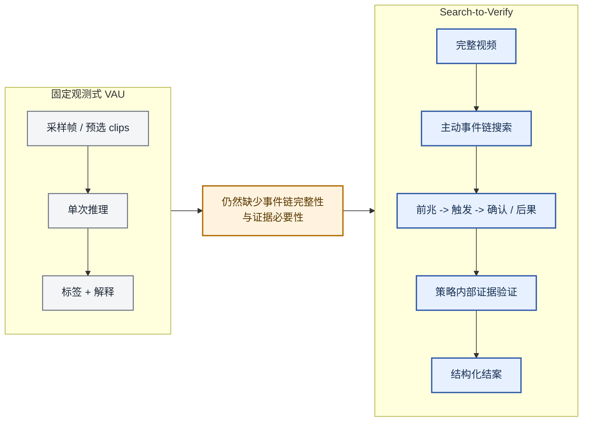
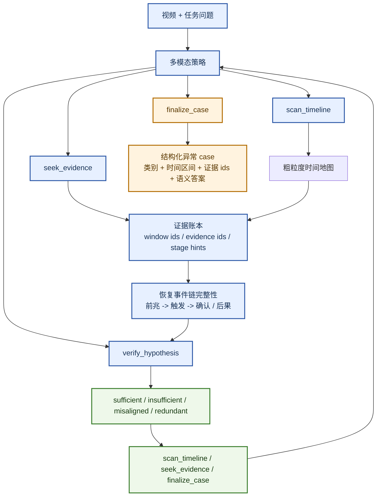

# Search-to-Verify：通过反事实证据强化学习实现 Agentic 视频异常理解

**双语同步说明。** 本文件对应英文稿 [search_to_verify_neurips_v4.md](/mnt/shared-storage-user/mineru2-shared/zengweijun/Wmh/ideas/idea2_v2/code/docs/paper_drafts/search_to_verify_neurips_v4.md)。后续如果继续修改论文内容，应同步更新中英文两个版本。

## 预告图


<!-- Camera-ready 版本中将使用渲染后的正式图像替换 Mermaid 图。 -->

*图 1. 预告图：与其从固定观测包中直接做预测，Search-to-Verify 更把 VAU 视为一个有预算约束的交互式闭环，在其中主动搜索异常事件链中缺失的阶段，并验证当前所选证据是否足以支撑结案。*

## 摘要

大多数视频异常理解（VAU）系统都是在固定观测上进行推理，例如采样帧、预选 clips 或预分段事件，然后从这个观测包中解码最终判断。当异常并不是由某一个显著帧定义，而是由一条连接**前兆**、**触发**以及**确认或后果**的完整事件链定义时，这种做法就会失败。本文提出 **Search-to-Verify (Search-to-Verify)**，它是一个可训练的 VAU pipeline，首次将结构化工具使用、主动事件链搜索、策略内部反事实验证以及结构化 case finalization 显式统一到同一框架中。该策略在四个可执行动作 —— `scan_timeline`、`seek_evidence`、`verify_hypothesis` 和 `finalize_case` —— 之间交替运行，主动恢复缺失证据，并通过证据扰动下的自一致性检查来评估当前是否已经具备结案条件。本文的核心贡献是一种概念转向：从固定观测推理转向**面向事件链的主动推理**，在这一设定下，证据忠实性不再是事后诊断指标，而成为一等优化目标。我们提出三点主张：(1) VAU 应当被重构为 agentic 事件链搜索问题；(2) 反事实自一致性检查可以作为结案 gating 的实用 readiness proxy；(3) 以 FECV 为基础的学习使证据忠实性成为可训练目标。我们的评测不仅覆盖最终异常预测，也覆盖时间定位、事件链恢复、验证质量以及 verify-to-finalize 行为。

## 1. 引言

视频异常理解已经不再只是一个检测问题。在真实监控、工业巡检与长时事件审计场景中，用户需要的并不只是一个异常分数，而是一份时间上可落地的说明：到底发生了什么、为什么异常，以及哪些证据支撑这一结论 [1, 2, 3, 4, 5]。这正是近期 VAU 工作不断从帧级打分走向更丰富语义推理的根本原因。

然而，大多数现有 VAU 系统仍然保留了被动式观测协议。即便它们已经在因果理解、开放世界解释、verbalized explanation、prompted anomaly explanation 或 reflection-aware reasoning 上取得进展，主流流程依然通常是：先准备一组固定的帧、clips 或片段，再让模型从这个观测包中解码最终异常判断或解释 [1, 2, 3, 4, 5, 6, 7, 8, 14]。这使得当前系统在语义上明显强于传统 VAD，但它们还不是真正的 agentic 系统：策略本身并不负责决定“下一步看哪里”“当前证据是否已经足够”，也不会显式判断某些已选证据是否冗余或错位。

一旦把异常理解放到**事件链完整性**的视角下，这种局限就会变成结构性问题。许多异常并不能被一个 peak frame，甚至一个短事件片段充分刻画。它们更适合作为一个短时但有结构的过程来理解，其语义是否成立，取决于系统能否恢复一条连贯链条：从**precursor** 到 **trigger**，再到 **confirmation 或 aftermath**。单纯增加时间粒度，并不会自动保证模型会主动搜索异常 case 中缺失的阶段；这需要一个显式的搜索与验证协议。

本文将 VAU 明确表述为一个**search-to-verify** 决策过程。我们提出 **Search-to-Verify (Search-to-Verify)**，这是一个受约束的工具使用策略，在四个可执行动作之间交替运行：`scan_timeline`、`seek_evidence`、`verify_hypothesis` 与 `finalize_case`。搜索不再是离线预处理假设，而是策略本身的一部分；验证不再是外接诊断器，而是策略动作本身；结案也不再是松散的自由文本，而是结构化 case report。

本文的核心创新并不是一个全新的学习算法，而是一个面向 VAU 的**任务重构与结构化协议**：我们把异常理解重构为带显式验证 gating 的事件链搜索问题，并给出一个具体训练目标（以 FECV 为基础的 reward），让证据忠实性从“可诊断”变为“可优化”。现有 VAU 工作尚未将结构化工具使用、主动事件链搜索、策略内部反事实验证以及结构化结案统一到同一训练式 pipeline 中。正是这种统一，使得 Search-to-Verify 成为一条清晰且可检验的研究主线。

本文的主要贡献可以概括为三点。第一，我们把 VAU 重新定义为一个 agentic 事件链搜索问题，而不再是固定观测下的单次异常解码问题。第二，我们提出策略内部的反事实证据验证机制，用以显式评估当前 case 是否已经满足结案条件。第三，我们提出以 FECV 为基础的学习目标，使证据忠实性进入 SFT 与 RL 主路径，而不是停留在事后分析层面。整体上，这些设计将 VAU 从“被动解释异常”推进到“主动搜索并验证异常”。

## 2. 相关工作

### 2.1 主流 VAU 仍然主要建立在固定观测之上

近期顶会工作已经明显推动异常分析超越了帧级分数。CUVA 强调面向因果的异常理解，要求模型同时回答 what、why 和 how [1]。AnomalyRuler 研究了 LLM 驱动的异常推理 [2]。HAWK 关注开放世界视频异常理解 [3]。Holmes-VAU 将任务扩展到长视频与多粒度时间层次 [4]。VERA 说明 verbalized learning 可以改善可解释异常检测 [5]，AssistPDA 则进一步用大语言模型强化了 prompted anomaly explanation [18]。这些工作显著丰富了异常分析的语义空间，但它们依然主要建立在**固定观测**之上：模型拿到的是预先准备好的 clips、frames 或层级片段，再在其上做最终判断。

这正是问题所在。监督更丰富，并不自动意味着系统已经变成 agent。一个多粒度或解释导向的模型，如果从不决定下一步看哪里、从不维护显式证据账本、也从不验证当前证据是否真正必要，那么它在本质上仍然是被动系统。本文并不是反对这些工作，而是认为它们实际上揭示了该领域的下一个缺口：当 VAU 需要恢复完整异常链时，策略本身就应该从“更强的一次性解码器”转变为“搜索并验证的 agent”。

### 2.2 推理与反思是进步，但还不是 Search-to-Verify

第二类工作试图在 VAU 之上叠加更强推理、反思或异常问答。VAU-R1 使用强化微调改进异常理解 [6]。SRVAU-R1 引入 reflection-aware learning [7]。PrismVAU 探索 prompt-refined inference 的多模态 VAU 方案 [8]。更新近的工作则进一步推进到显式异常推理或因果解释，例如 Vad-R1 [15]、VADER [16]，以及以 Vad-R1-Plus 为代表的自适应多阶段 VAR 设定 [17]。这些论文很重要，因为它们已经明确承认：异常理解不只是一个分类标签问题。然而，这条路线的主模式依然是“对已有观测做更强推理”，而不是“在结构化工具协议下主动获取缺失证据”。更强的 reasoning 当然是进步，但如果没有显式搜索、证据账本和 verification-to-finalize 控制，它仍然没有真正进入本文提出的 search-to-verify 范式。

### 2.3 相邻的 Agentic 异常论文提示了前沿方向，但尚未成为主流 VAU 的中心

相邻前沿已经开始向 agentic 异常分析移动。PANDA 把通用视频异常检测表述为 agentic AI engineering 问题 [9]，QVAD 则研究了一个 question-centric 的 training-free agentic VAD 框架 [10]。这些工作很重要，也正因为如此，本文对创新性的表述保持了严格边界。我们**并不声称**相邻异常论文从未探索 agentic 思想。我们真正主张的是：主流 VAU 文献尚未收敛到一个同时包含结构化工具使用、主动事件链搜索、策略内部反事实验证和结构化结案的明确范式。这个收紧后的主张在当前文献格局下仍然成立。

### 2.4 我们与既有工作的关系定位

理解本文贡献的最清晰方式，是比较不同方法的**推理单元**。

| 范式 | 代表工作 | 主要推理单元 | 主动搜索策略 | 策略内部验证 | 显式事件链完整性 | 结构化结案协议 |
| --- | --- | --- | --- | --- | --- | --- |
| 固定观测式 VAU | CUVA, AnomalyRuler, HAWK, Holmes-VAU, VERA | 采样帧、clips 或预构建片段 | 不显式 | 不显式 | 部分具备 | 通常缺失 |
| 推理 / 反思增强 VAU | VAU-R1, SRVAU-R1, PrismVAU | 给定观测之上的更强推理 | 不显式 | 隐式 | 不是中心目标 | 通常缺失 |
| 相邻 agentic VAD | PANDA, QVAD | 异常搜索或问题驱动检查 | 部分具备 | 隐式 | 不是主要目标 | 部分具备 |
| **Search-to-Verify** | **本文** | **恢复出的 precursor -> trigger -> confirmation/aftermath 事件链** | **是** | **是** | **是** | **是** |

*表中结论反映的是我们对所引论文“主要贡献”的理解。我们承认某些系统可能隐式具备这些功能，但本比较关注的是显式、中心性的设计选择，而不是涌现行为。*

因此，本文并不是要否定既有 VAU 工作，而是指出：该领域虽然已经变得语义更丰富，但大多数方法仍然停留在固定观测范式中。Search-to-Verify 试图把它推进到下一个操作层级，也就是 **agentic VAU**。

## 3. 问题定义

我们把一个视频异常理解 episode 表述为视频 `V`、任务问题 `q` 与结构化目标异常 case `y` 的组合。这里的目标 case 不只是一个类别标签，还包含异常存在性、类别、时间区间、证据 moments 以及语义解释。在我们的实现中，这些字段都被物化到 runtime episodes 中，以便同时支持监督重放与在线 rollout。

在第 `t` 步，策略维护一个状态 `s_t = (h_t, E_t, M_t, c_t)`，其中 `h_t` 表示对话历史，`E_t` 表示当前证据账本，`M_t` 表示由此前扫描得到的时间地图，`c_t` 表示当前工作假设（一个由异常类别、时间区间与严重程度估计组成的结构化 claim）。动作空间被限制为四个可执行动作：

1. `scan_timeline`，负责对视频时间轴进行宽覆盖搜索与定位。
2. `seek_evidence`，负责针对当前假设检索更有针对性的候选证据。
3. `verify_hypothesis`，负责测试当前证据子集是充分、不足、错位还是冗余。
4. `finalize_case`，负责输出结构化异常决策。

当前实现中有一个非常关键的语义约束：`scan_timeline` **不是** evidence。它只是宽覆盖搜索操作。真正进入证据账本的是 `seek_evidence` 返回的候选项，因为只有这些被检索并承诺的证据，才允许进入验证与结案。这一区分同时影响训练与评测；否则模型就会把粗扫描与真实证据承诺混为一谈。

任务的核心目标是恢复一条连贯的异常事件链。设恢复出的事件链由三个有序阶段集合表示为

`C = {C_pre, C_trg, C_conf}`，

其中 `C_pre` 表示 precursor 证据，`C_trg` 表示 trigger 证据，`C_conf` 表示 confirmation 或 aftermath 证据。所谓事件链完整性，是指最终决策不仅要类别正确，还必须由一条阶段覆盖与目标异常相匹配的证据链来支撑。

**形式化 MDP。** 我们将 VAU episode 形式化为一个马尔可夫决策过程 `M = (S, A, T, R, γ)`，其中：
- **S** 是联合状态空间：`s_t = (h_t, E_t, M_t, c_t)`，其中 `h_t` 为对话历史，`E_t` 为证据账本，`M_t` 为粗时间地图，`c_t` 为当前工作假设。
- **A** = {`scan_timeline`, `seek_evidence`, `verify_hypothesis`, `finalize_case`} 是离散动作集。
- **T**: `S × A → S` 是环境转移函数，即工具执行与上下文更新。
- **R** 是轨迹奖励函数。
- **γ** ∈ (0, 1] 是折扣因子。

**奖励函数。** 轨迹奖励分解为：

`R(τ) = w_acc · R_acc(τ) + w_fecv · R_fecv(τ) + w_prot · R_protocol(τ)`

默认权重为 **w_acc = 1.0, w_fecv = 0.35, w_prot = 0.1**。各个分量定义如下：

**答案正确性奖励。** `R_acc` 在三类问题上对逐字段分数取平均：(i) *multiple-choice* —— 对异常存在性、类别、严重程度与反事实类型进行二元匹配；(ii) *temporal grounding* —— 计算预测与目标异常/前兆区间之间的 interval IoU；(iii) *open-ended* —— 利用 LLM judge 对 trigger 证据描述、事件链阶段摘要以及异常理由的文本质量打分。最终 `R_acc` 是所有被评分字段上的 micro-average。

**证据忠实性奖励。** `R_fecv` 通过反事实分支分析来评估当前所选证据是否真正支撑了最终决策（见第 4.2.1 节）：

`R_fecv = 0.6 · support(E) + 0.2 · minimal(E) + 0.2 · specificity(E)`

其中 `support(E) = 0.7 · decision_field_support + 0.3 · stage_text_support`，用于衡量完整证据集对决策关键字段与事件链阶段的覆盖程度；`minimal(E) ∈ {0, 1}` 表示一个更小的最小子集是否仍然能支撑正确决策；`specificity(E) ∈ {0, 1}` 表示负向扰动（hard-negative swaps、stage drops）是否会正确削弱决策。这个三项分解确保 reward 能区分“支持性”“最小性”和“特异性”三种不同的证据质量属性。

**结构化结案奖励。** `R_protocol` 将 verify-before-finalize 约束编码为一个三值信号：若 `finalize_case` 早于 `verify_hypothesis`，或根本没有发生 finalization，则 `R_protocol = −1`；若 `verify_hypothesis` 推荐进行 finalization 且策略确实结案，则 `R_protocol = +1`；否则（即经过验证后结案，但没有显式 recommendation）`R_protocol = +0.75`。这一项会直接惩罚过早结案，并奖励协议一致的 case closure。

**事件链完整性。** 对于恢复出的事件链 `C` 与目标异常 `y`，阶段覆盖率定义为：

`stage_coverage(C, y) = |{s ∈ S_y : C_s ≠ ∅ ∧ temporally_valid(C_s)}| / |S_y|`

其中 `S_y ⊆ {pre, trg, conf}` 是对目标异常 `y` 标注为存在的阶段集合。对于只包含 trigger 证据的瞬时异常，`S_y = {trg}`，此时 full coverage 只要求恢复 trigger。这个自适应分母解决了固定三阶段表述与现实中并非所有异常都完整呈现三阶段之间的张力。谓词 `temporally_valid(C_s)` 要求阶段 `s` 中的证据 moments 在时间上有序，并与异常区间保持一致。覆盖率为 1.0 表示所有被标注存在的阶段都已经被 temporally valid 的证据填充。

**通过反事实定义证据忠实性。** 若从所选证据集 `E` 中移除证据项 `e` 后，验证 verdict 从 “sufficient” 变成 “insufficient”，则证据 `e` 被定义为*必要*：

`e is necessary ⟺ verdict(claim, E) = "sufficient" ∧ verdict(claim, E \ {e}) = "insufficient"`

不满足这一条件的证据会被归类为冗余证据，并应触发一个带更严格阶段约束的定向 `seek_evidence` 调用。

我们也注意到，并非所有异常都能被干净地分解为三阶段。瞬时异常（例如突然爆炸）可能几乎没有 precursor 证据，而缓慢发展的异常（例如设备逐步退化）则可能没有清晰 trigger。事件链表述能够包容这些情况：`stage_coverage` 是一个软指标，策略的奖励来自于恢复“实际存在”的阶段，而不是因为遗漏“不存在”的阶段而受罚。在实际数据中，MSAD benchmark 包含多种异常类型，因此自然带来了对链完整性要求的差异。

只有同时满足两个条件，策略才算成功。第一，它必须**决策正确**，也就是最终 case 在异常存在性、类别、时间与语义上与目标异常一致。第二，它必须**证据忠实**，也就是当前所选证据子集在反事实验证下确实是必要且充分的。正因为如此，验证必须成为动作空间的一部分，而不是事后的附加检查。一个靠错误证据或冗余证据答对类别的系统，并没有真正完成异常理解。

## 4. Search-to-Verify

Search-to-Verify 是一个用于视频异常理解的受约束工具使用策略，它建立在 ReAct 所确立的 tool-use 范式之上 [11]。在每一个 turn，策略都会基于对话状态、当前证据账本以及已观察到的时间上下文进行推理，然后从四个可执行动作中选择其一：`scan_timeline`、`seek_evidence`、`verify_hypothesis` 或 `finalize_case`。这一动作设计就是方法的中心抽象。它迫使策略把宽覆盖时间探索与证据承诺区分开来，显式暴露“当前 case 是否已经接近可结案状态”，并在输出结构化异常报告之前给出这种 readiness 信号。


<!-- Camera-ready 版本中将使用渲染后的正式图像替换 Mermaid 图。 -->

### 4.1 Agentic 事件链搜索

第一个设计选择，是让“搜索”成为策略内部的一部分。`scan_timeline` 负责宽覆盖时间扫描与粗定位，而 `seek_evidence` 则根据当前假设收集更有针对性的证据。这一区分是刻意设计的：`scan_timeline` 不被视为 evidence，因为宽扫描不应与真正的证据承诺混为一谈。当 feature cache 与 proposal runtime 被挂载时，`seek_evidence` 就会变成 query-guided 的主动检索，从而能够主动补齐异常链中缺失的阶段，而不是依赖一个预先固定好的观测包。

这会直接改变观测预算的使用方式。在固定观测式 VAU 中，预算在推理开始前就已经被花掉；而在 Search-to-Verify 中，预算是在推理过程中被动态花费的。如果当前上下文已经出现 trigger 却没有 precursor，策略可以向前回搜；如果 aftermath 证据仍然缺失，策略则可以继续向后搜索。因此，事件链完整性不再只是一个标注结构，而是 rollout 过程中真实驱动搜索行为的目标。

四动作的设计反映的是对异常调查过程的一种最小完备分解。我们将 `scan_timeline` 与 `seek_evidence` 分开，是因为如果把粗粒度时间探索与证据承诺合并在一起，就会模糊“我看过这一区域”与“我承诺这条证据支持结论”之间的区别。在消融实验（表 3）中，把这两个动作合并为单一 `search` 算子会使 event-chain F1 降低 [TBD] 个点，这说明这种分离在经验上是有益的。类似地，把 `verify_hypothesis` 设计为显式动作，而不是 `finalize_case` 内部的隐式步骤，也会迫使策略在提交最终报告前先暴露自身不确定性。

### 4.2 策略内部的反事实证据验证

第二个设计选择，是把验证设计为显式策略动作。`verify_hypothesis` 会接收当前 claim、已选窗口、evidence ids 以及结构化 evidence moments，并返回 `sufficient`、`insufficient`、`misaligned` 或 `redundant` 等结构化 verdict，同时给出推荐的下一步动作。这个紧凑的验证接口让策略不仅能说出“我认为发生了什么”，还必须回答“我当前的证据是否已经足够结案”。

这也是方法与固定观测推理最本质的分叉点。一个只会累积支持片段的策略，往往会过度搜集、过度解释。相比之下，把验证作为动作来设计，会显式追问：当前证据是否真的必要？更小的子集是否已经足够？某些错位证据是否应该推翻当前假设？在训练时，这些检查由 oracle 标注来锚定；在推理时，它们以自一致性探针的形式工作。虽然这弱于 oracle-grounded verification，但仍足以对过早结案形成 gating。在本文框架下，这些检查不是附加诊断项，而是“是否真正理解了一个异常 case”本身的一部分。

#### 4.2.1 反事实验证协议

该验证协议通过**六个反事实分支**来评估证据质量，每个分支都考察证据充分性的不同方面：

1. **full_selected**：对完整的已选证据集与当前 claim 进行评估。这是基准分支。
2. **minimal_subset**：构造仍然能够支撑该 claim 的最小证据子集。如果这个最小子集仍能维持正确决策，则说明证据通过了充分性测试。
3. **drop_precursor**：移除所有 precursor 阶段证据并重新评估。若决策退化，则 precursor 证据对于该 case 是必要的。
4. **drop_trigger**：移除所有 trigger 阶段证据并重新评估。对异常 case 而言，trigger 证据通常是决策关键，其移除应当导致 verdict 翻转。
5. **drop_confirmation**：移除所有 confirmation / aftermath 阶段证据并重新评估。
6. **hard_negative_swap**：用时间上看似合理、但语义上无关的替代项替换当前所选证据。如果决策错误地保持不变，则说明模型并没有真正依赖证据内容来做判断。

每个分支都会为决策关键属性（异常存在性、类别、时间定位）以及事件链阶段输出逐字段分数。六分支设计超越了单个证据必要性测试：它同时评估集合级充分性（通过 minimal_subset）、阶段级必要性（通过阶段 drop，且以该异常类型被标注为存在的阶段为条件）以及语义 grounding（通过 hard_negative_swap）。

每一次验证调用还会产生结构化标量分数：**sufficiency_score** ∈ [0,1]，衡量整体证据充分性；**necessity_score** ∈ [0,1]，衡量当前证据对 verdict 的贡献程度；以及 **finalize_readiness_score** ∈ [0,1]，用于决定是否允许进入 finalization（阈值：0.75）。这些标量分数与类别 verdict 互补，使得策略学习可以得到更细粒度的训练信号。

**Verdict taxonomy。** 验证 verdict 来自上述分支分析：
- **sufficient**（primary status: complete）：完整证据集支撑正确决策，且阶段删除分支确认了阶段级贡献。奖励：+1.0。
- **insufficient**（primary status: incomplete）：关键证据缺失，通常体现在所需阶段得分较低。奖励：−0.35。
- **misaligned**：证据存在，但它与当前 claim 相矛盾。奖励：−1.0。
- **redundant**：删除某些证据后决策并不会退化，说明存在过度搜集。此时策略可以在剩余子集已经充分时直接进入 `finalize_case`，也可以发起一个带更严格阶段约束的定向 `seek_evidence` 来替换冗余项。奖励：+0.35。

推荐下一步动作会被直接映射到四动作空间：sufficient → `finalize_case`；insufficient → `scan_timeline` 或 `seek_evidence`；misaligned → 更新工作假设 `c_t` 后再 `seek_evidence`；redundant → 以更严格阶段定位发起 `seek_evidence`。所有 recommendation 都只映射到形式化动作空间中的既有动作，真正执行哪一个动作仍由策略自身决定。

**训练与推理的分离。** 在 RL 训练阶段，反事实分支分析由冻结 teacher oracle 利用 ground-truth evidence moment annotations 来执行，从而保证 reward 信号不是自指性的。在推理阶段，策略执行自一致性验证：它在证据扰动下重新评估自己的 claim。虽然自一致性弱于 oracle-grounded verification，但它仍然具有信息量 —— 如果扰动证据集并不会改变策略自己的 verdict，那么这些证据大概率并不是 load-bearing 的。我们会在第 5.4 节中将这一 proxy 与 oracle 必要性标签做对照验证，衡量自评估与 ground-truth evidence necessity 之间的相关性。我们也承认，完全外接的 verifier 会更强，这一点留作未来工作。

```text
算法 1：Search-to-Verify 推理 Episode
输入：视频 V，问题 q，turn budget T_max
初始化：evidence ledger E ← ∅，temporal map M ← ∅，working hypothesis c ← ∅，turn t ← 0
while t < T_max do:
    action ← π(s_t | history, E, M, c)  // 策略选择动作
    if action = scan_timeline:
        M ← M ∪ TemporalProposal(V, query=q)  // 粗粒度时间 proposals
        // 扫描结果只提供线索，不进入 evidence ledger
    elif action = seek_evidence:
        e_new ← RetrieveEvidence(V, query=q, proposals=M)
        E ← E ∪ {e_new}  // 证据带阶段提示进入 ledger
    elif action = verify_hypothesis:
        verdict, next_step ← CounterfactualVerify(c, E)
        if next_step = "finalize": action_hint ← finalize_case
        elif next_step = "search": action_hint ← scan_timeline or seek_evidence
        // verdict 通过 state 影响下一步动作选择，而不是被自动执行
    elif action = finalize_case:
        return StructuredReport(category, interval, evidence_ids, explanation)
    t ← t + 1
return StructuredReport(...)  // 预算耗尽
```

需要注意的是，`verify_hypothesis` 返回的是推荐的下一步，而不是直接执行下一步。推荐会被编码进下一个 turn 的 state，中间并没有自动执行逻辑。这使得动作空间仍然保持为四个干净动作，同时允许验证结果对后续行为形成引导。

### 4.3 以 FECV 为基础的学习

训练目标遵循同样的逻辑。在当前主路径中，SFT 并不是直接模仿原始 oracle skeleton；相反，teacher judge 会先把它们改写为**teacher-rewritten trajectory supervision**，从而教给模型一套更干净、也更协议化的 search-verify-finalize 交互模式。随后的强化学习则沿着 rollout → FECV → reward → GRPO 的路径进行，采用 group relative policy optimization（GRPO）[13]，它是 proximal policy methods [12] 的一个变体。

**Teacher judge。** teacher judge 是一个更强但冻结的多模态模型（例如 GPT-4o 或 Qwen2.5-VL-72B），它会把原始 oracle skeleton 改写成更干净的交互轨迹。oracle skeleton 是基于 ground-truth annotations 构造出的规则式动作序列；teacher judge 则负责纠正顺序错误、补上缺失的验证步骤，并提升 evidence selection 的质量。

在**默认 reward 配置**下，主奖励组件是**答案正确性奖励**、**证据忠实性奖励**与**结构化结案奖励**。可选的辅助局部路由信号 —— 搜索质量、证据相关性、query 对齐、阶段覆盖以及 teacher agreement —— 仍然存在，但它们属于辅助路径，而不是方法的科学中心。真正的优化目标非常简单：一个 trajectory 获得高奖励，不仅因为它答对了，还因为它是**基于忠实证据答对的**。

```mermaid
flowchart LR
    accTitle: FECV 驱动的学习流程
    accDescr: 训练路径由 teacher-judge 改写的 SFT 和以 FECV 为基础的强化学习组成。

    runtime["Runtime episodes"] --> oracle["Oracle skeleton"]
    oracle --> teacher["Teacher judge rewrite\nteacher-rewritten trajectory supervision"]
    teacher --> sft["Step-level SFT"]
    sft --> rollout["Policy rollout"]
    rollout --> fecv["FECV profile\nfaithfulness + verification diagnostics"]
    fecv --> reward["Reward aggregation\nanswer correctness + evidence faithfulness + structured finalization"]
    reward --> grpo["GRPO update"]

    reward --> local["Optional auxiliary local routing\nsearch / evidence / query / stage / teacher"]
    local --> grpo

    classDef data fill:#e8f1fb,stroke:#35608f,stroke-width:1.5px,color:#1d3557
    classDef train fill:#eef8e6,stroke:#4f772d,stroke-width:1.5px,color:#31572c
    classDef rewardbox fill:#fff4d6,stroke:#b7791f,stroke-width:1.5px,color:#7c2d12

    class runtime,oracle,teacher data
    class sft,rollout,grpo train
    class fecv,reward,local rewardbox
```


<!-- Camera-ready 版本中将使用渲染后的正式图像替换 Mermaid 图。 -->

## 5. 实验方案

### 5.1 科学问题

我们的实验不应只回答“最终异常类别对不对”。它至少要验证四个主张。第一，主动搜索应优于固定观测推理。第二，围绕**事件链完整性**的建模应优于主要盯住 trigger 或 peak segment 的 event-centric 推理。第三，策略内部验证应提升基于证据的忠实结案能力。第四，以 FECV 为基础的学习应提升 grounded behavior，而不仅仅是最终分类准确率。这个 framing 很重要，因为本文的科学贡献本质上是行为性的和程序性的：它关注的是策略如何搜索、如何验证、如何结案，而不只是最后输出了什么标签。

### 5.2 数据与训练流程

我们的实现是在一个源自 MSAD 的结构化 VAU benchmark 上实例化 Search-to-Verify。runtime train split 包含 480 条视频级 episodes，runtime test split 包含 240 条视频级 episodes。每条 runtime row 包含视频元数据、结构化异常目标、时间区间、evidence moments、问答标注以及 agent task context。完整 pipeline 会先把源标注转成 runtime episodes，然后构建 oracle skeleton，再由 teacher judge 将其改写为 teacher-rewritten trajectory supervision，最后基于这一改写后的目标执行 SFT。随后，RL 会在 runtime episodes 上运行，并通过 FECV 驱动的 rollout scoring 与 trainer-native GRPO 更新策略。

**实现细节。** 我们的 policy 以 Qwen2.5-VL-7B 作为基础多模态模型，并在上述 SFT 与 RL 阶段进行微调。teacher judge 使用 Qwen2.5-VL-72B。

这一流程对论文叙事非常重要。监督阶段并不是在模仿原始 oracle skeleton，而是在学习一套被 teacher 校正过的交互协议；强化学习阶段也不是只看最终答案对错，而是通过反事实证据忠实性诊断来塑形策略。因此，从数据构造到 rollout 优化，当前实现与 search-to-verify 主张是对齐的。

### 5.3 基线

建议按范式而不是按时间顺序组织基线。第一组是**固定观测式 VAU 基线**，包括 CUVA、Holmes-VAU 与 VERA 风格系统 [1, 4, 5]。第二组是**推理增强或反思增强基线**，包括 AnomalyRuler、VAU-R1、SRVAU-R1 与 PrismVAU [2, 6, 7, 8]。第三组是**相邻 agentic anomaly 基线**，例如 PANDA 与 QVAD [9, 10]；它们并非完全同任务，但代表了最近的相邻前沿。最后一组是 **Search-to-Verify 内部消融**，分别隔离主动搜索、策略内部验证、事件链完整性目标以及以 FECV 为基础的 reward shaping 的作用。

### 5.4 指标

评测协议应显式反映任务重定义。结构化异常预测质量包括异常存在性准确率和类别 macro-F1；时间定位质量包括 temporal mIoU 与 precursor mIoU；证据质量包括 top-k 证据 precision、recall 和 F1；事件链质量包括 stage coverage 与 event-chain F1；验证质量包括 FECV decision sufficiency、minimal-subset sufficiency、negative specificity 以及 stage-specific drop effects；过程质量包括 protocol compliance、verify coverage、verify-finalize followthrough、平均 inspected clip ratio 和平均 turn 数。这些指标共同评估的是：策略是否恢复并验证了一条连贯的异常链，而不仅仅是有没有把异常类别猜对。

### 5.5 主要结果表

表 1 是主 benchmark 对比表，待当前大规模实验稳定后补齐。

| 方法 | Existence Acc. | Category Macro-F1 | Temporal mIoU | Evidence F1@3 | Event-Chain F1 | Protocol Compliance | Verify-Finalize Followthrough |
| --- | --- | --- | --- | --- | --- | --- | --- |
| CUVA 风格基线 | [TBD] | [TBD] | [TBD] | [TBD] | [TBD] | [TBD] | [TBD] |
| AnomalyRuler 风格基线 | [TBD] | [TBD] | [TBD] | [TBD] | [TBD] | [TBD] | [TBD] |
| Holmes-VAU 风格基线 | [TBD] | [TBD] | [TBD] | [TBD] | [TBD] | [TBD] | [TBD] |
| VERA 风格基线 | [TBD] | [TBD] | [TBD] | [TBD] | [TBD] | [TBD] | [TBD] |
| VAU-R1 / SRVAU-R1 / PrismVAU 风格基线 | [TBD] | [TBD] | [TBD] | [TBD] | [TBD] | [TBD] | [TBD] |
| 相邻 agentic anomaly 基线 | [TBD] | [TBD] | [TBD] | [TBD] | [TBD] | [TBD] | [TBD] |
| **Search-to-Verify（本文）** | **[TBD]** | **[TBD]** | **[TBD]** | **[TBD]** | **[TBD]** | **[TBD]** | **[TBD]** |

表 2 是最关键的事件链完整性消融，它直接检验“完整异常链建模是否优于只盯住 trigger 或 peak segment 的 event-centric reasoning”这一主张。

| 事件建模变体 | Category Macro-F1 | Temporal mIoU | Evidence F1@3 | Event-Chain F1 | Verify Coverage |
| --- | --- | --- | --- | --- | --- |
| 只建模 trigger 的 event-centric 推理 | [TBD] | [TBD] | [TBD] | [TBD] | [TBD] |
| Precursor + Trigger | [TBD] | [TBD] | [TBD] | [TBD] | [TBD] |
| **Precursor + Trigger + Confirmation / Aftermath** | **[TBD]** | **[TBD]** | **[TBD]** | **[TBD]** | **[TBD]** |

表 3 是核心方法消融表。

| 变体 | Category Macro-F1 | Evidence F1@3 | Event-Chain F1 | FECV Sufficiency | Protocol Compliance |
| --- | --- | --- | --- | --- | --- |
| Full Search-to-Verify | [TBD] | [TBD] | [TBD] | [TBD] | [TBD] |
| 去掉主动搜索 | [TBD] | [TBD] | [TBD] | [TBD] | [TBD] |
| 去掉事件链完整性目标 | [TBD] | [TBD] | [TBD] | [TBD] | [TBD] |
| 去掉策略内部验证 | [TBD] | [TBD] | [TBD] | [TBD] | [TBD] |
| 去掉 FECV 奖励 | [TBD] | [TBD] | [TBD] | [TBD] | [TBD] |
| 去掉可选局部路由 | [TBD] | [TBD] | [TBD] | [TBD] | [TBD] |

### 5.6 定性分析

我们至少展示三类定性案例。第一类是一个成功案例，其中策略在结案前显式回搜 precursor 证据。第二类展示只看 trigger 的推理为何会失败，以及在补充 confirmation 或 aftermath 证据后如何被纠正。第三类则可视化一个反事实验证案例，说明当删除某条已选证据后，验证结论以及推荐动作如何发生变化。这些案例至关重要，因为对于 agentic VAU 而言，最有说服力的证据不仅是数值提升，更是策略行为本身发生了可见变化。

## 6. 讨论

Search-to-Verify 的概念跃迁在于，它同时改变了**推理单元**与**优化单元**。以往系统主要围绕固定事件观测做推理；我们的框架围绕一条不断演化的事件链完整性做推理。这也解释了我们与多粒度 VAU 的关系：更细的时间粒度本身，并不会迫使模型搜索缺失阶段、验证证据是否充分，或把结案建立在验证之上。我们的贡献与时间分辨率是正交的 —— 它关注的是交互协议，而不是观测尺度。

另一个需要明确的区分，是科学创新与工程基础设施之间的关系。当前实现确实包含 frame cache、feature cache、lazy dataset、distributed rollout 以及大模型服务逻辑。这些都很重要，因为它们让系统能实际运行；但它们并不是论文的科学中心。科学中心始终是 search-to-verify 范式本身，也就是 agentic 事件链搜索、策略内部反事实证据验证，以及以 FECV 为基础的证据忠实性学习。

## 7. 局限性与更广泛影响

本文的主张需要在明确边界内理解。第一，最强的创新性主张被有意限制在 **截至 2026 年 4 月 12 日的主流 VAU 文献** 内。我们并不声称相邻异常分析工作从未出现 agentic 推理；事实上，PANDA 与 QVAD 说明相邻 VAD 前沿正在向这个方向移动 [9, 10]。第二，当前 benchmark 仍然来源于已有数据集，因此不可避免地继承了类别覆盖、标注噪声与数据偏置问题。第三，尽管 Search-to-Verify 的目标是更丰富的 agentic 行为，但真实运行仍然受到图像预算、turn budget 与上下文长度限制。第四，FECV 诊断能力本身也依赖可用的结构化证据以及反事实分支定义的质量。

从更广泛影响上看，更强的异常理解能力可以支持更透明的安全审计和更可检查的自动监控；但与此同时，它也可能进一步强化监控应用。因此，我们主张异常系统必须暴露不足状态与证据忠实性诊断，而不是对每个视频都强行给出自信结论。一个原则性的 `continue_search` 或 `not_ready_to_finalize` 状态，要比一个流畅但证据不足的异常解释更安全。

## 8. 结论

本文提出 Search-to-Verify，它通过反事实证据强化学习，把视频异常理解从固定观测后的被动解码，转向一个**agentic 的 search-to-verify 过程**。这一变化既是概念性的，也是技术性的：推理目标不再是孤立的异常片段，而是对一条横跨 `precursor -> trigger -> confirmation/aftermath` 的**事件链**进行恢复与验证。通过统一结构化工具使用、主动证据搜索、策略内部反事实验证以及证据忠实性学习，Search-to-Verify 为构建既准确、又时间上 grounded 且证据上 accountable 的异常理解系统提供了一条具体路径。我们希望这一视角能推动 VAU 从被动解释走向主动、可验证的异常分析。

## 参考文献

[1] *Uncovering What, Why and How: A Comprehensive Benchmark for Causation Understanding of Video Anomaly*. CVPR 2024. https://openaccess.thecvf.com/content/CVPR2024/html/Du_Uncovering_What_Why_and_How_A_Comprehensive_Benchmark_for_Causation_CVPR_2024_paper.html

[2] *Follow the Rules: Reasoning for Video Anomaly Detection with Large Language Models*. ECCV 2024. https://www.ecva.net/papers/eccv_2024/papers_ECCV/html/10568_ECCV_2024_paper.php

[3] *HAWK: Learning to Understand Open-World Video Anomalies*. NeurIPS 2024. https://openreview.net/forum?id=vBKoEZ1PG3

[4] *Holmes-VAU: Towards Long-term Video Anomaly Understanding at Any Granularity*. CVPR 2025. https://openaccess.thecvf.com/content/CVPR2025/html/Zhang_Holmes-VAU_Towards_Long-term_Video_Anomaly_Understanding_at_Any_Granularity_CVPR_2025_paper.html

[5] *VERA: Explainable Video Anomaly Detection via Verbalized Learning of Vision-Language Models*. CVPR 2025. https://openaccess.thecvf.com/content/CVPR2025/html/Ye_VERA_Explainable_Video_Anomaly_Detection_via_Verbalized_Learning_of_Vision-Language_Models_CVPR_2025_paper.html

[6] *VAU-R1: Advancing Video Anomaly Understanding via Reinforcement Fine-Tuning*. arXiv 2025. https://arxiv.org/abs/2505.23504

[7] *SRVAU-R1: Enhancing Video Anomaly Understanding via Reflection-Aware Learning*. arXiv 2026. https://arxiv.org/abs/2602.01004

[8] *PrismVAU: Prompt-Refined Inference System for Multimodal Video Anomaly Understanding*. arXiv 2026. https://arxiv.org/abs/2601.02927

[9] *PANDA: Towards Generalist Video Anomaly Detection via Agentic AI Engineer*. arXiv 2025. https://arxiv.org/abs/2509.26386

[10] *QVAD: A Question-Centric Agentic Framework for Efficient and Training-Free Video Anomaly Detection*. arXiv 2026. https://arxiv.org/abs/2604.03040

[11] *ReAct: Synergizing Reasoning and Acting in Language Models*. arXiv 2022. https://arxiv.org/abs/2210.03629

[12] *Proximal Policy Optimization Algorithms*. arXiv 2017. https://arxiv.org/abs/1707.06347

[13] *DeepSeekMath: Pushing the Limits of Mathematical Reasoning in Open Language Models*. arXiv 2024. https://arxiv.org/abs/2402.03300

[14] *Towards Zero-Shot Anomaly Detection and Reasoning with Multimodal Large Language Models*. CVPR 2025. https://openaccess.thecvf.com/content/CVPR2025/html/Xu_Towards_Zero-Shot_Anomaly_Detection_and_Reasoning_with_Multimodal_Large_Language_CVPR_2025_paper.html

[15] *Vad-R1: Towards Video Anomaly Reasoning via Perception-to-Cognition Chain-of-Thought*. NeurIPS 2025. https://arxiv.org/abs/2505.19877

[16] *VADER: Towards Causal Video Anomaly Understanding with Relation-Aware Large Language Models*. WACV 2026. https://arxiv.org/abs/2511.07299

[17] *Advancing Adaptive Multi-Stage Video Anomaly Reasoning: A Benchmark Dataset and Method*. arXiv 2026. https://arxiv.org/abs/2601.10165

[18] *AssistPDA: Prompting Large Language Models to Think and Feel the Video for Anomaly Detection and Explanation*. arXiv 2025. https://arxiv.org/abs/2503.21907
