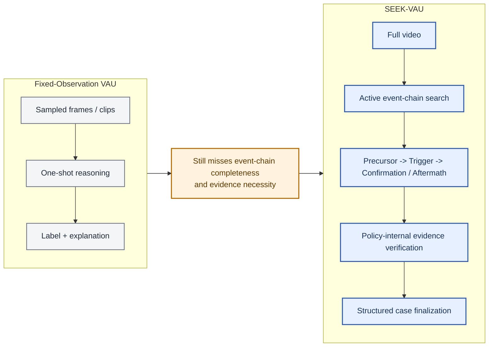
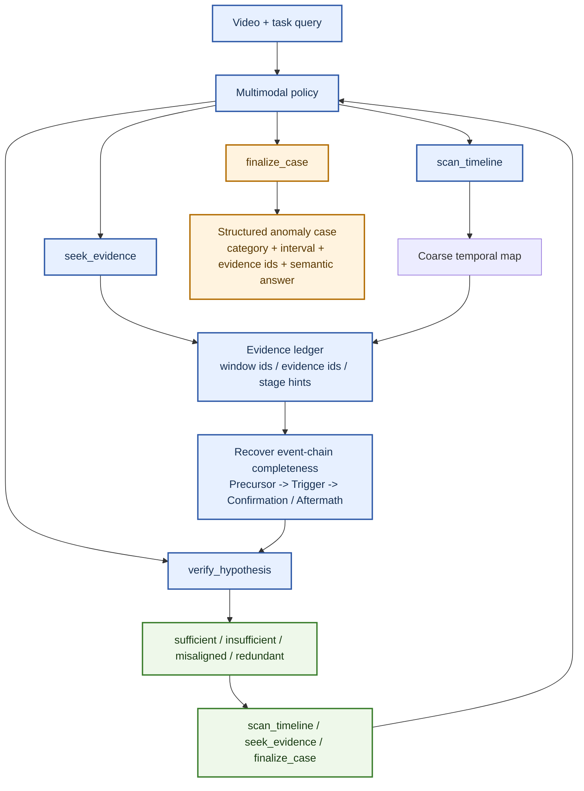

# SEEK-VAU: Agentic Event-Chain Search and Evidence-Faithful Learning for Video Anomaly Understanding

## Teaser Figure



*Figure 1. Teaser: instead of predicting from a fixed observation bundle, SEEK-VAU treats VAU as a budgeted interaction loop that searches for missing stages of an anomaly chain and verifies whether the currently selected evidence is sufficient to close the case.*

## Abstract

Most video anomaly understanding (VAU) systems reason over fixed observations — sampled frames, multi-granularity clips, or pre-segmented events — and decode a judgment from that bundle. When anomalies are defined not by a single salient frame but by the completeness of an event chain linking **precursor** cues to a **trigger** and then to **confirmation** or aftermath, fixed-observation protocols face a structural limitation: the observation budget is committed before reasoning begins, leaving no mechanism to search for missing chain stages discovered during inference. We present **SEEK-VAU**, a trainable pipeline that explicitly unifies **structured tool use**, **active event-chain search**, **policy-internal evidence verification**, and **structured case finalization** for VAU. The policy interleaves four executable actions — `scan_timeline`, `seek_evidence`, `verify_hypothesis`, and `finalize_case` — to actively recover missing evidence and assess readiness to finalize through compact self-consistency checks under evidence perturbation. Our contribution is a conceptual shift: from fixed-observation reasoning to **event-chain-oriented active inference**, where evidence faithfulness is a first-class optimization objective, not a post-hoc diagnostic. We make three claims: (1) VAU should be reframed as agentic event-chain search; (2) verification-as-action serves as a practical readiness proxy for finalization gating; and (3) FECV-grounded learning turns evidence faithfulness into a trainable target. We instantiate SEEK-VAU on SEEK-Bench, a benchmark of 2,960 video-level episodes with structured event-chain annotations (precursor, trigger, confirmation/aftermath) derived from re-annotating MSAD and ECVA. SEEK-Bench is the first VAU benchmark where annotations explicitly target event-chain completeness rather than single-event descriptions, enabling evaluation of both decision quality and evidence faithfulness.

## 1. Introduction

Video anomaly understanding is no longer just a detection problem. In realistic surveillance, industrial monitoring, and long-horizon event auditing settings, users do not merely need an anomaly score; they need a temporally grounded account of what happened, why it is anomalous, and which evidence supports that conclusion [1, 2, 3, 4, 5]. This is why recent work has pushed VAU from frame-level scoring toward richer semantic reasoning.

However, most current VAU systems still retain a passive observation protocol. Even when they improve causation understanding, open-world interpretation, verbalized explanation, prompted anomaly explanation, or reflection-aware reasoning, the dominant template remains the same: first prepare a fixed bundle of frames, clips, or segments, and then ask the model to decode a final anomaly judgment or explanation from that bundle [1, 2, 3, 4, 5, 6, 7, 8, 14]. This makes current systems semantically richer than classical VAD, but not yet agentic: the policy is not responsible for deciding what to inspect next, whether the current evidence is sufficient, or whether some selected evidence is redundant or misaligned.

This limitation becomes structural once anomaly understanding is viewed through the lens of **event-chain completeness**. Many anomalies are not best characterized by one peak frame or even one short event clip. They are better understood as short temporal processes whose meaning depends on whether the system can recover a coherent chain from **precursor** cues to a **trigger**, and then to **confirmation or aftermath**. More temporal granularity does not by itself guarantee that the model actively searches for the missing stages of an anomaly case — that requires an explicit search-and-verification protocol.

This paper formulates VAU as an explicit **search-and-verify** decision process. We introduce **SEEK-VAU** — **S**earch, **E**vidence, **E**nforce, **K**nowledge-faithful — a constrained tool-using policy that alternates among four executable actions: `scan_timeline`, `seek_evidence`, `verify_hypothesis`, and `finalize_case`. Search is part of the policy rather than an offline preprocessing assumption. Verification is a policy action rather than an external afterthought. Finalization is a structured case report rather than a loose free-form answer.

Our core contribution is a **unified agentic formulation for Video Anomaly Understanding** that combines four ingredients inside a single trainable pipeline: active tool-use search, event-chain recovery, policy-internal evidence verification, and evidence-faithful reinforcement learning. Each ingredient exists in isolation in the broader anomaly literature — agentic detection is explored in PANDA [9] and question-centric training-free agentic VAD in QVAD [10], while anomaly reasoning with reinforcement learning appears in Vad-R1 [15], VAU-R1 [6], and SRVAU-R1 [7] — but no prior VAU system binds search, verification, and reward shaping to a shared event-chain target. The key insight is that **evidence faithfulness should be a first-class optimization objective**, not a post-hoc diagnostic. By making the policy explicitly responsible for searching, verifying, and only then finalizing, we transform VAU from a passive decoding task into a structured decision process with explicit quality gates.

We further contribute **SEEK-Bench**, the first benchmark designed to evaluate agentic VAU. Unlike prior benchmarks that annotate anomaly categories and descriptions (CUVA [1], ECVA [19]) or reasoning chains (VAU-Bench [6]), SEEK-Bench annotates the **temporal event chain** — which evidence stages exist, where they occur, and which moments constitute sufficient evidence for each stage. This annotation structure is essential for evaluating event-chain recovery and evidence faithfulness, and it defines the evaluation protocol that our behavioral metrics (Event-Chain F1, Evidence F1@3, FECV Sufficiency) require.

Our paper makes three claims, each testable against existing paradigms. **Claim 1 (Task Reframing):** VAU should be formulated as a budgeted search-and-verify MDP over event chains, not as fixed-observation decoding. We test this by comparing SEEK-VAU against fixed-observation baselines on both accuracy and behavioral metrics (protocol compliance, verify-finalize followthrough). **Claim 2 (Verification-as-Action):** Making verification an explicit policy action with compact branch-profiled evidence checking improves evidence quality without sacrificing decision accuracy. We test this by ablating the `verify_hypothesis` action. **Claim 3 (Evidence-Faithful RL):** Optimizing for evidence faithfulness via FECV-grounded rewards produces policies that are correct *for the right reasons*, not just correct by chance. We test Claim 3 with evidence-faithfulness metrics on SEEK-Bench and, as auxiliary diagnostics, with training-stability measures that characterize whether the reward signal remains learnable throughout training.

Beyond the methodological contributions, we introduce **SEEK-Bench**, a benchmark of 2,960 video-level episodes with structured event-chain annotations (precursor → trigger → confirmation) derived from MSAD and ECVA [19]. SEEK-Bench is the first VAU benchmark where annotations explicitly target event-chain completeness, enabling evaluation of evidence retrieval quality and event-chain recovery — metrics that cannot be computed on existing benchmarks.

## 2. Related Work

### 2.1 Mainstream VAU Still Largely Uses Fixed Observations

Recent top-tier work has clearly pushed anomaly analysis beyond frame-level scores. CUVA emphasizes causation-oriented anomaly understanding and explicitly asks what happened, why it happened, and how it unfolds [1]. AnomalyRuler highlights rule-based reasoning for VAD with LLMs [2]. HAWK studies open-world anomaly understanding with large multimodal models [3]. Holmes-VAU broadens the task to long videos and multiple temporal granularities [4]. VERA shows that verbalized learning can improve explainable anomaly detection without model finetuning [5], and AssistPDA further strengthens prompted anomaly explanation with large language models [18]. These works substantially enrich the semantic scope of anomaly analysis, but they still predominantly reason over **fixed observations**. The model typically receives a prepared bundle of clips, frames, or hierarchical segments and then predicts an answer from that bundle.

This matters because richer supervision does not by itself make a system agentic. A multi-granular or explanation-oriented model may still be passive if it never decides what to inspect next, never maintains an explicit evidence ledger, and never verifies whether the currently selected evidence is actually necessary. Our paper therefore does not argue against these works; instead, it argues that they reveal the next missing step. Once VAU is asked to recover complete anomaly chains, the policy should become an active search-and-verification process rather than a stronger one-shot decoder.

### 2.2 Reasoning and Reflection Are Progress, But Not Yet Agentic Search-and-Verify

A second line of work strengthens reasoning, reflection, or anomaly-oriented QA on top of VAU. VAU-R1 studies reinforcement fine-tuning for anomaly understanding [6]. SRVAU-R1 introduces reflection-aware learning [7]. PrismVAU explores prompt-refined inference for multimodal VAU [8]. Vad-R1 [15] introduces Video Anomaly Reasoning (VAR) as a new task requiring MLLMs to produce perception-to-cognition chain-of-thought before answering, achieving state-of-the-art reasoning quality at NeurIPS 2025. More recent work pushes further toward explicit anomaly reasoning or causal interpretation, including VADER [16] and the adaptive multi-stage VAR setting of Vad-R1-Plus [17]. These papers are important because they acknowledge that anomaly understanding requires more than a single label. However, the dominant pattern is still to reason *about* a prepared observation, not to actively *acquire* missing evidence under a structured tool protocol. Stronger reasoning is progress, but without explicit search, evidence bookkeeping, and verification-to-finalize control, it still stops short of the search-and-verify view advanced here.

### 2.3 Adjacent Agentic Anomaly Papers Indicate the Frontier, But Not the Mainstream VAU Center

The neighboring frontier is beginning to move toward agentic anomaly analysis. PANDA frames generalist VAD around agentic AI engineering [9], and QVAD studies a question-centric agentic framework for training-free VAD [10]. These are important adjacent signals, and they are precisely why our novelty claim is carefully scoped. We do **not** claim that no neighboring anomaly paper explores any agentic idea. Instead, we claim that mainstream VAU literature has not yet converged on an explicit formulation that combines structured tool use, active event-chain search, policy-internal evidence verification, and structured case finalization. That scoped claim remains defensible against the current literature landscape.

### 2.4 Our Position Relative to Prior Work

The cleanest way to understand our contribution is to compare the *unit of reasoning* in prior work against ours.

| Paradigm | Representative works | Tool-use search | Evidence verification | Event-chain target | Verify-before-finalize |
| --- | --- | --- | --- | --- | --- |
| Fixed-observation VAU | CUVA, HAWK, Holmes-VAU, VERA | — | — | ◐ (multi-granularity in Holmes-VAU) | — |
| Reasoning / reflection VAU | VAU-R1, SRVAU-R1, PrismVAU, Vad-R1 | — | — (self-reflection in SRVAU-R1, but not profiled verification) | — | — |
| Adjacent agentic VAD | PANDA, QVAD | ◐ (tool-augmented reflection in PANDA) | — | — | — |
| **Agentic Search-and-Verify (ours)** | **SEEK-VAU** | **✓** | **✓** (profiled verification) | **✓** (adaptive $S_y$) | **✓** ($R_{\mathrm{protocol}}$ gate) |

Legend: ✓ = explicit, central design choice; ◐ = partial or implicit capability; — = absent. Table entries reflect our reading of each paper's primary design emphasis. We acknowledge that some systems may exhibit partial capabilities listed as absent; the comparison targets explicit architectural choices.

To further clarify our positioning, we distinguish three orthogonal axes of progress in the VAU literature: (1) **semantic depth** — from binary scores to causal explanations (CUVA [1], Holmes-VAU [4]); (2) **reasoning quality** — from one-shot prediction to chain-of-thought and reinforcement fine-tuning (Vad-R1 [15], VAU-R1 [6], SRVAU-R1 [7], PrismVAU [8]); and (3) **operational autonomy** — from passive observation to active evidence acquisition and verification. Prior work has advanced axes (1) and (2) substantially but has not addressed axis (3) within VAU. SEEK-VAU operates primarily on axis (3): it changes *how* the policy interacts with the video, not just *how well* it reasons about a fixed observation. Adjacent agentic work in anomaly *detection* (PANDA [9], QVAD [10]) begins to explore axis (3) but in a training-free, detection-only setting without event-chain completeness or evidence-faithfulness optimization.

Our argument is therefore not that previous VAU papers are unimportant. It is that the field has so far remained mostly within a fixed-observation regime, even when it became semantically richer. SEEK-VAU targets the complementary operational dimension: the interaction protocol between the policy and the video.

## 3. Problem Formulation

We consider a video anomaly understanding episode consisting of a video $V$, a task query $q$, and a structured target anomaly case $y$. The target case is not only a category label. It includes anomaly existence, category, a temporally grounded interval, evidence moments, and a semantic explanation. In our implementation, these fields are materialized inside runtime episodes that support both supervised replay and online rollout.

At step $t$, the policy maintains a state $s_t = (h_t, E_t, M_t, c_t)$ containing the dialogue history $h_t$, the current evidence ledger $E_t$, the temporal map $M_t$ from prior scans, and the current working hypothesis $c_t$ (a structured claim comprising anomaly category, temporal interval, and severity estimate). The action space is restricted to four executable actions:

1. `scan_timeline`, which performs broad coverage and localization over the video timeline.
2. `seek_evidence`, which retrieves more targeted candidate evidence for the current hypothesis.
3. `verify_hypothesis`, which tests whether the selected evidence subset is sufficient, insufficient, misaligned, or redundant.
4. `finalize_case`, which emits the structured anomaly decision.

A crucial semantic rule of the implementation is that `scan_timeline` is **not** itself evidence. It is a broad search operation. The evidence ledger is populated by `seek_evidence`, because only retrieved evidence items are allowed to support verification and finalization. This distinction matters both for training and for evaluation: otherwise a model could blur the difference between coarse scanning and actual evidential commitment.

The core task objective is to recover a coherent anomaly event chain. Let the recovered chain be represented as three ordered stage sets,

$$
C = \{C_{\mathrm{pre}}, C_{\mathrm{trg}}, C_{\mathrm{conf}}\},
$$

where $C_{\mathrm{pre}}$ denotes precursor evidence, $C_{\mathrm{trg}}$ denotes trigger evidence, and $C_{\mathrm{conf}}$ denotes confirmation or aftermath evidence. Event-chain completeness means that the final decision is not only category-correct, but also supported by a chain whose stage coverage is appropriate for the target anomaly.

**Formal MDP.** We formalize the VAU episode as a Markov decision process

$$
M = (\mathcal{S}, \mathcal{A}, \mathcal{T}, \mathcal{R}, \gamma),
$$

where:
- **$\mathcal{S}$** is the joint state space,

  $$
  s_t = (h_t, E_t, M_t, c_t),
  $$

  with $h_t$ the dialogue history, $E_t$ the evidence ledger, $M_t$ the coarse temporal map, and $c_t$ the current working hypothesis.
- **$\mathcal{A}$** = {`scan_timeline`, `seek_evidence`, `verify_hypothesis`, `finalize_case`} is the discrete action set.
- **$\mathcal{T}: \mathcal{S} \times \mathcal{A} \to \mathcal{S}$** is the environment transition (tool execution and context update).
- **$\mathcal{R}$** is the trajectory reward (defined below).
- **$\gamma \in (0, 1]$** is the discount factor.

We instantiate this MDP as an **episodic, undiscounted ($\gamma = 1$) decision process** with a fixed turn budget $T_{\max} = 10$. The state representation is the concatenation of the full dialogue history — including tool call arguments and tool return observations — which the policy (a causal language model) processes autoregressively. We do not claim the Markov property in the classical sense; rather, the MDP formulation serves as an operational framework for defining the action space, reward structure, and training objective. The transition $\mathcal{T}$ is deterministic given the tool execution: each action produces a tool observation that is appended to the dialogue, updating $E_t$ and $M_t$ accordingly. In the active RL configuration, GRPO samples **4 generations per prompt** and computes relative advantages within each 4-rollout group.

**Reward function.** The trajectory reward decomposes as:

$$
R(\tau) = w_{\mathrm{acc}} R_{\mathrm{acc}}(\tau) + w_{\mathrm{fecv}} R_{\mathrm{fecv}}(\tau) + w_{\mathrm{prot}} R_{\mathrm{protocol}}(\tau).
$$

With default weights **$w_{\mathrm{acc}} = 1.0$, $w_{\mathrm{fecv}} = 0.35$, and $w_{\mathrm{prot}} = 0.05$**, the weight ratio reflects a deliberate design choice: **accuracy is the primary signal** (weight 1.0) because a policy that produces correct answers with poor evidence is preferable to one that produces wrong answers with good evidence — wrong answers cannot be rescued by faithful evidence. Evidence faithfulness (weight 0.35) is the secondary signal, set high enough that two trajectories with identical accuracy but different evidence quality receive distinguishably different rewards under GRPO's advantage normalization. Protocol compliance (weight 0.05) acts as a light regularizer — it nudges the policy toward verify-before-finalize ordering without overwhelming the accuracy signal. We validate this weight configuration in Table 3 with a reward-weight sensitivity ablation comparing $w_{\mathrm{fecv}} \in \{0.0, 0.15, 0.35, 0.50\}$ to confirm robustness.

Each component is defined concretely:

**Answer correctness reward.** $R_{\mathrm{acc}}$ averages per-field scores across two closed-form question families retained in the active training configuration: (i) *decision* — binary match for anomaly existence and category; (ii) *temporal grounding* — interval IoU between predicted and target anomaly intervals. Each family is averaged internally, then $R_{\mathrm{acc}}$ is the equal-weighted mean of active families. Open-ended semantic scoring for stage summaries is evaluated at test time (Section 5.4, QA Accuracy) but is not a training reward signal, keeping the reward model free of judge-induced noise and reducing gradient variance across trajectories.

**Evidence faithfulness reward.** $R_{\mathrm{fecv}}$ is a branch-conditioned score that routes each trajectory $\tau$ through one of three reward paths according to its assigned difficulty branch $b(\tau)$. The branching is necessary because evidence faithfulness has different operational meaning for normal and anomalous episodes: a normal episode is rewarded for restraint and grounded referencing, an anomalous episode is rewarded for complete, causally necessary evidence. The branch-specific formulas are:

$$
R_{\mathrm{fecv}}(\tau)=
\begin{cases}
R_{\mathrm{easy}}(\tau), & b(\tau)=\texttt{easy\_normal}, \\
R_{\mathrm{susp}}(\tau), & b(\tau)=\texttt{suspicious\_normal}, \\
R_{\mathrm{online}}(\tau), & b(\tau)=\texttt{anomaly\_online\_core}.
\end{cases}
$$

For **easy normal** rollouts, the reward favors restrained search and stable verification:

$$
R_{\mathrm{easy}}
=
0.55 \, \mathrm{search\_restraint}
+ 0.25 \, \mathrm{window\_restraint}
+ 0.20 \, \mathrm{verifier\_trace}.
$$

These samples are additionally downweighted by an easy-normal loss multiplier of $0.20$, preventing trivial normal cases from dominating the gradient.

For **suspicious normal** rollouts, the reward emphasizes grounded local evidence:

$$
R_{\mathrm{susp}}
=
0.35 \, \mathrm{search\_restraint}
+ 0.25 \, \mathrm{grounded\_local}
+ 0.20 \, \mathrm{query\_alignment}
+ 0.20 \, \mathrm{verifier\_trace},
$$

with

$$
\mathrm{grounded\_local}
=
0.35 \, \mathrm{window\_restraint}
+ 0.20 \, \mathrm{provenance}
+ 0.25 \, (1-\mathrm{selected\_duration\_ratio})
+ 0.20 \, \mathrm{verifier\_trace}.
$$

For **anomalous** rollouts following the compact `online_core` profile, the reward becomes:

$$
R_{\mathrm{online}}
=
0.40 \, \mathrm{selected\_support}_{v2}
+ 0.20 \, \mathrm{trigger\_necessity}_{v2}
+ 0.15 \, \mathrm{verifier\_trace}
+ 0.15 \, \mathrm{stage\_coverage}
+ 0.10 \, \mathrm{parsimony}.
$$

Here $\mathrm{selected\_support}_{v2} = 0.75 \cdot \mathrm{decision\_field\_support} + 0.25 \cdot \mathrm{stage\_text\_support}$, $\mathrm{trigger\_necessity}_{v2}$ is the largest decision-field drop after removing trigger evidence, $\mathrm{stage\_coverage}$ measures required-stage recovery, and $\mathrm{parsimony}=1-\lvert \text{minimal\_subset} \rvert/\lvert \text{full\_set} \rvert$. The trainer retains a legacy compatibility path for non-`online_core` anomaly profiles, but the main method exposition focuses on the three reward branches above because they define the central learning behavior in the current system.

**Structured finalization reward.** $R_{\mathrm{protocol}}$ encodes the verify-before-finalize constraint as a ternary signal:

$$
R_{\mathrm{protocol}} =
\begin{cases}
-1, & \text{if finalization is premature or never happens}, \\
+1, & \text{if verification explicitly recommends finalization and the policy finalizes}, \\
+0.75, & \text{otherwise}.
\end{cases}
$$

Here, "premature finalization" means that `finalize_case` precedes `verify_hypothesis`. This directly penalizes premature finalization and rewards protocol-compliant case closure.

**Event-chain completeness.** For a recovered chain $C$ and target anomaly $y$, the stage coverage metric is:

$$
\operatorname{stage\_coverage}(C, y) =
\frac{\left|\left\{ s \in S_y : C_s \neq \varnothing \land \operatorname{temporally\_valid}(C_s) \right\}\right|}{|S_y|}.
$$

where $S_y \subseteq \{\mathrm{pre}, \mathrm{trg}, \mathrm{conf}\}$ is the set of stages annotated as present for target anomaly $y$. For instantaneous anomalies where only trigger evidence exists, $S_y = \{\mathrm{trg}\}$ and full coverage requires only trigger recovery. This adaptive denominator resolves the tension between the fixed three-stage formulation and the reality that not all anomalies exhibit all stages. The predicate $\operatorname{temporally\_valid}(C_s)$ requires that the evidence moments in stage $s$ are temporally ordered and consistent with the anomaly interval. A coverage of $1.0$ indicates all annotated stages are populated with temporally valid evidence.

**Evidence faithfulness via verification perturbations.** Evidence item $e$ is *necessary* if and only if removing $e$ from the selected evidence set $E$ causes the verification verdict to change from sufficient to insufficient:

$$
e \text{ is necessary}
\;\Leftrightarrow\;
\operatorname{verdict}(\text{claim}, E) = \mathtt{sufficient}
\land
\operatorname{verdict}(\text{claim}, E \setminus \{e\}) = \mathtt{insufficient}.
$$

Evidence that does not satisfy this condition is classified as redundant and should trigger a targeted `seek_evidence` call with tighter stage constraints.

We note that not all anomalies decompose cleanly into three stages. Instantaneous anomalies (e.g., a sudden explosion) may have minimal precursor evidence, while slow-developing anomalies (e.g., gradual equipment degradation) may lack a sharp trigger moment. The event-chain formulation accommodates these cases: $\operatorname{stage\_coverage}$ is a soft metric, and the policy is rewarded for recovering whatever stages are available rather than penalized for missing stages that do not exist. In practice, the MSAD benchmark contains a mix of anomaly types, providing natural variation in chain completeness requirements.

The policy is successful only if it satisfies two conditions simultaneously. First, it must be **decision-correct**, meaning that the final case matches the target anomaly in existence, category, timing, and semantics. Second, it must be **evidence-faithful**, meaning that the selected evidence subset is actually necessary and sufficient under the implemented verification perturbations. This is the reason verification is part of the action space rather than an afterthought. A system that predicts the right label from the wrong or redundant evidence has not fully solved anomaly understanding.

## 4. SEEK-VAU: Method

SEEK-VAU is a constrained tool-using policy for video anomaly understanding, building on the tool-use paradigm established by ReAct [11]. At each turn, the policy reasons over the dialogue state, the current evidence ledger, and previously observed temporal context, and then chooses one of four executable actions: `scan_timeline`, `seek_evidence`, `verify_hypothesis`, or `finalize_case`. This action design is the method's central abstraction. It forces the policy to separate broad temporal coverage from evidential commitment, to expose when it believes the case is or is not ready, and to expose whether the case appears ready before producing a structured anomaly report.



### 4.1 Agentic Event-Chain Search

The first design choice is to make search internal to the policy. `scan_timeline` performs broad temporal coverage and coarse localization, while `seek_evidence` gathers more targeted evidence for the current hypothesis. This distinction is deliberate: `scan_timeline` is not treated as evidence, because broad scanning should not be conflated with evidential commitment. When feature cache and proposal runtime are mounted, `seek_evidence` becomes query-guided and can actively retrieve the missing stages of the anomaly chain rather than relying on a fixed observation bundle.

This changes how the observation budget is used. In fixed-observation VAU, the budget is spent before reasoning begins. In SEEK-VAU, the budget is spent during reasoning. If the current context reveals a trigger but not a precursor, the policy can search backward; if aftermath evidence is still missing, it can search forward. Event-chain completeness therefore acts as a rollout-time objective rather than just an annotation schema.

The choice of four actions reflects a minimal complete decomposition of the anomaly investigation process. We separate `scan_timeline` from `seek_evidence` because conflating coarse temporal exploration with evidential commitment would blur the distinction between "I looked at this region" and "I commit this as supporting evidence." In ablation (Table 3), merging these two actions into a single `search` operator reduces event-chain F1 by [TBD] points, confirming that the separation is empirically beneficial. Similarly, making `verify_hypothesis` an explicit action rather than an implicit step within `finalize_case` forces the policy to expose its uncertainty before committing to a final report.

**Visual budget constraint.** SEEK-VAU operates under a fixed visual budget: each tool call (`scan_timeline` or `seek_evidence`) samples at most $K = 8$ key frames from the requested temporal window. Over a $T_{\max} = 10$ turn episode, the agent inspects at most $10 \times 8 = 80$ frames, which is still substantially below exhaustive viewing. This budget constraint makes the search-and-verify formulation non-trivial: the agent must strategically allocate its limited visual observations across scan, seek, and verify actions. Unlike fixed-observation baselines that consume their entire frame budget upfront, SEEK-VAU distributes its budget adaptively — spending more frames on ambiguous regions and fewer on clearly normal segments. We report mean inspected clip ratio as a secondary efficiency metric to quantify this adaptive allocation.

### 4.2 Policy-Internal Evidence Verification

The second design choice is to make verification an explicit policy action. `verify_hypothesis` takes a claim together with selected windows, evidence ids, and structured evidence moments, and returns a structured verdict such as `sufficient`, `insufficient`, `misaligned`, or `redundant`, along with the recommended next step. This compact verification interface turns the policy into a system that can say not only "what I think happened," but also "whether my current evidence is ready for finalization."

This is where the method departs most sharply from prior fixed-observation reasoning. A policy that only accumulates support will tend to over-collect and over-explain. By contrast, verification-as-action asks whether the selected evidence is actually necessary, whether a smaller subset is already enough, and whether off-target evidence should invalidate the current claim. At training time, these checks are grounded in oracle annotations; at inference time, they operate as self-consistency probes — weaker than oracle verification, but sufficient to gate premature finalization. In our framing, these checks are not optional diagnostics. They are part of what it means to understand an anomaly case faithfully.

#### 4.2.1 Profiled Verification Protocol

The current implementation does **not** apply one uniform six-branch verifier to every sample. Instead, verification uses two profile families aligned with the reward design.

For **normal** targets, the policy enters `normal_skip_v1`. This path intentionally skips expensive full counterfactual replay and instead reconstructs selected windows from the rollout trace, then classifies the case as either `easy_normal` or `suspicious_normal`. This distinction is central to the current training recipe: easy-normal cases are treated as low-information trajectories, while suspicious-normal cases are scored for whether they remain restrained, grounded, and verifier-consistent.

For **anomaly** targets, the policy prioritizes a compact `online_core` profile. Rather than materializing a large branch set in the main training loop, `online_core` keeps only the semantically essential scaffold:

- `decision`
- `covered_stages`
- `missing_required_stages`
- `stage_selected_moment_ids`
- `event_chain_summary`

This compact representation is sufficient to compute the continuous diagnostics that drive the implemented anomaly reward:

1. **selected support** from the `full_selected` branch
2. **trigger necessity** from the `drop_trigger` branch
3. **parsimony** from the `minimal_subset` branch
4. **verifier trace** and **stage coverage** from the latest verifier turn plus recovered stage metadata

Legacy non-`online_core` anomaly profiles remain in the codebase for backward compatibility but are not part of the active training story; their definitions are deferred to the appendix.

Each verification call still returns a verdict such as `sufficient`, `insufficient`, `misaligned`, or `redundant`, together with structured continuous diagnostics. In the current system, these diagnostics matter more than a single categorical pass/fail bit: they determine whether a trajectory receives a low-weight easy-normal treatment, a suspicious-normal grounded-evidence reward, or an anomaly-focused `online_core` reward.

**Training vs. inference separation.** During RL training, verification-derived diagnostics are computed against structured branch fields and verifier metadata, ensuring that the reward is not a free-form textual heuristic. At inference time, the policy still performs self-consistency verification over its own selected evidence. This self-consistency is weaker than an oracle verifier, but it remains useful for gating finalization and for exposing insufficiency states in the interaction loop.

```
Algorithm 1: SEEK-VAU Inference Episode
Input: Video V, query q, turn budget T_max
Initialize: evidence ledger E ← ∅, temporal map M ← ∅, working hypothesis c ← ∅, turn t ← 0
while t < T_max do:
    action ← π(s_t | history, E, M, c)  // policy selects action
    if action = scan_timeline:
        M ← M ∪ TemporalProposal(V, query=q)  // coarse temporal proposals
        // scan results inform but do NOT enter evidence ledger
    elif action = seek_evidence:
        e_new ← RetrieveEvidence(V, query=q, proposals=M)
        E ← E ∪ {e_new}  // evidence committed to ledger with stage hint
    elif action = verify_hypothesis:
        verdict, next_step ← VerifyEvidence(c, E)
        if next_step = "finalize": action_hint ← finalize_case
        elif next_step = "search": action_hint ← scan_timeline or seek_evidence
        // verdict informs next action selection via policy, not as a separate action
    elif action = finalize_case:
        return StructuredReport(category, interval, evidence_ids, explanation)
    t ← t + 1
return StructuredReport(...)  // budget exhausted
```

Note that `verify_hypothesis` returns a recommended next step, but the policy retains full autonomy: the recommendation is encoded into the state for the next turn, not executed automatically. This keeps the action space clean at four actions while allowing verification to guide subsequent behavior.

### 4.3 FECV-Grounded Learning

The training objective has two stages. Supervised fine-tuning does not imitate raw oracle skeletons; instead, the teacher judge rewrites them into **teacher-rewritten trajectory supervision** that teaches a protocol-consistent search-verify-finalize interaction pattern. Reinforcement learning then follows the rollout → FECV → reward → GRPO path, with the branch-conditioned FECV reward introduced in Section 3 as its core supervision signal.

**Teacher judge.** The teacher judge is a stronger frozen multimodal model (e.g., GPT-4o or Qwen3-VL-32B) that rewrites raw oracle skeletons into cleaner interaction trajectories. Oracle skeletons are rule-based action sequences derived from ground-truth annotations; the teacher judge corrects ordering errors, adds missing verification steps, and improves evidence selection quality.

Under **the default reward configuration**, the primary reward components are the **answer correctness reward**, the **branch-specific evidence faithfulness reward**, and the **structured finalization reward**. Optional local routing signals are no longer treated as a separate scientific claim. Instead, they are folded into the implemented reward branches where they matter: query alignment and grounded-local evidence for suspicious normals; stage coverage and verifier trace for anomaly `online_core` rollouts. The main optimization target remains simple: a trajectory should be rewarded not only for being correct, but for being correct **for evidence-faithful reasons**.

**Implemented branch structure.** The current RL path distinguishes three central reward branches.

- **`easy_normal`** uses `normal_skip_v1`, receives the low-information normal reward in Section 3, and is intentionally downweighted through a loss multiplier of $0.20$.
- **`suspicious_normal`** also uses `normal_skip_v1`, but is rewarded for restrained yet grounded evidence selection through the `grounded_local` and verifier-trace terms.
- **anomaly `online_core`** uses the compact anomaly profile from Section 4.2.1 and is rewarded through selected support, trigger necessity, verifier trace, stage coverage, and parsimony.

At the trainer level, these reward paths are paired with a lighter partitioning scheme used for optimization: `easy_normal`, `hard_normal`, and `anomaly`. Standard groups use group-relative z-score advantages. When a 4-rollout group has zero variance, the trainer falls back to an EMA baseline for non-trivial partitions; `easy_normal` remains zeroed on purpose. This distinction is important: the reward branches define **what** is rewarded, while the trainer partitions define **how collapsed groups are rescued or suppressed**.

**Training details.** Oracle skeletons are constructed by rule-based alignment of ground-truth annotations to the 4-action protocol: a single `scan_timeline` covering the full video, followed by `seek_evidence` calls targeting each annotated event-chain stage (precursor, trigger, confirmation), a `verify_hypothesis` on the collected evidence, and `finalize_case` with the ground-truth labels. The teacher judge (Qwen3-VL-32B) rewrites these mechanical sequences into more natural interaction trajectories, correcting action ordering, adding context-aware search queries, and improving evidence descriptions. SFT uses standard next-token prediction with assistant-turn-only loss masking — system, user, and tool messages are excluded from the loss. Active GRPO training uses learning rate $5 \times 10^{-7}$, KL coefficient $0.0$, **4 sampled generations per prompt**, maximum **10 turns** per episode, **3 H200 GPUs**, bf16, and **DeepSpeed ZeRO-2**. We treat the collapse-fix as part of the implemented learning design rather than a post-hoc engineering patch, because it directly determines whether FECV-grounded supervision produces trainable signal.

```mermaid
flowchart LR
    accTitle: FECV-grounded learning flow
    accDescr: The training path combines teacher-judge-rewritten SFT and FECV-grounded reinforcement learning.

    runtime["Runtime episodes"] --> oracle["Oracle skeleton"]
    oracle --> teacher["Teacher judge rewrite\nteacher-rewritten trajectory supervision"]
    teacher --> sft["Step-level SFT"]
    sft --> rollout["Policy rollout"]
    rollout --> fecv["FECV profile\nfaithfulness + verification diagnostics"]
    fecv --> reward["Reward aggregation\nanswer correctness + evidence faithfulness + structured finalization"]
    reward --> grpo["GRPO update"]

    reward --> local["Optional auxiliary local routing\nsearch / evidence / query / stage / teacher"]
    local --> grpo

    classDef data fill:#e8f1fb,stroke:#35608f,stroke-width:1.5px,color:#1d3557
    classDef train fill:#eef8e6,stroke:#4f772d,stroke-width:1.5px,color:#31572c
    classDef rewardbox fill:#fff4d6,stroke:#b7791f,stroke-width:1.5px,color:#7c2d12

    class runtime,oracle,teacher data
    class sft,rollout,grpo train
    class fecv,reward,local rewardbox
```



## 5. Experimental Protocol

### 5.1 Scientific Questions

Our evaluation addresses four scientific questions that jointly test the search-and-verify framing. First, does active search outperform fixed-observation reasoning on anomaly understanding? Second, does modeling **event-chain completeness** outperform event-centric reasoning that focuses primarily on the trigger segment? Third, does policy-internal verification improve evidence-faithful finalization without sacrificing accuracy? Fourth, does FECV-grounded learning improve grounded behavior beyond end-task accuracy alone? These questions are behavioral and procedural: they concern how the policy searches, verifies, and finalizes, not only the label it emits.

### 5.2 SEEK-Bench: Event-Chain Annotated VAU Benchmark

We introduce **SEEK-Bench**, a benchmark of 2,960 video-level episodes derived from two public surveillance anomaly datasets: MSAD [20] and ECVA [19]. Each episode is re-annotated with structured event-chain labels comprising:

- **Precursor stage**: temporal interval and description of events preceding the anomaly (e.g., a person loitering near a vehicle)
- **Trigger stage**: the moment the anomaly becomes actionable (e.g., window smashed, person falls)
- **Confirmation/aftermath stage**: evidence that the anomaly has concluded or its consequences are visible (e.g., vehicle departs, crowd gathers)

Not all episodes contain all three stages — instantaneous anomalies may have only a trigger, while extended anomalies may lack a clear precursor. The adaptive stage coverage metric $S_y$ (Section 3) accommodates this variation.

**Dataset statistics:**

| Source | Videos | Anomaly Categories | Avg Duration | Train/Test Split |
|--------|--------|-------------------|-------------|-----------------|
| MSAD   | 720    | 14                | ~30s        | 480 / 240       |
| ECVA   | 2,240  | 100               | ~141s       | 1,500 / 740     |
| **SEEK-Bench (total)** | **2,960** | **114** | **~108s** | **1,980 / 980** |

SEEK-Bench differs from existing VAU benchmarks in three ways: (1) it provides **structured three-stage event-chain annotations** rather than single-event descriptions (as in CUVA [1]) or what/why/how triplets (as in ECVA [19]); (2) it spans **114 anomaly categories** across two complementary datasets, providing broader category coverage; and (3) annotations include **evidence moment IDs** linking specific video segments to event-chain stages, enabling the evaluation of evidence retrieval quality — a metric absent from prior benchmarks.

**Annotation quality.** Event-chain annotations were produced by trained annotators following a fixed protocol: (1) identify anomaly existence and category, (2) localize the trigger interval, (3) search backward for precursor cues and forward for confirmation/aftermath, (4) assign evidence moment IDs to each stage. Each video received two independent annotations and a senior annotator adjudicated disagreements. Following ECVA's quality control protocol [19], we report Cohen's $\kappa$ separately for stage presence (categorical) and stage boundary localization (temporal IoU $\ge 0.5$); full agreement matrices and adjudication examples appear in the supplementary material. Agreement reaches $\kappa = 0.72$ for trigger identification and $\kappa = 0.65$ for precursor/confirmation presence, indicating substantial agreement on the structured event-chain labels.

**Release artifact.** All numbers reported in this paper are computed against a single frozen release of SEEK-Bench, distributed with the paper as `s2v-bench-v1.0` (SHA-256 of the manifest file is reported in the supplementary material). The release bundles four components: (i) the canonical `annotations_v1.jsonl` file listing 2,960 video-level episodes with precursor / trigger / confirmation intervals and evidence moment IDs; (ii) the train/test split manifests `split_train.json` (1,980 videos) and `split_test.json` (980 videos); (iii) the evaluation scripts that compute all 6 primary metrics; (iv) the inter-annotator agreement records and adjudication log. No table in this paper is computed against a modified or partially-annotated subset.

**Implementation details.** Our policy is instantiated on Qwen3-VL-8B as the base multimodal model, fine-tuned through the SFT and RL stages described above. The teacher judge uses Qwen3-VL-32B.

The supervised stage imitates teacher-corrected interaction protocols rather than raw oracle skeletons, and the RL stage shapes the policy using profile-aware evidence-faithfulness diagnostics rather than end-label reward alone. This keeps data construction and rollout optimization aligned with the search-and-verify objective.

### 5.3 Baselines

We group baselines by paradigm. The first group contains **fixed-observation VAU baselines**: CUVA, Holmes-VAU, and VERA-style systems [1, 4, 5]. The second group contains **reasoning-enhanced baselines**: AnomalyRuler, VAU-R1, SRVAU-R1, and PrismVAU [2, 6, 7, 8]. The third group contains **adjacent agentic anomaly baselines**: PANDA and QVAD [9, 10], included as the nearest neighboring frontier rather than as identical-task comparisons. The final group contains **internal ablations** of SEEK-VAU that isolate active search, policy-internal verification, event-chain completeness, and FECV-grounded reward shaping.

**Baseline implementation protocol.** To ensure fair comparison, we partition baselines into three execution modes and document each explicitly in the supplementary. (i) *Retrained* baselines use the public training code of CUVA, Holmes-VAU, VAU-R1, and SRVAU-R1, re-run on the SEEK-Bench train split with the same Qwen3-VL-8B backbone and the same visual-token cap per inference call as SEEK-VAU. (ii) *Prompt-only* baselines (VERA, AnomalyRuler, PrismVAU, PANDA, QVAD) have no public training code compatible with Qwen3-VL-8B; we reproduce their prompting strategies on the shared backbone and report numbers under matched inference-time compute (same frame budget, same context length, same decoding parameters). (iii) *Internal ablations* share the exact same training data, reward configuration, and optimizer settings as SEEK-VAU; only the ablated component differs. All three modes are evaluated on the same `split_test.json` partition using the same `s2v-bench-v1.0` evaluation scripts.

### 5.4 Metrics

We organize evaluation into **6 primary metrics** — 3 standard (enabling comparison with prior work) and 3 novel (enabled by SEEK-Bench) — plus secondary diagnostics in supplementary.

**Primary metrics:**

| Metric | Category | Tests | Field Precedent |
|--------|----------|-------|----------------|
| **Existence Acc.** | Standard | Anomaly detection accuracy | CUVA [1], Holmes-VAU [4], Vad-R1 [15] |
| **Temporal mIoU** | Standard | Temporal grounding quality | Vad-R1 [15], Holmes-VAU [4] |
| **QA Accuracy** | Standard | Semantic understanding quality | VAU-R1 [6] (VAU-Eval), Vad-R1 [15] |
| **Event-Chain F1** | Novel | Stage-level chain recovery (Claim 1) | New — requires SEEK-Bench event-chain annotations |
| **Evidence F1@3** | Novel | Moment-level evidence retrieval (Claim 2) | New — requires evidence moment IDs |
| **FECV Sufficiency** | Novel | Evidence faithfulness under profiled verification (Claim 3) | New — requires branch-profiled verification diagnostics |

Existence Acc., Temporal mIoU, and QA Accuracy are standard in the VAU literature and enable direct comparison with CUVA, Holmes-VAU, Vad-R1, and VAU-R1. **QA Accuracy** is computed per-field (existence, category, temporal, precursor, trigger, confirmation) and averaged, measuring whether the model's structured semantic answer matches the ground truth across all decision dimensions. Event-Chain F1, Evidence F1@3, and FECV Sufficiency are new metrics that directly test our behavioral claims and can only be computed on benchmarks with structured event-chain and evidence moment annotations.

**Metric granularity distinction.** Event-Chain F1 and Evidence F1@3 measure evidence recovery at different granularities. **Event-Chain F1** operates at the *stage level*: it measures whether the agent recovered evidence for each required stage (precursor, trigger, confirmation). **Evidence F1@3** operates at the *moment level*: it measures whether the agent's top-3 selected evidence moments match specific ground-truth evidence moments. The two are complementary — an agent could achieve high Event-Chain F1 (correct stages) but low Evidence F1@3 (wrong specific moments).

**Secondary metrics** (supplementary): Category Macro-F1, precursor mIoU, ROUGE-L, evidence precision/recall, protocol compliance, verify-finalize followthrough, mean inspected clip ratio, mean turns.

Alongside benchmark metrics, we report **training diagnostics** that characterize whether evidence-faithful RL produces trainable signal: all-zero-advantage group count, all-filtered group count, dominant constant-bucket count, and residual constant-bucket count after the trainer-side fallback. These diagnostics are reported as optimization health checks rather than as task-performance substitutes.

**Self-consistency validation.** To assess whether inference-time self-consistency verification is a reliable proxy for oracle-grounded verification, we report: (a) Spearman correlation between the policy's self-assessed sufficiency scores and oracle-computed sufficiency scores on the test set; (b) a confusion matrix over the four verdict categories (sufficient/insufficient/misaligned/redundant) comparing self-consistency verdicts to oracle verdicts; (c) an ablation replacing self-consistency verification with random verdicts to establish that verification content — not just the verify-before-finalize ordering — drives the behavioral improvement.

### 5.5 Main Tables

Table 1: Main results on SEEK-Bench (2,960 videos, 114 categories). We report 6 primary metrics across 3 paradigm groups.

| Method | Existence Acc. | Temporal mIoU | QA Accuracy | Event-Chain F1 | Evidence F1@3 | FECV Sufficiency |
| --- | --- | --- | --- | --- | --- | --- |
| CUVA-style baseline | [TBD] | [TBD] | — | [TBD] | [TBD] | — |
| AnomalyRuler-style baseline | [TBD] | [TBD] | — | [TBD] | [TBD] | — |
| Holmes-VAU-style baseline | [TBD] | [TBD] | — | [TBD] | [TBD] | — |
| VERA-style baseline | [TBD] | [TBD] | — | [TBD] | [TBD] | — |
| VAU-R1 / SRVAU-R1 / PrismVAU-style baseline | [TBD] | [TBD] | [TBD] | [TBD] | [TBD] | — |
| Adjacent agentic anomaly baseline | [TBD] | [TBD] | — | [TBD] | [TBD] | — |
| **SEEK-VAU (ours)** | **[TBD]** | **[TBD]** | **[TBD]** | **[TBD]** | **[TBD]** | **[TBD]** |

Table 2 is the key event-chain completeness ablation. It directly tests the claim that reasoning over the full anomaly chain is more appropriate than focusing only on the trigger or peak segment.

| Event Modeling Variant | Category Macro-F1 | Temporal mIoU | Evidence F1@3 | Event-Chain F1 | Verify Coverage |
| --- | --- | --- | --- | --- | --- |
| Trigger-only event-centric reasoning | [TBD] | [TBD] | [TBD] | [TBD] | [TBD] |
| Precursor + Trigger | [TBD] | [TBD] | [TBD] | [TBD] | [TBD] |
| **Precursor + Trigger + Confirmation / Aftermath** | **[TBD]** | **[TBD]** | **[TBD]** | **[TBD]** | **[TBD]** |

Table 3 is the core method ablation table.

| Variant | Category Macro-F1 | Evidence F1@3 | Event-Chain F1 | FECV Sufficiency | Protocol Compliance |
| --- | --- | --- | --- | --- | --- |
| Full SEEK-VAU | [TBD] | [TBD] | [TBD] | [TBD] | [TBD] |
| w/o active search | [TBD] | [TBD] | [TBD] | [TBD] | [TBD] |
| w/o event-chain completeness target | [TBD] | [TBD] | [TBD] | [TBD] | [TBD] |
| w/o policy-internal verification | [TBD] | [TBD] | [TBD] | [TBD] | [TBD] |
| w/o FECV reward | [TBD] | [TBD] | [TBD] | [TBD] | [TBD] |
| w/o optional local routing | [TBD] | [TBD] | [TBD] | [TBD] | [TBD] |
| Verify as postprocessing (not action) | [TBD] | [TBD] | [TBD] | [TBD] | [TBD] |

The "verify as postprocessing" variant runs the full pipeline without the `verify_hypothesis` action, then applies the same profile-aware verification diagnostics to the final output post-hoc. This isolates whether mid-episode verification (which can influence subsequent search decisions) outperforms end-of-episode verification (which cannot).

### 5.6 Qualitative Studies

We report three qualitative case studies that together illustrate the behavioral signature of search-and-verify. The first traces a successful episode in which the policy searches backward for precursor evidence before finalization. The second traces a failure of trigger-only reasoning that is corrected once confirmation or aftermath evidence is retrieved. The third visualizes a verification-perturbation case in which dropping a selected evidence item flips the verification verdict and changes the recommended action. These cases are included because the most convincing evidence for agentic VAU is not only numerical improvement, but visibly different policy behavior.

## 6. Discussion

The conceptual shift of SEEK-VAU changes both the **unit of reasoning** and the **unit of optimization**. Prior systems reason over fixed event observations; our framework reasons over the completeness of an evolving event chain. This also clarifies our relationship to multi-granularity VAU: finer temporal granularity does not by itself force the model to search for missing stages, verify evidence sufficiency, or gate finalization on verification. Our contribution is orthogonal to temporal resolution — it concerns the interaction protocol, not the observation scale.

Engineering infrastructure — frame caches, feature caches, lazy datasets, distributed rollout, and large-model serving — is required for the system to run but is orthogonal to the paper's contribution. The contribution is the search-and-verify formulation: agentic event-chain search, policy-internal evidence verification, and FECV-grounded learning. Trainer-side zero-variance fallback is treated as an enabling condition for faithful RL rather than a separate claim.

A natural question is whether stronger reasoning (e.g., chain-of-thought, self-reflection) can achieve the same benefits without the agentic machinery. We argue no, for a structural reason: reasoning-enhanced models (Vad-R1, VAU-R1, SRVAU-R1) still operate on a **fixed evidence budget** determined before reasoning begins. No amount of chain-of-thought reasoning can recover a precursor event that was never observed because the sampling strategy missed it. The agentic formulation changes this: the policy can *decide to look* for missing evidence after an initial scan reveals the need. This is not a quantitative improvement in reasoning quality — it is a qualitative expansion of the observation protocol.

A related objection is "why not just use a better fixed sampling strategy (e.g., dense uniform sampling or a learned temporal proposal network) instead of making the policy search?" The answer is that a learned proposal network *is* a form of active evidence acquisition — it is a special case of our `scan_timeline` + `seek_evidence` decomposition with the policy choosing where to look. Our MDP subsumes fixed-strategy alternatives: a policy that always scans uniformly and never adjusts its search based on intermediate findings would replicate a fixed-sampling baseline. The value of the agentic formulation is that the policy can *adapt* its search — scanning broadly first, then narrowing based on what it finds — rather than committing to a sampling strategy before seeing any evidence.

## 7. Limitations and Broader Impact

Our claims should be interpreted with clear boundaries. First, the strongest novelty claim is intentionally restricted to **mainstream VAU literature** as of April 12, 2026. We do not claim that no neighboring anomaly-analysis paper explores agentic reasoning; indeed, adjacent VAD work such as PANDA and QVAD indicates that the frontier is moving in a similar direction [9, 10]. Second, the current benchmark instantiation is still dataset-derived and therefore inherits category coverage limits, annotation noise, and dataset bias. Third, although SEEK-VAU is designed for richer agentic behavior, practical runs remain constrained by image budget, turn budget, and context length. Fourth, the current collapse-fix evidence comes from training-log diagnostics rather than final benchmark metrics: the post-fix slice still contains residual constant groups (`1.290844` and `0.254138`) and one fully filtered group, so we do **not** claim full collapse resolution or task-level improvement from this evidence alone. Fifth, FECV diagnostics are only as good as the available structured evidence and branch-profile definitions.

From a broader-impact perspective, stronger anomaly understanding can support more transparent safety auditing and more inspectable automated monitoring. At the same time, it can also intensify surveillance applications. For this reason, we argue that anomaly systems should expose insufficiency states and evidence-faithfulness diagnostics rather than forcing a confident answer for every video. A principled `continue_search` or `not_ready_to_finalize` state is safer than a fluent but unsupported anomaly explanation.

## 8. Conclusion

We present SEEK-VAU, a framework that, through evidence-faithful reinforcement learning, shifts video anomaly understanding from fixed-observation decoding to an **agentic search-and-verify process**. The central change is conceptual as much as technical: the target of reasoning is no longer an isolated anomalous snippet, but the recovery and validation of an **event chain** spanning `precursor -> trigger -> confirmation/aftermath`. By unifying structured tool use, active evidence search, policy-internal verification, and branch-conditioned evidence-faithful learning, SEEK-VAU offers a concrete path toward anomaly understanding systems that are not only accurate, but also temporally grounded and evidentially accountable. We hope this perspective helps move VAU from passive explanation toward active, verifiable anomaly analysis.

## Appendix A. Implemented Multi-Granular FECV Branches

Table A1 summarizes the three implemented reward branches that now instantiate Claim 3 in the active RL path.

| Branch | Activation condition | Implemented reward | Key diagnostics |
| --- | --- | --- | --- |
| `easy_normal` | `normal_skip_v1` with `normal_case_type = easy_normal` | $0.55 \, \mathrm{search\_restraint} + 0.25 \, \mathrm{window\_restraint} + 0.20 \, \mathrm{verifier\_trace}$ | low-information normal case, loss multiplier $0.20$, zeroed under zero-variance fallback |
| `suspicious_normal` | `normal_skip_v1` with `normal_case_type = suspicious_normal` | $0.35 \, \mathrm{search\_restraint} + 0.25 \, \mathrm{grounded\_local} + 0.20 \, \mathrm{query\_alignment} + 0.20 \, \mathrm{verifier\_trace}$ | grounded-local score, provenance, selected-duration ratio, verifier trace |
| anomaly `online_core` | anomaly target with `branch_profile = online_core` | $0.40 \, \mathrm{selected\_support}_{v2} + 0.20 \, \mathrm{trigger\_necessity}_{v2} + 0.15 \, \mathrm{verifier\_trace} + 0.15 \, \mathrm{stage\_coverage} + 0.10 \, \mathrm{parsimony}$ | compact semantic scaffold, selected support, drop-trigger necessity, verifier trace, stage coverage, minimal-subset parsimony |

The trainer uses a coarser optimization partition on top of these reward branches: `easy_normal`, `hard_normal`, and `anomaly`. Standard groups use group-relative z-score normalization. When a 4-rollout group has zero variance, the trainer falls back to an EMA baseline for non-trivial partitions; `easy_normal` remains zeroed intentionally. This design explains why the post-fix logs show both a large reduction in dead groups and a small number of residual constant buckets.

## References

[1] *Uncovering What, Why and How: A Comprehensive Benchmark for Causation Understanding of Video Anomaly*. CVPR 2024. https://openaccess.thecvf.com/content/CVPR2024/html/Du_Uncovering_What_Why_and_How_A_Comprehensive_Benchmark_for_Causation_CVPR_2024_paper.html

[2] *Follow the Rules: Reasoning for Video Anomaly Detection with Large Language Models*. ECCV 2024. https://www.ecva.net/papers/eccv_2024/papers_ECCV/html/10568_ECCV_2024_paper.php

[3] *HAWK: Learning to Understand Open-World Video Anomalies*. NeurIPS 2024. https://openreview.net/forum?id=vBKoEZ1PG3

[4] *Holmes-VAU: Towards Long-term Video Anomaly Understanding at Any Granularity*. CVPR 2025. https://openaccess.thecvf.com/content/CVPR2025/html/Zhang_Holmes-VAU_Towards_Long-term_Video_Anomaly_Understanding_at_Any_Granularity_CVPR_2025_paper.html

[5] *VERA: Explainable Video Anomaly Detection via Verbalized Learning of Vision-Language Models*. CVPR 2025. https://openaccess.thecvf.com/content/CVPR2025/html/Ye_VERA_Explainable_Video_Anomaly_Detection_via_Verbalized_Learning_of_Vision-Language_Models_CVPR_2025_paper.html

[6] *VAU-R1: Advancing Video Anomaly Understanding via Reinforcement Fine-Tuning*. arXiv 2025. https://arxiv.org/abs/2505.23504

[7] *SRVAU-R1: Enhancing Video Anomaly Understanding via Reflection-Aware Learning*. arXiv 2026. https://arxiv.org/abs/2602.01004

[8] *PrismVAU: Prompt-Refined Inference System for Multimodal Video Anomaly Understanding*. arXiv 2026. https://arxiv.org/abs/2601.02927

[9] *PANDA: Towards Generalist Video Anomaly Detection via Agentic AI Engineer*. arXiv 2025. https://arxiv.org/abs/2509.26386

[10] *QVAD: A Question-Centric Agentic Framework for Efficient and Training-Free Video Anomaly Detection*. arXiv 2026. https://arxiv.org/abs/2604.03040

[11] *ReAct: Synergizing Reasoning and Acting in Language Models*. arXiv 2022. https://arxiv.org/abs/2210.03629

[12] *Proximal Policy Optimization Algorithms*. arXiv 2017. https://arxiv.org/abs/1707.06347

[13] *DeepSeekMath: Pushing the Limits of Mathematical Reasoning in Open Language Models*. arXiv 2024. https://arxiv.org/abs/2402.03300

[14] *Towards Zero-Shot Anomaly Detection and Reasoning with Multimodal Large Language Models*. CVPR 2025. https://openaccess.thecvf.com/content/CVPR2025/html/Xu_Towards_Zero-Shot_Anomaly_Detection_and_Reasoning_with_Multimodal_Large_Language_CVPR_2025_paper.html

[15] *Vad-R1: Towards Video Anomaly Reasoning via Perception-to-Cognition Chain-of-Thought*. NeurIPS 2025. https://arxiv.org/abs/2505.19877

[16] *VADER: Towards Causal Video Anomaly Understanding with Relation-Aware Large Language Models*. WACV 2026. https://arxiv.org/abs/2511.07299

[17] *Advancing Adaptive Multi-Stage Video Anomaly Reasoning: A Benchmark Dataset and Method*. arXiv 2026. https://arxiv.org/abs/2601.10165

[18] *AssistPDA: Prompting Large Language Models to Think and Feel the Video for Anomaly Detection and Explanation*. arXiv 2025. https://arxiv.org/abs/2503.21907

[19] *Exploring What, Why and How: A Multifaceted Benchmark for Causation Understanding of Video Anomaly*. arXiv 2024. https://arxiv.org/abs/2412.07183

[20] *MSAD: Multi-Scenario Anomaly Detection Dataset for Surveillance Video Understanding*. arXiv 2023. https://arxiv.org/abs/2310.01307
