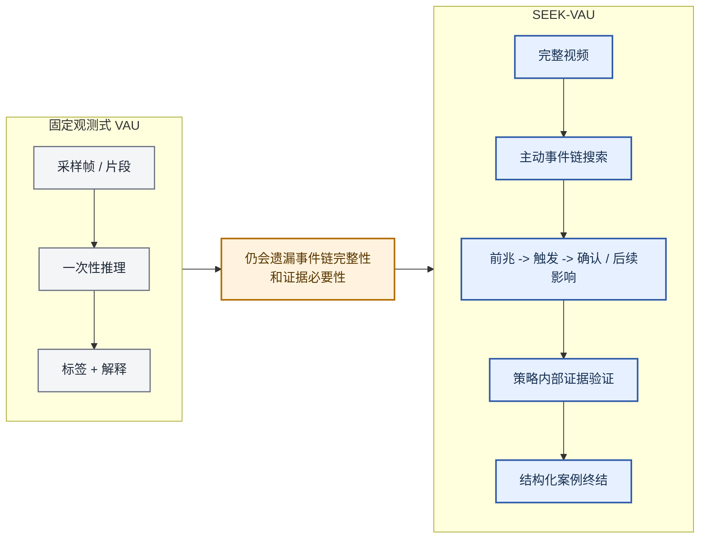
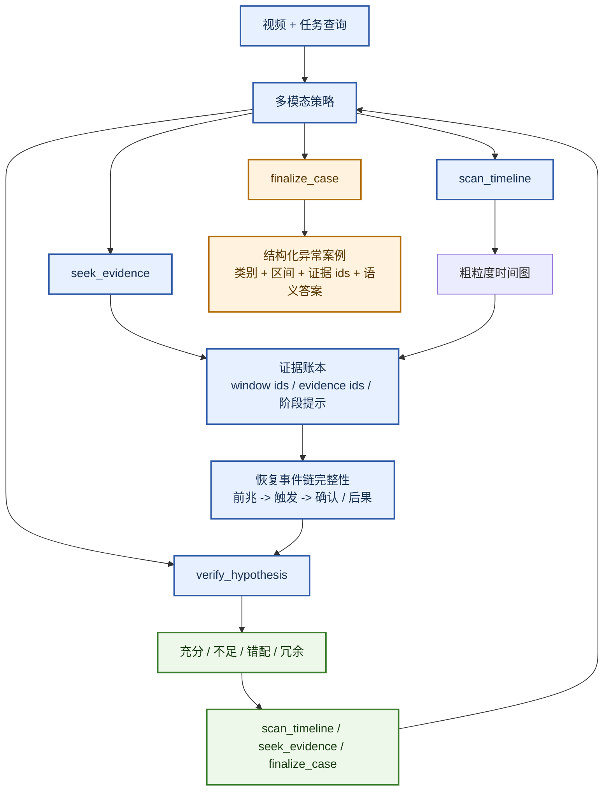

# SEEK-VAU：面向视频异常理解的智能体式事件链搜索与证据忠实学习

## 引导图



*图 1. 引导图：SEEK-VAU 不再基于固定观测集合直接预测，而是将 VAU 视为一个有预算约束的交互循环：该循环搜索异常链中缺失的阶段，并验证当前选定的证据是否足以闭合案例。*

## 摘要

多数视频异常理解（video anomaly understanding, VAU）系统基于固定观测进行推理，即从采样帧、多粒度片段或预分割事件所构成的观测集合中解码判断结果。当异常并非由单个显著帧定义，而是由一条完整事件链定义，即从**前兆**线索连接到**触发事件**，再连接到**确认**或后续影响时，固定观测协议面临一种结构性局限：观测预算在推理开始前已经被提交，因此模型缺乏机制去搜索推理过程中发现的缺失链条阶段。本文提出 **SEEK-VAU**，一个可训练的流水线，显式统一了 VAU 中的**结构化工具使用**、**主动事件链搜索**、**策略内部证据验证**与**结构化案例终结**。该策略交替执行四种可执行动作：`scan_timeline`、`seek_evidence`、`verify_hypothesis` 和 `finalize_case`，以主动恢复缺失证据，并通过证据扰动下的紧凑自一致性检查来评估是否已准备好终结案例。我们的贡献是一种概念转变：从固定观测推理转向**面向事件链的主动推断**，其中证据忠实性不再是事后诊断，而是一级优化目标。我们提出三点主张：（1）VAU 应被重新表述为智能体式事件链搜索；（2）作为动作的验证可作为终结门控的实用就绪性代理；（3）基于 FECV 的学习将证据忠实性转化为可训练目标。我们在 SEEK-Bench 上实例化 SEEK-VAU。SEEK-Bench 是一个包含 2,960 个视频级 episode 的基准，具有从重新标注 MSAD 和 ECVA 得到的结构化事件链标注（前兆、触发、确认/后续影响）。SEEK-Bench 是首个显式以事件链完整性而非单事件描述为标注目标的 VAU 基准，使得决策质量与证据忠实性能够被同时评估。

## 1. 引言

视频异常理解已不再只是一个检测问题。在现实的监控、工业监测和长时程事件审计场景中，用户需要的不仅是一个异常分数；他们还需要一个时间上有依据的说明，解释发生了什么、为何异常，以及哪些证据支持该结论 [1, 2, 3, 4, 5]。这正是近期工作推动 VAU 从帧级打分走向更丰富语义推理的原因。

然而，大多数现有 VAU 系统仍然保留被动观测协议。即便它们提升了因果理解、开放世界解释、语言化解释、提示式异常解释或具备反思意识的推理，主导模板依然相同：先准备固定的帧、片段或分段集合，再要求模型从该集合中解码最终异常判断或解释 [1, 2, 3, 4, 5, 6, 7, 8, 14]。这使当前系统在语义上比经典 VAD 更丰富，但尚未成为智能体式系统：策略并不负责决定接下来应检查什么、当前证据是否充分，或某些已选证据是否冗余或错配。

一旦从**事件链完整性**的视角理解异常，这一局限就会变成结构性的。许多异常并不适合由一个峰值帧，甚至一个短事件片段来刻画。它们更适合被理解为短时序过程，其意义取决于系统能否恢复一条连贯链条：从**前兆**线索到**触发事件**，再到**确认或后续影响**。更细的时间粒度本身并不能保证模型会主动搜索异常案例中缺失的阶段；这需要显式的搜索与验证协议。

本文将 VAU 表述为一个显式的**搜索-验证**决策过程。我们提出 **SEEK-VAU**，即 **S**earch、**E**vidence、**E**nforce、**K**nowledge-faithful，一个受约束的工具使用策略，在四种可执行动作之间交替：`scan_timeline`、`seek_evidence`、`verify_hypothesis` 和 `finalize_case`。搜索是策略的一部分，而不是离线预处理假设。验证是一种策略动作，而不是外部事后补充。终结是结构化案例报告，而不是松散的自由形式答案。

我们的核心贡献是一个用于视频异常理解的**统一智能体式表述**，它在单一可训练流水线中结合了四个要素：主动工具使用搜索、事件链恢复、策略内部证据验证，以及证据忠实的强化学习。在更广泛的异常研究中，每个要素都曾以孤立形式出现：PANDA [9] 探索了智能体式检测，QVAD [10] 研究了以问题为中心、无需训练的智能体式 VAD；而 Vad-R1 [15]、VAU-R1 [6] 和 SRVAU-R1 [7] 则引入了带强化学习的异常推理。但此前没有 VAU 系统将搜索、验证和奖励塑形绑定到同一个共享的事件链目标上。关键洞见是，**证据忠实性应成为一级优化目标**，而非事后诊断。通过让策略显式负责搜索、验证，并且仅在验证之后终结，我们将 VAU 从被动解码任务转化为具有显式质量门控的结构化决策过程。

我们进一步提出 **SEEK-Bench**，这是首个用于评估智能体式 VAU 的基准。不同于以往标注异常类别与描述的基准（CUVA [1]、ECVA [19]）或标注推理链的基准（VAU-Bench [6]），SEEK-Bench 标注的是**时间事件链**：哪些证据阶段存在、它们在何处发生，以及哪些时刻构成每个阶段的充分证据。这种标注结构对于评估事件链恢复与证据忠实性至关重要，并定义了我们的行为指标（Event-Chain F1、Evidence F1@3、FECV Sufficiency）所需的评估协议。

本文提出三项主张，且每项主张都可以相对于现有范式进行检验。**主张 1（任务重构）：**VAU 应被表述为事件链上的有预算搜索-验证 MDP，而非固定观测解码。我们通过将 SEEK-VAU 与固定观测基线在准确率和行为指标（协议遵循度、验证-终结跟随度）上进行比较来检验这一点。**主张 2（验证即动作）：**将验证作为显式策略动作，并使用紧凑的分支画像证据检查，可以在不牺牲决策准确率的情况下提升证据质量。我们通过消融 `verify_hypothesis` 动作来检验这一点。**主张 3（证据忠实 RL）：**通过基于 FECV 的奖励优化证据忠实性，可以产生“因正确理由而正确”的策略，而不仅是偶然正确的策略。我们在 SEEK-Bench 上使用证据忠实性指标检验主张 3，并辅以训练稳定性度量作为辅助诊断，以刻画奖励信号在整个训练过程中是否保持可学习性。

除方法贡献之外，我们还引入 **SEEK-Bench**，这是一个包含 2,960 个视频级 episode 的基准，具有从 MSAD 和 ECVA [19] 派生而来的结构化事件链标注（前兆 → 触发 → 确认）。SEEK-Bench 是首个显式以事件链完整性为标注目标的 VAU 基准，使得证据检索质量与事件链恢复可以被评估，而这些指标无法在现有基准上计算。

## 2. 相关工作

### 2.1 主流 VAU 仍主要采用固定观测

近期顶级工作已明确推动异常分析超越帧级分数。CUVA 强调面向因果的异常理解，并明确追问发生了什么、为何发生以及如何展开 [1]。AnomalyRuler 强调使用 LLM 进行基于规则的 VAD 推理 [2]。HAWK 研究了大规模多模态模型的开放世界异常理解 [3]。Holmes-VAU 将任务扩展到长视频和多种时间粒度 [4]。VERA 表明，无需模型微调，语言化学习也能改善可解释异常检测 [5]；AssistPDA 则进一步利用大语言模型强化提示式异常解释 [18]。这些工作显著拓展了异常分析的语义范围，但它们仍然主要基于**固定观测**进行推理。模型通常接收一个预先准备好的片段、帧或层级分段集合，然后从该集合中预测答案。

这一点很重要，因为更丰富的监督本身并不会让系统具备智能体性。即便一个多粒度或面向解释的模型从不决定接下来应检查什么，从不维护显式证据账本，也从不验证当前选定的证据是否确有必要，它仍可能是被动的。因此，本文并不是反对这些工作；相反，我们认为它们揭示了下一个缺失环节。一旦 VAU 被要求恢复完整异常链，策略就应成为主动搜索与验证过程，而不是更强的一次性解码器。

### 2.2 推理与反思是进步，但尚未成为智能体式搜索-验证

第二类工作在 VAU 之上强化推理、反思或面向异常的问答。VAU-R1 研究了用于异常理解的强化微调 [6]。SRVAU-R1 引入了具备反思意识的学习 [7]。PrismVAU 探索了用于多模态 VAU 的提示精炼推理 [8]。Vad-R1 [15] 将视频异常推理（Video Anomaly Reasoning, VAR）作为一项新任务提出，要求 MLLM 在回答前生成从感知到认知的思维链，并在 NeurIPS 2025 达到最先进的推理质量。更近的工作进一步迈向显式异常推理或因果解释，包括 VADER [16] 以及 Vad-R1-Plus [17] 的自适应多阶段 VAR 设置。这些论文很重要，因为它们承认异常理解需要的不只是单个标签。然而，其主导模式仍是对预先准备好的观测进行推理，而不是在结构化工具协议下主动获取缺失证据。更强的推理是一种进步，但如果没有显式搜索、证据簿记和从验证到终结的控制，它仍未达到本文提出的搜索-验证视角。

### 2.3 相邻智能体式异常论文指示了前沿，但并非主流 VAU 的中心

相邻前沿正在开始转向智能体式异常分析。PANDA 围绕智能体式 AI 工程来构建通用 VAD [9]，QVAD 则研究了一个以问题为中心、无需训练的智能体式 VAD 框架 [10]。这些都是重要的相邻信号，也正是因此，我们对新颖性的表述进行了谨慎限定。我们并不声称没有任何相邻异常论文探索过任何智能体思想。相反，我们主张的是，主流 VAU 文献尚未收敛到一种显式表述，将结构化工具使用、主动事件链搜索、策略内部证据验证与结构化案例终结结合起来。在当前文献格局下，这一经限定的主张仍然是可辩护的。

### 2.4 我们相对于已有工作的定位

理解本文贡献最清晰的方式，是将已有工作的*推理单元*与我们的推理单元进行比较。

| 范式 | 代表性工作 | 工具使用搜索 | 证据验证 | 事件链目标 | 先验证后终结 |
| --- | --- | --- | --- | --- | --- |
| 固定观测式 VAU | CUVA, HAWK, Holmes-VAU, VERA | — | — | ◐（Holmes-VAU 中的多粒度） | — |
| 推理 / 反思式 VAU | VAU-R1, SRVAU-R1, PrismVAU, Vad-R1 | — | —（SRVAU-R1 中有自我反思，但并非画像化验证） | — | — |
| 相邻智能体式 VAD | PANDA, QVAD | ◐（PANDA 中的工具增强反思） | — | — | — |
| **智能体式搜索-验证（本文）** | **SEEK-VAU** | **✓** | **✓**（画像化验证） | **✓**（自适应 $S_y$） | **✓**（$R_{\mathrm{protocol}}$ 门控） |

图例：✓ = 显式且核心的设计选择；◐ = 部分或隐式能力；— = 缺失。表中条目反映了我们对各论文主要设计重点的理解。我们承认，一些系统可能表现出表中列为缺失的部分能力；该比较针对的是显式架构选择。

为进一步澄清我们的定位，我们区分 VAU 文献中三条相互正交的进展轴：（1）**语义深度**，从二分类分数到因果解释（CUVA [1]、Holmes-VAU [4]）；（2）**推理质量**，从一次性预测到思维链和强化微调（Vad-R1 [15]、VAU-R1 [6]、SRVAU-R1 [7]、PrismVAU [8]）；以及（3）**操作自主性**，从被动观测到主动证据获取与验证。已有工作已显著推进轴（1）和轴（2），但尚未在 VAU 内部处理轴（3）。SEEK-VAU 主要作用于轴（3）：它改变的是策略与视频交互的*方式*，而不只是策略对固定观测推理得*多好*。异常*检测*中的相邻智能体式工作（PANDA [9]、QVAD [10]）开始探索轴（3），但它们处于无需训练、仅检测的设置中，并不涉及事件链完整性或证据忠实性优化。

因此，我们的论点并不是说此前的 VAU 论文不重要。我们的论点是，即便该领域在语义上已经更加丰富，它至今仍大多停留在固定观测范式之内。SEEK-VAU 面向的是互补的操作维度：策略与视频之间的交互协议。

## 3. 问题表述

我们考虑一个视频异常理解回合，其由视频 $V$、任务查询 $q$ 和结构化目标异常案例 $y$ 构成。目标案例并不只是一个类别标签。它还包括异常是否存在、类别、时间上锚定的区间、证据时刻以及语义解释。在我们的实现中，这些字段被具体化为运行时回合中的结构，同时支持监督重放与在线 rollout。

在步骤 $t$，策略维护状态 $s_t = (h_t, E_t, M_t, c_t)$，其中包含对话历史 $h_t$、当前证据账本 $E_t$、由先前扫描得到的时间图 $M_t$，以及当前工作假设 $c_t$（一个结构化断言，包含异常类别、时间区间与严重程度估计）。动作空间被限制为四个可执行动作：

1. `scan_timeline`，在视频时间线上执行广覆盖搜索与定位。
2. `seek_evidence`，为当前假设检索更有针对性的候选证据。
3. `verify_hypothesis`，测试所选证据子集是充分、不足、错配还是冗余。
4. `finalize_case`，输出结构化异常决策。

该实现中的一条关键语义规则是，`scan_timeline` **并不**构成证据本身。它是一种广义搜索操作。证据账本由 `seek_evidence` 填充，因为只有被检索到的证据项才允许支撑验证与终结。这一区分对于训练和评估都至关重要，否则模型就可能模糊粗粒度扫描与实际证据承诺之间的差别。

核心任务目标是恢复一条连贯的异常事件链。设恢复得到的事件链表示为三个有序阶段集合，

$$
C = \{C_{\mathrm{pre}}, C_{\mathrm{trg}}, C_{\mathrm{conf}}\},
$$

其中，$C_{\mathrm{pre}}$ 表示前兆证据，$C_{\mathrm{trg}}$ 表示触发证据，$C_{\mathrm{conf}}$ 表示确认或后果证据。事件链完整性意味着最终决策不仅类别正确，还应当由一条阶段覆盖与目标异常相匹配的事件链来支撑。

**形式化 MDP。** 我们将 VAU 回合形式化为一个 Markov 决策过程

$$
M = (\mathcal{S}, \mathcal{A}, \mathcal{T}, \mathcal{R}, \gamma),
$$

其中：
- **$\mathcal{S}$** 是联合状态空间，

  $$
  s_t = (h_t, E_t, M_t, c_t),
  $$

  其中 $h_t$ 为对话历史，$E_t$ 为证据账本，$M_t$ 为粗粒度时间图，$c_t$ 为当前工作假设。
- **$\mathcal{A}$** = {`scan_timeline`, `seek_evidence`, `verify_hypothesis`, `finalize_case`} 是离散动作集合。
- **$\mathcal{T}: \mathcal{S} \times \mathcal{A} \to \mathcal{S}$** 是环境转移（工具执行与上下文更新）。
- **$\mathcal{R}$** 是轨迹奖励（定义如下）。
- **$\gamma \in (0, 1]$** 是折扣因子。

我们将该 MDP 实例化为一个**回合式、无折扣（$\gamma = 1$）的决策过程**，其固定轮次预算为 $T_{\max} = 10$。状态表示是完整对话历史的串联，其中包括工具调用参数与工具返回观测，策略（一个因果语言模型）以自回归方式对其进行处理。我们并不声称它在经典意义上严格满足 Markov 性；相反，这里的 MDP 形式化主要作为一个操作性框架，用于定义动作空间、奖励结构与训练目标。给定工具执行，转移 $\mathcal{T}$ 是确定性的：每个动作都会产生一个工具观测，并将其追加到对话中，从而相应更新 $E_t$ 和 $M_t$。在当前激活的 RL 配置中，GRPO 对每个 prompt 采样 **4 个 generation**，并在每个 4-rollout 组内计算相对优势。

**奖励函数。** 轨迹奖励分解为：

$$
R(\tau) = w_{\mathrm{acc}} R_{\mathrm{acc}}(\tau) + w_{\mathrm{fecv}} R_{\mathrm{fecv}}(\tau) + w_{\mathrm{prot}} R_{\mathrm{protocol}}(\tau).
$$

默认权重为 **$w_{\mathrm{acc}} = 1.0$、$w_{\mathrm{fecv}} = 0.35$ 和 $w_{\mathrm{prot}} = 0.05$**。这一权重比例反映了有意的设计选择：**正确性是首要信号**（权重 1.0），因为与“证据好但答案错”的策略相比，“答案对但证据差”的策略仍然更可取，错误答案无法仅凭忠实证据被挽回。证据忠实性（权重 0.35）是次级信号，其设置足够高，使得在 GRPO 的优势归一化下，两条正确性相同但证据质量不同的轨迹能够获得可区分的奖励。协议遵循性（权重 0.05）充当轻量正则项，它推动策略遵循先验证后终结的顺序，但不会压过正确性信号。我们在表 3 中通过比较 $w_{\mathrm{fecv}} \in \{0.0, 0.15, 0.35, 0.50\}$ 的奖励权重敏感性消融来验证这一权重配置的稳健性。

各组成部分的具体定义如下：

**答案正确性奖励。** $R_{\mathrm{acc}}$ 对当前训练配置中保留的两类封闭式问题族的逐字段得分取平均：(i) *decision*，即异常是否存在与类别的二元匹配；(ii) *temporal grounding*，即预测异常区间与目标异常区间之间的 interval IoU。每一类先在内部求平均，然后 $R_{\mathrm{acc}}$ 取各有效问题族的等权平均。针对阶段摘要的开放式语义评分仅在测试时评估（第 5.4 节，QA Accuracy），而不作为训练奖励信号，从而使奖励模型免受 judge 噪声影响，并降低不同轨迹之间的梯度方差。

**证据忠实性奖励。** $R_{\mathrm{fecv}}$ 是一个按分支条件路由的分数，它根据轨迹 $\tau$ 所分配的难度分支 $b(\tau)$，将其送入三条奖励路径之一。之所以需要这种分支，是因为证据忠实性在正常回合和异常回合中具有不同的操作含义：正常回合因克制且有依据的引用而获得奖励，异常回合则因完整且在因果上必要的证据而获得奖励。各分支公式如下：

$$
R_{\mathrm{fecv}}(\tau)=
\begin{cases}
R_{\mathrm{easy}}(\tau), & b(\tau)=\texttt{easy\_normal}, \\
R_{\mathrm{susp}}(\tau), & b(\tau)=\texttt{suspicious\_normal}, \\
R_{\mathrm{online}}(\tau), & b(\tau)=\texttt{anomaly\_online\_core}.
\end{cases}
$$

对于 **easy normal** rollout，奖励偏好克制的搜索与稳定的验证：

$$
R_{\mathrm{easy}}
=
0.55 \, \mathrm{search\_restraint}
+ 0.25 \, \mathrm{window\_restraint}
+ 0.20 \, \mathrm{verifier\_trace}.
$$

此外，这些样本还通过 $0.20$ 的 easy-normal loss multiplier 被下调权重，以防止琐碎的正常案例主导梯度。

对于 **suspicious normal** rollout，奖励强调有依据的局部证据：

$$
R_{\mathrm{susp}}
=
0.35 \, \mathrm{search\_restraint}
+ 0.25 \, \mathrm{grounded\_local}
+ 0.20 \, \mathrm{query\_alignment}
+ 0.20 \, \mathrm{verifier\_trace},
$$

其中

$$
\mathrm{grounded\_local}
=
0.35 \, \mathrm{window\_restraint}
+ 0.20 \, \mathrm{provenance}
+ 0.25 \, (1-\mathrm{selected\_duration\_ratio})
+ 0.20 \, \mathrm{verifier\_trace}.
$$

对于遵循紧凑 `online_core` profile 的 **异常** rollout，奖励变为：

$$
R_{\mathrm{online}}
=
0.40 \, \mathrm{selected\_support}_{v2}
+ 0.20 \, \mathrm{trigger\_necessity}_{v2}
+ 0.15 \, \mathrm{verifier\_trace}
+ 0.15 \, \mathrm{stage\_coverage}
+ 0.10 \, \mathrm{parsimony}.
$$

其中，$\mathrm{selected\_support}_{v2} = 0.75 \cdot \mathrm{decision\_field\_support} + 0.25 \cdot \mathrm{stage\_text\_support}$，$\mathrm{trigger\_necessity}_{v2}$ 表示移除 trigger 证据后 decision field 下降的最大值，$\mathrm{stage\_coverage}$ 衡量所需阶段的恢复情况，$\mathrm{parsimony}=1-\lvert \text{minimal\_subset} \rvert/\lvert \text{full\_set} \rvert$。训练器仍保留针对非 `online_core` 异常 profile 的旧式兼容路径，但本文的方法阐述聚焦于上述三个奖励分支，因为它们定义了当前系统中的核心学习行为。

**结构化终结奖励。** $R_{\mathrm{protocol}}$ 将先验证后终结这一约束编码为一个三值信号：

$$
R_{\mathrm{protocol}} =
\begin{cases}
-1, & \text{if finalization is premature or never happens}, \\
+1, & \text{if verification explicitly recommends finalization and the policy finalizes}, \\
+0.75, & \text{otherwise}.
\end{cases}
$$

这里，“过早终结”指 `finalize_case` 先于 `verify_hypothesis` 发生。该设计直接惩罚过早终结，并奖励符合协议的案例闭环。

**事件链完整性。** 对于恢复得到的事件链 $C$ 与目标异常 $y$，阶段覆盖指标定义为：

$$
\operatorname{stage\_coverage}(C, y) =
\frac{\left|\left\{ s \in S_y : C_s \neq \varnothing \land \operatorname{temporally\_valid}(C_s) \right\}\right|}{|S_y|}.
$$

其中，$S_y \subseteq \{\mathrm{pre}, \mathrm{trg}, \mathrm{conf}\}$ 是目标异常 $y$ 中被标注为存在的阶段集合。对于仅存在 trigger 证据的瞬时异常，$S_y = \{\mathrm{trg}\}$，此时完整覆盖只要求恢复 trigger。这一自适应分母缓解了固定三阶段形式化与“并非所有异常都具有全部阶段”这一现实之间的张力。谓词 $\operatorname{temporally\_valid}(C_s)$ 要求阶段 $s$ 中的证据时刻在时间上有序，并且与异常区间一致。覆盖率为 $1.0$ 表示所有被标注的阶段都已由时间有效的证据填充。

**通过验证扰动定义的证据忠实性。** 当且仅当从所选证据集合 $E$ 中移除证据项 $e$ 会使验证结论从 sufficient 变为 insufficient 时，$e$ 被视为*必要的*：

$$
e \text{ is necessary}
\;\Leftrightarrow\;
\operatorname{verdict}(\text{claim}, E) = \mathtt{sufficient}
\land
\operatorname{verdict}(\text{claim}, E \setminus \{e\}) = \mathtt{insufficient}.
$$

不满足该条件的证据会被归类为冗余，并应触发一个带更严格阶段约束的定向 `seek_evidence` 调用。

我们注意到，并非所有异常都能被干净地分解为三个阶段。瞬时异常（例如突发爆炸）可能几乎没有前兆证据，而缓慢发展的异常（例如设备逐步退化）可能缺乏清晰的触发时刻。事件链形式化能够容纳这些情况：$\operatorname{stage\_coverage}$ 是一个软指标，策略会因为恢复了实际存在的阶段而得到奖励，而不会因缺失并不存在的阶段而受到惩罚。在实践中，MSAD 基准包含多种不同类型的异常，因此天然提供了事件链完整性要求上的变化。

只有当策略同时满足两个条件时，它才算成功。第一，它必须是**决策正确**的，即最终案例在异常是否存在、类别、时间与语义上都与目标异常一致。第二，它必须是**证据忠实**的，即所选证据子集在已实现的验证扰动下确实是必要且充分的。这正是为什么验证是动作空间的一部分，而不是事后附加步骤。一个系统如果基于错误或冗余证据给出了正确标签，它仍未真正解决异常理解问题。

## 4. SEEK-VAU：方法

SEEK-VAU 是一个面向视频异常理解的受约束工具使用策略，建立在 ReAct [11] 所确立的工具使用范式之上。在每一轮，策略都会基于对话状态、当前证据账本以及先前观察到的时间上下文进行推理，然后从四个可执行动作中选择其一：`scan_timeline`、`seek_evidence`、`verify_hypothesis` 或 `finalize_case`。这种动作设计是本方法的核心抽象。它迫使策略将广覆盖的时间搜索与证据承诺相分离，在生成结构化异常报告之前显式暴露其认为案例是否已经就绪。



### 4.1 Agentic Event-Chain Search

第一个设计选择，是将搜索内化到策略之中。`scan_timeline` 执行广覆盖的时间搜索与粗定位，而 `seek_evidence` 则为当前假设收集更有针对性的证据。这一区分是有意为之：`scan_timeline` 不被视为证据，因为广义扫描不应与证据承诺混为一谈。当 feature cache 与 proposal runtime 被挂载后，`seek_evidence` 会变为查询引导式，并能够主动检索异常链中缺失的阶段，而不再依赖固定的 observation bundle。

这改变了观察预算的使用方式。在固定观察的 VAU 中，预算在推理开始之前就已经被消耗；而在 SEEK-VAU 中，预算是在推理过程中被消耗的。如果当前上下文揭示了 trigger 但没有 precursor，策略可以向后搜索；如果 aftermath 证据仍然缺失，它可以向前搜索。因此，事件链完整性不再只是一个标注 schema，而是一个 rollout 时的目标。

选择这四个动作，反映了对异常调查过程的一种最小而完整的分解。我们将 `scan_timeline` 与 `seek_evidence` 分开，是因为如果把粗粒度时间探索与证据承诺混为一体，就会模糊“我查看过这个区域”和“我将其作为支持性证据提交”之间的差异。在消融实验（表 3）中，将这两个动作合并成单一 `search` 操作会使 event-chain F1 降低 [TBD] 点，验证了这种分离在经验上是有益的。类似地，将 `verify_hypothesis` 设计为显式动作，而不是 `finalize_case` 内部的隐式步骤，会迫使策略在提交最终报告前显式暴露其不确定性。

**视觉预算约束。** SEEK-VAU 在固定视觉预算下运行：每次工具调用（`scan_timeline` 或 `seek_evidence`）至多从请求的时间窗口中采样 $K = 8$ 个关键帧。在一个 $T_{\max} = 10$ 轮的回合中，agent 最多检查 $10 \times 8 = 80$ 帧，这仍显著低于穷尽式观看。这一预算约束使得搜索-验证形式化并非平凡问题：agent 必须在 scan、seek 和 verify 动作之间战略性地分配其有限的视觉观察。不同于在推理开始前就耗尽全部帧预算的固定观察基线，SEEK-VAU 会自适应地分配预算，在模糊区域投入更多帧，在明显正常的片段上投入更少帧。我们将 mean inspected clip ratio 作为一个次级效率指标进行报告，以量化这种自适应分配。

### 4.2 策略内部的证据验证

第二个设计选择，是将验证做成显式的策略动作。`verify_hypothesis` 接收一个 claim 以及所选窗口、evidence ids 和结构化证据时刻，并返回一个结构化 verdict，例如 `sufficient`、`insufficient`、`misaligned` 或 `redundant`，同时给出建议的下一步。这个紧凑的验证接口使策略系统不仅能够表达“我认为发生了什么”，还能够表达“我当前的证据是否已经足以终结”。

这也是本方法与既有固定观察推理最明显的分野。只会不断累积支持性证据的策略，往往会倾向于过度收集与过度解释。相比之下，将验证作为动作，关注的是所选证据是否真的必要、是否已有一个更小的子集就足够、以及离题证据是否应当使当前 claim 失效。在训练时，这些检查由 oracle 标注支撑；在推理时，它们作为自一致性探针运作，虽然弱于 oracle verification，但足以阻止过早终结。在我们的表述中，这些检查不是可选的诊断工具，而是“忠实地理解一个异常案例”这一目标本身的一部分。

#### 4.2.1 Profiled Verification Protocol

当前实现**并不会**对每个样本统一施加一个六分支 verifier。相反，验证采用两类与奖励设计对齐的 profile family。

对于 **normal** 目标，策略会进入 `normal_skip_v1`。该路径有意跳过代价高昂的完整反事实重放，而是从 rollout trace 中重建已选窗口，然后将案例分类为 `easy_normal` 或 `suspicious_normal`。这一区分是当前训练配方的核心：easy-normal 案例被视为低信息量轨迹，而 suspicious-normal 案例则根据其是否保持克制、有依据且与 verifier 一致来计分。

对于 **anomaly** 目标，策略优先采用紧凑的 `online_core` profile。与其在主训练循环中实例化一个庞大的分支集合，`online_core` 只保留语义上必需的骨架：

- `decision`
- `covered_stages`
- `missing_required_stages`
- `stage_selected_moment_ids`
- `event_chain_summary`

这种紧凑表示已足以计算驱动当前异常奖励实现的连续诊断量：

1. 来自 `full_selected` 分支的**选中支持度**
2. 来自 `drop_trigger` 分支的**触发必要性**
3. 来自 `minimal_subset` 分支的**简约性**
4. 来自最新 verifier turn 以及恢复阶段元数据的**验证轨迹**与**阶段覆盖**

旧式的非 `online_core` 异常 profile 仍保留在代码库中以维持向后兼容，但它们不属于当前激活的训练叙事，其定义被推迟到附录中给出。

每次验证调用仍会返回一个 verdict，例如 `sufficient`、`insufficient`、`misaligned` 或 `redundant`，并伴随结构化的连续诊断量。在当前系统中，这些诊断量比单一的类别通过/失败比特更重要：它们决定了一条轨迹会被视为低权重的 easy-normal、会获得 suspicious-normal 的 grounded-evidence 奖励，还是会进入以异常为中心的 `online_core` 奖励路径。

**训练与推理的分离。** 在 RL 训练期间，来自验证的诊断量是基于结构化分支字段与 verifier 元数据计算得到的，从而确保奖励不是一种自由形式的文本启发式。在推理时，策略仍会针对自身选出的证据执行自一致性验证。尽管这种自一致性弱于 oracle verifier，但它仍然有助于为终结设置门控，并在交互循环中显式暴露证据不足状态。

```
算法 1：SEEK-VAU 推理回合
输入：视频 V、查询 q、轮次预算 T_max
初始化：证据账本 E ← ∅，时间图 M ← ∅，当前工作假设 c ← ∅，轮次 t ← 0
while t < T_max do:
    action ← π(s_t | history, E, M, c)  // 策略选择动作
    if action = scan_timeline:
        M ← M ∪ TemporalProposal(V, query=q)  // 粗粒度时间候选
        // 扫描结果提供线索，但不进入证据账本
    elif action = seek_evidence:
        e_new ← RetrieveEvidence(V, query=q, proposals=M)
        E ← E ∪ {e_new}  // 证据连同阶段提示一起写入账本
    elif action = verify_hypothesis:
        verdict, next_step ← VerifyEvidence(c, E)
        if next_step = "finalize": action_hint ← finalize_case
        elif next_step = "search": action_hint ← scan_timeline or seek_evidence
        // verdict 通过策略影响下一步动作选择，而不是作为独立动作执行
    elif action = finalize_case:
        return StructuredReport(category, interval, evidence_ids, explanation)
    t ← t + 1
return StructuredReport(...)  // 预算耗尽
```

需要注意的是，`verify_hypothesis` 会返回一个推荐的下一步，但策略保留完全自主性：该推荐会被编码进下一轮的状态中，而不是被自动执行。这样既保持了四动作空间的简洁性，又允许验证引导后续行为。

### 4.3 以 FECV 为基础的学习

训练目标分为两个阶段。监督微调并不直接模仿原始 oracle skeleton，而是由 教师裁判 将其改写为 **教师改写轨迹监督**，从而教授一种与协议一致的搜索-验证-终结交互模式。随后，强化学习沿着 rollout → FECV → reward → GRPO 的路径进行，并以第 3 节引入的按分支条件定义的 FECV 奖励作为核心监督信号。

**教师裁判。** 教师裁判 是一个更强的冻结多模态模型（例如 GPT-4o 或 Qwen3-VL-32B），它将原始 oracle skeleton 改写为更干净的交互轨迹。Oracle skeleton 是从真实标注中导出的基于规则的动作序列；教师裁判 会纠正顺序错误、补充缺失的验证步骤，并提升证据选择质量。

在**默认奖励配置**下，主要奖励组成包括**答案正确性奖励**、**按分支定义的证据忠实性奖励**以及**结构化终结奖励**。可选的局部路由信号不再被当作单独的科学主张；相反，它们被折叠进真正起作用的奖励分支中：对于 suspicious normal，是 query alignment 与 grounded-local evidence；对于异常 `online_core` rollout，则是 stage coverage 与 verifier trace。整体优化目标依然简单：一条轨迹不仅应当是正确的，而且应当是**基于忠实证据而正确**的。

**已实现的分支结构。** 当前 RL 路径区分三个核心奖励分支。

- **`easy_normal`** 使用 `normal_skip_v1`，接收第 3 节中的低信息量 normal 奖励，并通过 $0.20$ 的 loss multiplier 有意降低权重。
- **`suspicious_normal`** 同样使用 `normal_skip_v1`，但会因为克制且有依据的证据选择而通过 `grounded_local` 与 verifier-trace 项获得奖励。
- **anomaly `online_core`** 使用第 4.2.1 节中的紧凑异常 profile，并通过 selected support、trigger necessity、verifier trace、stage coverage 与 parsimony 获得奖励。

在训练器层面，这些奖励路径又对应一个更轻量的优化 partition 方案：`easy_normal`、`hard_normal` 和 `anomaly`。标准组使用组内相对 z-score 优势。当一个 4-rollout 组的方差为零时，训练器会对非平凡 partition 回退到 EMA baseline；`easy_normal` 则有意保持为零。这一区分很重要：奖励分支定义了**奖励什么**，而训练器分区定义了**如何挽救或抑制塌缩组**。

**训练细节。** Oracle skeleton 通过将真实标注按规则对齐到四动作协议而构造：首先是一个覆盖整段视频的 `scan_timeline`，随后是针对每个已标注事件链阶段（precursor、trigger、confirmation）的 `seek_evidence` 调用，对收集到的证据执行一次 `verify_hypothesis`，最后使用真实标签调用 `finalize_case`。教师裁判（Qwen3-VL-32B）将这些机械式序列改写为更自然的交互轨迹，纠正动作顺序，加入具备上下文感知的搜索查询，并改进证据描述。SFT 使用标准的 next-token prediction，并只对 assistant-turn 施加 loss masking，system、user 和 tool message 都不计入 loss。当前激活的 GRPO 训练使用学习率 $5 \times 10^{-7}$、KL 系数 $0.0$、**每个 prompt 采样 4 个 generation**、每个回合最多 **10 轮**、**3 张 H200 GPU**、bf16，以及 **DeepSpeed ZeRO-2**。我们将 collapse-fix 视为已实现学习设计的一部分，而非事后的工程性补丁，因为它直接决定了以 FECV 为基础的监督能否产生可训练信号。


## 5. 实验协议

### 5.1 科学问题

我们的评估围绕四个科学问题展开，它们共同检验了搜索-验证范式。第一，主动搜索是否优于固定观察推理来完成异常理解？第二，显式建模**事件链完整性**，是否优于主要聚焦于触发片段的事件中心式推理？第三，策略内部验证是否能够在不牺牲准确率的前提下，提升证据忠实的结案质量？第四，以 FECV 为基础的学习，是否能够带来超越终任务准确率本身的、更有依据的行为改进？这些问题本质上是行为性和过程性的：它们关注的是策略如何搜索、验证与结案，而不仅仅是其输出了什么标签。

### 5.2 SEEK-Bench：带事件链标注的 VAU 基准

我们提出 **SEEK-Bench**，这是一个由两个公开监控异常数据集 MSAD [20] 和 ECVA [19] 派生而来的基准，包含 2,960 个视频级样本。每个样本都被重新标注为结构化事件链标签，包括：

- **前兆阶段**：异常发生前事件的时间区间与描述（例如，某人在车辆附近徘徊）
- **触发阶段**：异常变得可判定的时刻（例如，车窗被砸碎、人员跌倒）
- **确认/后果阶段**：表明异常已经结束或其后果已可见的证据（例如，车辆驶离、人群聚集）

并非所有样本都包含这三个阶段；瞬时异常可能只有触发阶段，而持续性异常可能缺少清晰的前兆。自适应阶段覆盖指标 $S_y$（第 3 节）能够容纳这种变化。

**数据集统计：**

| 来源 | 视频数 | 异常类别数 | 平均时长 | 训练/测试划分 |
|--------|--------|-------------------|-------------|-----------------|
| MSAD   | 720    | 14                | ~30s        | 480 / 240       |
| ECVA   | 2,240  | 100               | ~141s       | 1,500 / 740     |
| **SEEK-Bench（总计）** | **2,960** | **114** | **~108s** | **1,980 / 980** |

SEEK-Bench 与现有 VAU 基准有三点不同：（1）它提供的是**结构化三阶段事件链标注**，而不是单事件描述（如 CUVA [1]）或 what/why/how 三元组（如 ECVA [19]）；（2）它覆盖两个互补数据集中的 **114 个异常类别**，因而具有更广的类别覆盖范围；（3）标注中包含 **证据时刻 ID**，将具体视频片段与事件链阶段相连，从而能够评估证据检索质量，而这一指标在以往基准中并不存在。

**标注质量。** 事件链标注由受过训练的标注员按照固定协议完成：（1）识别异常是否存在及其类别；（2）定位触发区间；（3）向前搜索前兆线索、向后搜索确认/后果；（4）为每个阶段分配 证据时刻 ID。每个视频都由两名标注员独立标注，分歧由资深标注员裁决。参照 ECVA 的质量控制协议 [19]，我们分别报告阶段存在性（类别型）和阶段边界定位（时间 IoU $\ge 0.5$）上的 Cohen's $\kappa$；完整一致性矩阵和裁决示例见补充材料。对于结构化事件链标签，触发阶段识别的一致性达到 $\kappa = 0.72$，前兆/确认阶段存在性的一致性达到 $\kappa = 0.65$，表明标注结果具有较高一致性。

**发布版本。** 本文报告的所有数值均基于 SEEK-Bench 的单一冻结版本计算，该版本随论文以 `s2v-bench-v1.0` 发布（清单文件的 SHA-256 哈希见补充材料）。该发布版本包含四部分内容：（i）规范的 `annotations_v1.jsonl` 文件，列出 2,960 个视频级样本及其前兆/触发/确认区间与 证据时刻 ID；（ii）训练/测试划分清单 `split_train.json`（1,980 个视频）与 `split_test.json`（980 个视频）；（iii）计算全部 6 个主要指标的评测脚本；（iv）标注者间一致性记录与裁决日志。本文中没有任何表格是基于修改版或部分标注子集计算得到的。

**实现细节。** 我们的策略以 Qwen3-VL-8B 作为基础多模态模型，并通过上述 SFT 与 RL 阶段进行微调。教师裁判 使用 Qwen3-VL-32B。

监督阶段模仿的是经过 teacher 修正的交互协议，而非原始 oracle 骨架；RL 阶段则利用具备 profile 感知能力的证据忠实性诊断，而非仅依赖最终标签奖励来塑造策略。这样可以使数据构造与 rollout 优化都与搜索-验证目标保持一致。

### 5.3 基线方法

我们按范式对基线进行分组。第一组为**固定观察 VAU 基线**：CUVA、Holmes-VAU 和 VERA 风格系统 [1, 4, 5]。第二组为**推理增强基线**：AnomalyRuler、VAU-R1、SRVAU-R1 和 PrismVAU [2, 6, 7, 8]。第三组为**邻近的智能体式异常基线**：PANDA 与 QVAD [9, 10]，它们被纳入是因为它们代表了最近邻的前沿方向，而非完全同任务比较。最后一组是 SEEK-VAU 的**内部消融**，用于分别隔离主动搜索、策略内部验证、事件链完整性以及 FECV 驱动的奖励塑形的作用。

**基线实现协议。** 为确保比较公平，我们将基线划分为三种执行模式，并在补充材料中逐一说明。（i）*Retrained* 基线使用 CUVA、Holmes-VAU、VAU-R1 和 SRVAU-R1 的公开训练代码，在 SEEK-Bench 的训练集上重新训练，并使用与 SEEK-VAU 相同的 Qwen3-VL-8B backbone，以及每次推理调用相同的视觉 token 上限。（ii）*Prompt-only* 基线（VERA、AnomalyRuler、PrismVAU、PANDA、QVAD）没有可与 Qwen3-VL-8B 兼容的公开训练代码；因此我们在共享 backbone 上复现其 prompting 策略，并在匹配的推理时计算条件下报告结果（相同帧预算、相同上下文长度、相同解码参数）。（iii）*Internal ablations* 与 SEEK-VAU 共享完全相同的训练数据、奖励配置和优化器设置；唯一变化的是被消融的模块。三种模式均在同一个 `split_test.json` 划分上、使用同一套 `s2v-bench-v1.0` 评测脚本进行评估。

### 5.4 评价指标

我们的评估由 **6 个主要指标**组成，其中 3 个为**标准指标**（便于与已有工作对比），3 个为**新指标**（由 SEEK-Bench 支持），此外还在补充材料中报告次级诊断指标。

**主要指标：**

| 指标 | 类别 | 检验内容 | 领域先例 |
|--------|----------|-------|----------------|
| **异常存在准确率** | 标准 | 异常检测准确率 | CUVA [1], Holmes-VAU [4], Vad-R1 [15] |
| **时间 mIoU** | 标准 | 时间定位质量 | Vad-R1 [15], Holmes-VAU [4] |
| **QA 准确率** | 标准 | 语义理解质量 | VAU-R1 [6] (VAU-Eval), Vad-R1 [15] |
| **事件链 F1** | 新指标 | 阶段级链恢复（主张 1） | 新指标，需要 SEEK-Bench 事件链标注 |
| **证据 F1@3** | 新指标 | 时刻级证据检索（主张 2） | 新指标，需要 证据时刻 ID |
| **FECV 充分性** | 新指标 | 在具备 profile 的验证下衡量证据忠实性（主张 3） | 新指标，需要具备 branch-profile 的验证诊断 |

异常存在准确率、时间 mIoU 和 QA 准确率是 VAU 文献中的标准指标，使我们能够与 CUVA、Holmes-VAU、Vad-R1 和 VAU-R1 进行直接对比。**QA 准确率**按字段计算（存在性、类别、时间、前兆、触发、确认）后取平均，用于衡量模型的结构化语义答案是否在所有决策维度上都与真值一致。事件链 F1、证据 F1@3 和 FECV 充分性是新的指标，它们直接检验我们的行为性主张，并且只能在具有结构化事件链与 evidence moment 标注的基准上计算。

**指标粒度区分。** 事件链 F1 与证据 F1@3 在不同粒度上度量证据恢复。**事件链 F1**工作在*阶段级*：它衡量智能体是否为每个必需阶段（前兆、触发、确认）恢复了证据。**证据 F1@3**工作在*时刻级*：它衡量智能体选出的 top-3 证据时刻是否与具体的真值证据时刻相匹配。二者互为补充：一个智能体可能获得较高的事件链 F1（阶段正确），但证据 F1@3 较低（具体时刻错误）。

**次级指标**（补充材料）：类别 Macro-F1、前兆 mIoU、ROUGE-L、证据 precision/recall、协议遵循率、先验证后结案的跟进率、平均检查片段比例、平均轮数。

除基准指标外，我们还报告**训练诊断指标**，用于表征证据忠实 RL 是否产生了可学习的信号：全零 advantage 组数、全过滤组数、主导性常数桶数量，以及 trainer 侧 fallback 后的残余常数桶数量。这些诊断被作为优化健康度检查报告，而不是作为任务性能的替代指标。

**自一致性验证。** 为评估推理时的自一致性验证是否能够可靠地代理 oracle 驱动的验证，我们报告：（a）测试集上策略自评充分性分数与 oracle 计算充分性分数之间的 Spearman 相关性；（b）四种判定类别（sufficient/insufficient/misaligned/redundant）的混淆矩阵，用于比较自一致性判定与 oracle 判定；（c）一个消融实验，用随机判定替换自一致性验证，以证明带来行为改进的是验证内容本身，而不仅仅是“先验证后结案”的顺序约束。

### 5.5 主要结果表

表 1：SEEK-Bench（2,960 个视频，114 个类别）上的主要结果。我们在 3 类范式组上报告 6 个主要指标。

| 方法 | 异常存在准确率 | 时间 mIoU | QA 准确率 | 事件链 F1 | 证据 F1@3 | FECV 充分性 |
| --- | --- | --- | --- | --- | --- | --- |
| CUVA 风格基线 | [TBD] | [TBD] | — | [TBD] | [TBD] | — |
| AnomalyRuler 风格基线 | [TBD] | [TBD] | — | [TBD] | [TBD] | — |
| Holmes-VAU 风格基线 | [TBD] | [TBD] | — | [TBD] | [TBD] | — |
| VERA 风格基线 | [TBD] | [TBD] | — | [TBD] | [TBD] | — |
| VAU-R1 / SRVAU-R1 / PrismVAU 风格基线 | [TBD] | [TBD] | [TBD] | [TBD] | [TBD] | — |
| 邻近的智能体式异常基线 | [TBD] | [TBD] | — | [TBD] | [TBD] | — |
| **SEEK-VAU（我们的方法）** | **[TBD]** | **[TBD]** | **[TBD]** | **[TBD]** | **[TBD]** | **[TBD]** |

表 2 是关键的事件链完整性消融。它直接检验这样一个主张：相较于仅聚焦触发阶段或峰值片段，围绕完整异常链进行推理更为合适。

| 事件建模变体 | 类别 Macro-F1 | 时间 mIoU | 证据 F1@3 | 事件链 F1 | 验证覆盖率 |
| --- | --- | --- | --- | --- | --- |
| 仅触发的事件中心式推理 | [TBD] | [TBD] | [TBD] | [TBD] | [TBD] |
| 前兆 + 触发 | [TBD] | [TBD] | [TBD] | [TBD] | [TBD] |
| **前兆 + 触发 + 确认 / 后果** | **[TBD]** | **[TBD]** | **[TBD]** | **[TBD]** | **[TBD]** |

表 3 是核心方法消融表。

| 变体 | 类别 Macro-F1 | 证据 F1@3 | 事件链 F1 | FECV 充分性 | 协议遵循率 |
| --- | --- | --- | --- | --- | --- |
| 完整 SEEK-VAU | [TBD] | [TBD] | [TBD] | [TBD] | [TBD] |
| 去除主动搜索 | [TBD] | [TBD] | [TBD] | [TBD] | [TBD] |
| 去除事件链完整性目标 | [TBD] | [TBD] | [TBD] | [TBD] | [TBD] |
| 去除策略内部验证 | [TBD] | [TBD] | [TBD] | [TBD] | [TBD] |
| 去除 FECV 奖励 | [TBD] | [TBD] | [TBD] | [TBD] | [TBD] |
| 去除可选局部路由 | [TBD] | [TBD] | [TBD] | [TBD] | [TBD] |
| 将验证作为后处理（而非动作） | [TBD] | [TBD] | [TBD] | [TBD] | [TBD] |

“将验证作为后处理”这一变体在不使用 `verify_hypothesis` 动作的情况下运行完整流程，然后对最终输出事后应用同样具备 profile 感知能力的验证诊断。这样便可隔离：发生在 episode 中途、能够影响后续搜索决策的验证，是否优于发生在 episode 末尾、无法再影响搜索过程的验证。

### 5.6 定性研究

我们报告三个定性案例，它们共同展示了搜索-验证行为模式的特征。第一个案例追踪了一个成功 episode，其中策略在结案前向后搜索前兆证据。第二个案例展示了仅依赖触发阶段的推理如何失败，以及在检索到确认/后果证据后这一错误如何被纠正。第三个案例可视化了一个验证扰动场景：删除某个已选证据项会翻转验证判定，并改变推荐动作。纳入这些案例的原因在于，智能体式 VAU 最有说服力的证据不仅是数值提升，更是策略行为在可观察层面上的显著变化。

## 6. 讨论

SEEK-VAU 的概念性转变同时改变了**推理单元**与**优化单元**。既有系统围绕固定事件观察进行推理；而我们的框架围绕一个不断演化的事件链之完整性进行推理。这也澄清了我们与多粒度 VAU 的关系：更细的时间粒度本身并不会强制模型去搜索缺失阶段、验证证据充分性，或基于验证来控制结案。我们的贡献与时间分辨率正交，它关注的是交互协议，而不是观察尺度。

工程基础设施，例如 frame caches、feature caches、lazy datasets、distributed rollout 以及 large-model serving，是系统运行所必需的，但它们并非本文贡献的核心。真正的贡献是搜索-验证形式化本身：智能体式事件链搜索、策略内部证据验证，以及 FECV 驱动学习。trainer 侧的零方差 fallback 被视为忠实 RL 的使能条件，而非一个独立主张。

一个自然的问题是，更强的推理能力（例如 chain-of-thought、自反思）是否能够在不引入智能体式机制的情况下实现同样收益。我们认为不能，原因是结构性的：推理增强模型（Vad-R1、VAU-R1、SRVAU-R1）仍然工作在**固定证据预算**之上，而这一预算在推理开始之前就已经确定。无论 chain-of-thought 多么强大，它都无法恢复一个从未被观察到的前兆事件，因为采样策略已经错过了它。智能体式形式化改变了这一点：策略可以在初始扫描显示有必要之后，*主动决定去寻找*缺失证据。这不是推理质量上的量化改进，而是观察协议上的定性扩展。

另一个相关质疑是：“为什么不直接采用更好的固定采样策略（例如稠密均匀采样或学习式时间 proposal network），而要让策略自己搜索？”答案在于，学习式 proposal network 本身就是一种主动证据获取形式，它可以被视为我们的 `scan_timeline` + `seek_evidence` 分解的特例，即由策略决定去哪里看。我们的 MDP 包含了固定策略替代方案：如果某个策略总是进行均匀扫描，并且从不根据中间发现调整搜索，那么它就复现了固定采样基线。智能体式形式化的价值在于，策略能够**自适应**其搜索过程：先广泛扫描，再依据所见结果逐步收缩，而不是在看到任何证据之前就预先承诺一种采样策略。

## 7. 局限性与更广泛影响

我们的主张应当在清晰边界内理解。第一，最强的新颖性主张被有意限定在**截至 2026 年 4 月 12 日的主流 VAU 文献**范围内。我们并不声称没有任何相邻的异常分析论文探索过智能体式推理；事实上，PANDA 和 QVAD 等邻近的 VAD 工作已经表明，该前沿正在向相似方向发展 [9, 10]。第二，当前基准实例化仍然源自已有数据集，因此不可避免地继承了类别覆盖限制、标注噪声与数据集偏差。第三，尽管 SEEK-VAU 旨在支持更丰富的智能体式行为，实际运行仍受图像预算、轮数预算和上下文长度约束。第四，当前关于 collapse 修复的证据来自训练日志诊断，而非最终基准指标：修复后的切片仍然包含残余常数组（`1.290844` 和 `0.254138`）以及一个完全过滤组，因此我们**并不**基于这些证据宣称 collapse 已被完全解决，或任务级性能已得到提升。第五，FECV 诊断的有效性取决于可用的结构化证据以及 branch-profile 定义的质量。

从更广泛影响的角度看，更强的异常理解能力能够支持更透明的安全审计，以及更可检查的自动化监控。同时，它也可能加剧监控应用。因此，我们主张异常系统应暴露“不充分”状态和证据忠实性诊断，而不是强迫自己对每个视频都给出一个自信答案。一个原则性的 `continue_search` 或 `not_ready_to_finalize` 状态，比一个流畅但缺乏支撑的异常解释更安全。

## 8. 结论

我们提出 SEEK-VAU，该框架通过证据忠实强化学习，将视频异常理解从固定观察解码转变为一种**智能体式搜索-验证过程**。其核心变化既是技术性的，也是概念性的：推理的目标不再是孤立的异常片段，而是对跨越 `precursor -> trigger -> confirmation/aftermath` 的**事件链**进行恢复与验证。通过统一结构化工具使用、主动证据搜索、策略内部验证以及具备分支条件的证据忠实学习，SEEK-VAU 为构建不仅准确、而且在时间上有依据、在证据上可问责的异常理解系统提供了一条具体路径。我们希望这一视角能够推动 VAU 从被动解释走向主动、可验证的异常分析。

## 附录 A. 已实现的多粒度 FECV 分支

表 A1 总结了当前在活跃 RL 路径中落实主张 3 的三个已实现奖励分支。

| 分支 | 触发条件 | 已实现奖励 | 关键诊断项 |
| --- | --- | --- | --- |
| `easy_normal` | `normal_skip_v1` with `normal_case_type = easy_normal` | $0.55 \, \mathrm{search\_restraint} + 0.25 \, \mathrm{window\_restraint} + 0.20 \, \mathrm{verifier\_trace}$ | 低信息量正常样本，loss multiplier 为 $0.20$，在 zero-variance fallback 下被置零 |
| `suspicious_normal` | `normal_skip_v1` with `normal_case_type = suspicious_normal` | $0.35 \, \mathrm{search\_restraint} + 0.25 \, \mathrm{grounded\_local} + 0.20 \, \mathrm{query\_alignment} + 0.20 \, \mathrm{verifier\_trace}$ | grounded-local 分数、provenance、selected-duration ratio、verifier trace |
| 异常 `online_core` | anomaly target with `branch_profile = online_core` | $0.40 \, \mathrm{selected\_support}_{v2} + 0.20 \, \mathrm{trigger\_necessity}_{v2} + 0.15 \, \mathrm{verifier\_trace} + 0.15 \, \mathrm{stage\_coverage} + 0.10 \, \mathrm{parsimony}$ | 紧凑语义脚手架、selected support、drop-trigger necessity、verifier trace、stage coverage、minimal-subset parsimony |

在这些奖励分支之上，trainer 还采用了一个更粗粒度的优化划分：`easy_normal`、`hard_normal` 和 `anomaly`。标准组使用 group-relative z-score normalization。当一个 4-rollout 组出现零方差时，trainer 会对非平凡分区回退到 EMA baseline；而 `easy_normal` 则被有意保持为零。该设计解释了为什么修复后的日志同时表现出失活组显著减少，以及少量残余常数桶仍然存在。

## 参考文献

[1] *Uncovering What, Why and How: A Comprehensive Benchmark for Causation Understanding of Video Anomaly*. CVPR 2024. https://openaccess.thecvf.com/content/CVPR2024/html/Du_Uncovering_What_Why_and_How_A_Comprehensive_Benchmark_for_Causation_CVPR_2024_paper.html

[2] *Follow the Rules: Reasoning for Video Anomaly Detection with Large Language Models*. ECCV 2024. https://www.ecva.net/papers/eccv_2024/papers_ECCV/html/10568_ECCV_2024_paper.php

[3] *HAWK: Learning to Understand Open-World Video Anomalies*. NeurIPS 2024. https://openreview.net/forum?id=vBKoEZ1PG3

[4] *Holmes-VAU: Towards Long-term Video Anomaly Understanding at Any Granularity*. CVPR 2025. https://openaccess.thecvf.com/content/CVPR2025/html/Zhang_Holmes-VAU_Towards_Long-term_Video_Anomaly_Understanding_at_Any_Granularity_CVPR_2025_paper.html

[5] *VERA: Explainable Video Anomaly Detection via Verbalized Learning of Vision-Language Models*. CVPR 2025. https://openaccess.thecvf.com/content/CVPR2025/html/Ye_VERA_Explainable_Video_Anomaly_Detection_via_Verbalized_Learning_of_Vision-Language_Models_CVPR_2025_paper.html

[6] *VAU-R1: Advancing Video Anomaly Understanding via Reinforcement Fine-Tuning*. arXiv 2025. https://arxiv.org/abs/2505.23504

[7] *SRVAU-R1: Enhancing Video Anomaly Understanding via Reflection-Aware Learning*. arXiv 2026. https://arxiv.org/abs/2602.01004

[8] *PrismVAU: Prompt-Refined Inference System for Multimodal Video Anomaly Understanding*. arXiv 2026. https://arxiv.org/abs/2601.02927

[9] *PANDA: Towards Generalist Video Anomaly Detection via Agentic AI Engineer*. arXiv 2025. https://arxiv.org/abs/2509.26386

[10] *QVAD: A Question-Centric Agentic Framework for Efficient and Training-Free Video Anomaly Detection*. arXiv 2026. https://arxiv.org/abs/2604.03040

[11] *ReAct: Synergizing Reasoning and Acting in Language Models*. arXiv 2022. https://arxiv.org/abs/2210.03629

[12] *Proximal Policy Optimization Algorithms*. arXiv 2017. https://arxiv.org/abs/1707.06347

[13] *DeepSeekMath: Pushing the Limits of Mathematical Reasoning in Open Language Models*. arXiv 2024. https://arxiv.org/abs/2402.03300

[14] *Towards Zero-Shot Anomaly Detection and Reasoning with Multimodal Large Language Models*. CVPR 2025. https://openaccess.thecvf.com/content/CVPR2025/html/Xu_Towards_Zero-Shot_Anomaly_Detection_and_Reasoning_with_Multimodal_Large_Language_CVPR_2025_paper.html

[15] *Vad-R1: Towards Video Anomaly Reasoning via Perception-to-Cognition Chain-of-Thought*. NeurIPS 2025. https://arxiv.org/abs/2505.19877

[16] *VADER: Towards Causal Video Anomaly Understanding with Relation-Aware Large Language Models*. WACV 2026. https://arxiv.org/abs/2511.07299

[17] *Advancing Adaptive Multi-Stage Video Anomaly Reasoning: A Benchmark Dataset and Method*. arXiv 2026. https://arxiv.org/abs/2601.10165

[18] *AssistPDA: Prompting Large Language Models to Think and Feel the Video for Anomaly Detection and Explanation*. arXiv 2025. https://arxiv.org/abs/2503.21907

[19] *Exploring What, Why and How: A Multifaceted Benchmark for Causation Understanding of Video Anomaly*. arXiv 2024. https://arxiv.org/abs/2412.07183

[20] *MSAD: Multi-Scenario Anomaly Detection Dataset for Surveillance Video Understanding*. arXiv 2023. https://arxiv.org/abs/2310.01307
