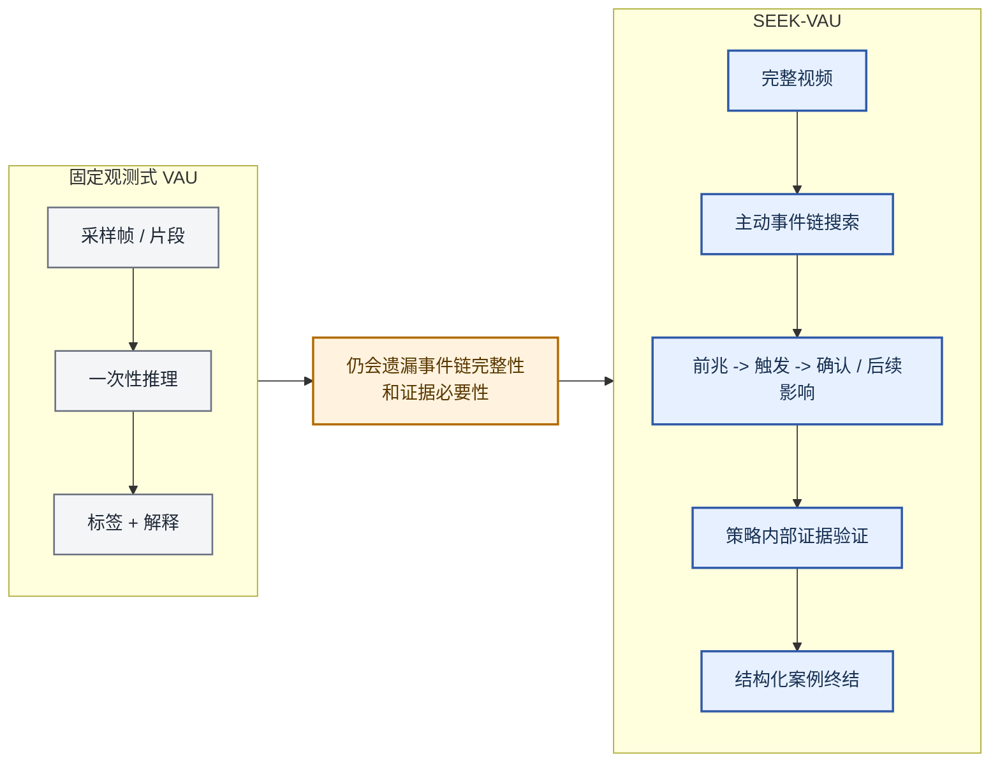

# SEEK-VAU：面向视频异常理解的智能体式事件链搜索与证据忠实学习

## 引导图

*图 1. 引导图：SEEK-VAU 不再基于固定观测集合直接预测，而是将 VAU 视为一个有预算约束的交互循环：该循环搜索异常链中缺失的阶段，并验证当前选定的证据是否足以闭合案例。*

## 摘要

多数视频异常理解（video anomaly understanding, VAU）系统基于固定观测进行推理，即从采样帧、多粒度片段或预分割事件所构成的观测集合中解码判断结果。当异常并非由单个显著帧定义，而是由一条完整事件链定义，即从**前兆**线索连接到**触发事件**，再连接到**确认**或后续影响时，固定观测协议面临一种结构性局限：观测预算在推理开始前已经被提交，因此模型缺乏机制去搜索推理过程中发现的缺失链条阶段。本文提出 **SEEK-VAU**，一个可训练的流水线，显式统一了 VAU 中的**结构化工具使用**、**主动事件链搜索**、**策略内部证据验证**与**结构化案例终结**。该策略交替执行四种可执行动作：`scan_timeline`、`seek_evidence`、`verify_hypothesis` 和 `finalize_case`，以主动恢复缺失证据，并通过证据扰动下的紧凑自一致性检查来评估是否已准备好终结案例。我们的贡献是一种概念转变：从固定观测推理转向**面向事件链的主动推断**，其中证据忠实性不再是事后诊断，而是一级优化目标。我们提出三点主张：（1）VAU 应被重新表述为智能体式事件链搜索；（2）作为动作的验证可作为终结门控的实用就绪性代理；（3）基于 FECV 的学习将证据忠实性转化为可训练目标。我们在 SEEK-Bench 上实例化 SEEK-VAU。SEEK-Bench 是一个包含 2,960 个视频级 episode 的基准，具有从重新标注 MSAD 和 ECVA 得到的结构化事件链标注（前兆、触发、确认/后续影响）。SEEK-Bench 是首个显式以事件链完整性而非单事件描述为标注目标的 VAU 基准，使得决策质量与证据忠实性能够被同时评估。

## 1. 引言

视频异常理解已不再只是一个检测问题。在现实的监控、工业监测和长时程事件审计场景中，用户需要的不仅是一个异常分数；他们还需要一个时间上有依据的说明，解释发生了什么、为何异常，以及哪些证据支持该结论 [1, 2, 3, 4, 5]。这正是近期工作推动 VAU 从帧级打分走向更丰富语义推理的原因。

然而，大多数现有 VAU 系统仍然保留被动观测协议。即便它们提升了因果理解、开放世界解释、语言化解释、提示式异常解释或具备反思意识的推理，主导模板依然相同：先准备固定的帧、片段或分段集合，再要求模型从该集合中解码最终异常判断或解释 [1, 2, 3, 4, 5, 6, 7, 8, 14]。这使当前系统在语义上比经典 VAD 更丰富，但尚未成为智能体式系统：策略并不负责决定接下来应检查什么、当前证据是否充分，或某些已选证据是否冗余或错配。

一旦从**事件链完整性**的视角理解异常，这一局限就会变成结构性的。许多异常并不适合由一个峰值帧，甚至一个短事件片段来刻画。它们更适合被理解为短时序过程，其意义取决于系统能否恢复一条连贯链条：从**前兆**线索到**触发事件**，再到**确认或后续影响**。更细的时间粒度本身并不能保证模型会主动搜索异常案例中缺失的阶段；这需要显式的搜索与验证协议。

本文将 VAU 表述为一个显式的**搜索-验证**决策过程。我们提出 **SEEK-VAU**，即 **S**earch、**E**vidence、**E**nforce、**K**nowledge-faithful，一个受约束的工具使用策略，在四种可执行动作之间交替：`scan_timeline`、`seek_evidence`、`verify_hypothesis` 和 `finalize_case`。搜索是策略的一部分，而不是离线预处理假设。验证是一种策略动作，而不是外部事后补充。终结是结构化案例报告，而不是松散的自由形式答案。

我们的核心贡献是一个用于视频异常理解的**统一智能体式表述**，它在单一可训练流水线中结合了四个要素：主动工具使用搜索、事件链恢复、策略内部证据验证，以及证据忠实的强化学习。在更广泛的异常研究中，每个要素都曾以孤立形式出现：PANDA [9] 探索了智能体式检测，QVAD [10] 研究了以问题为中心、无需训练的智能体式 VAD；而 Vad-R1 [15]、VAU-R1 [6] 和 SRVAU-R1 [7] 则引入了带强化学习的异常推理。但此前没有 VAU 系统将搜索、验证和奖励塑形绑定到同一个共享的事件链目标上。关键洞见是，**证据忠实性应成为一级优化目标**，而非事后诊断。通过让策略显式负责搜索、验证，并且仅在验证之后终结，我们将 VAU 从被动解码任务转化为具有显式质量门控的结构化决策过程。

我们进一步提出 **SEEK-Bench**，这是首个用于评估智能体式 VAU 的基准。不同于以往标注异常类别与描述的基准（CUVA [1]、ECVA [19]）或标注推理链的基准（VAU-Bench [6]），SEEK-Bench 标注的是**时间事件链**：哪些证据阶段存在、它们在何处发生，以及哪些时刻构成每个阶段的充分证据。这种标注结构对于评估事件链恢复与证据忠实性至关重要，并定义了我们的行为指标（Event-Chain F1、Evidence F1@3、FECV Sufficiency）所需的评估协议。

本文提出三项主张，且每项主张都可以相对于现有范式进行检验。**主张 1（任务重构）：**VAU 应被表述为事件链上的有预算搜索-验证 MDP，而非固定观测解码。我们通过将 SEEK-VAU 与固定观测基线在准确率和行为指标（协议遵循度、验证-终结跟随度）上进行比较来检验这一点。**主张 2（验证即动作）：**将验证作为显式策略动作，并使用紧凑的分支画像证据检查，可以在不牺牲决策准确率的情况下提升证据质量。我们通过消融 `verify_hypothesis` 动作来检验这一点。**主张 3（证据忠实 RL）：**通过基于 FECV 的奖励优化证据忠实性，可以产生“因正确理由而正确”的策略，而不仅是偶然正确的策略。我们在 SEEK-Bench 上使用证据忠实性指标检验主张 3，并辅以训练稳定性度量作为辅助诊断，以刻画奖励信号在整个训练过程中是否保持可学习性。

除方法贡献之外，我们还引入 **SEEK-Bench**，这是一个包含 2,960 个视频级 episode 的基准，具有从 MSAD 和 ECVA [19] 派生而来的结构化事件链标注（前兆 → 触发 → 确认）。SEEK-Bench 是首个显式以事件链完整性为标注目标的 VAU 基准，使得证据检索质量与事件链恢复可以被评估，而这些指标无法在现有基准上计算。

## 2. 相关工作

### 2.1 主流 VAU 仍主要采用固定观测

近期顶级工作已明确推动异常分析超越帧级分数。CUVA 强调面向因果的异常理解，并明确追问发生了什么、为何发生以及如何展开 [1]。AnomalyRuler 强调使用 LLM 进行基于规则的 VAD 推理 [2]。HAWK 研究了大规模多模态模型的开放世界异常理解 [3]。Holmes-VAU 将任务扩展到长视频和多种时间粒度 [4]。VERA 表明，无需模型微调，语言化学习也能改善可解释异常检测 [5]；AssistPDA 则进一步利用大语言模型强化提示式异常解释 [18]。这些工作显著拓展了异常分析的语义范围，但它们仍然主要基于**固定观测**进行推理。模型通常接收一个预先准备好的片段、帧或层级分段集合，然后从该集合中预测答案。

这一点很重要，因为更丰富的监督本身并不会让系统具备智能体性。即便一个多粒度或面向解释的模型从不决定接下来应检查什么，从不维护显式证据账本，也从不验证当前选定的证据是否确有必要，它仍可能是被动的。因此，本文并不是反对这些工作；相反，我们认为它们揭示了下一个缺失环节。一旦 VAU 被要求恢复完整异常链，策略就应成为主动搜索与验证过程，而不是更强的一次性解码器。

### 2.2 推理与反思是进步，但尚未成为智能体式搜索-验证

第二类工作在 VAU 之上强化推理、反思或面向异常的问答。VAU-R1 研究了用于异常理解的强化微调 [6]。SRVAU-R1 引入了具备反思意识的学习 [7]。PrismVAU 探索了用于多模态 VAU 的提示精炼推理 [8]。Vad-R1 [15] 将视频异常推理（Video Anomaly Reasoning, VAR）作为一项新任务提出，要求 MLLM 在回答前生成从感知到认知的思维链，并在 NeurIPS 2025 达到最先进的推理质量。更近的工作进一步迈向显式异常推理或因果解释，包括 VADER [16] 以及 Vad-R1-Plus [17] 的自适应多阶段 VAR 设置。这些论文很重要，因为它们承认异常理解需要的不只是单个标签。然而，其主导模式仍是对预先准备好的观测进行推理，而不是在结构化工具协议下主动获取缺失证据。更强的推理是一种进步，但如果没有显式搜索、证据簿记和从验证到终结的控制，它仍未达到本文提出的搜索-验证视角。

### 2.3 相邻智能体式异常论文指示了前沿，但并非主流 VAU 的中心

相邻前沿正在开始转向智能体式异常分析。PANDA 围绕智能体式 AI 工程来构建通用 VAD [9]，QVAD 则研究了一个以问题为中心、无需训练的智能体式 VAD 框架 [10]。这些都是重要的相邻信号，也正是因此，我们对新颖性的表述进行了谨慎限定。我们并不声称没有任何相邻异常论文探索过任何智能体思想。相反，我们主张的是，主流 VAU 文献尚未收敛到一种显式表述，将结构化工具使用、主动事件链搜索、策略内部证据验证与结构化案例终结结合起来。在当前文献格局下，这一经限定的主张仍然是可辩护的。

### 2.4 我们相对于已有工作的定位

理解本文贡献最清晰的方式，是将已有工作的*推理单元*与我们的推理单元进行比较。

| 范式 | 代表性工作 | 工具使用搜索 | 证据验证 | 事件链目标 | 先验证后终结 |
| --- | --- | --- | --- | --- | --- |
| 固定观测式 VAU | CUVA, HAWK, Holmes-VAU, VERA | — | — | ◐（Holmes-VAU 中的多粒度） | — |
| 推理 / 反思式 VAU | VAU-R1, SRVAU-R1, PrismVAU, Vad-R1 | — | —（SRVAU-R1 中有自我反思，但并非画像化验证） | — | — |
| 相邻智能体式 VAD | PANDA, QVAD | ◐（PANDA 中的工具增强反思） | — | — | — |
| **智能体式搜索-验证（本文）** | **SEEK-VAU** | **✓** | **✓**（画像化验证） | **✓**（自适应 $S_y$） | **✓**（$R_{\mathrm{protocol}}$ 门控） |

图例：✓ = 显式且核心的设计选择；◐ = 部分或隐式能力；— = 缺失。表中条目反映了我们对各论文主要设计重点的理解。我们承认，一些系统可能表现出表中列为缺失的部分能力；该比较针对的是显式架构选择。

为进一步澄清我们的定位，我们区分 VAU 文献中三条相互正交的进展轴：（1）**语义深度**，从二分类分数到因果解释（CUVA [1]、Holmes-VAU [4]）；（2）**推理质量**，从一次性预测到思维链和强化微调（Vad-R1 [15]、VAU-R1 [6]、SRVAU-R1 [7]、PrismVAU [8]）；以及（3）**操作自主性**，从被动观测到主动证据获取与验证。已有工作已显著推进轴（1）和轴（2），但尚未在 VAU 内部处理轴（3）。SEEK-VAU 主要作用于轴（3）：它改变的是策略与视频交互的*方式*，而不只是策略对固定观测推理得*多好*。异常*检测*中的相邻智能体式工作（PANDA [9]、QVAD [10]）开始探索轴（3），但它们处于无需训练、仅检测的设置中，并不涉及事件链完整性或证据忠实性优化。

因此，我们的论点并不是说此前的 VAU 论文不重要。我们的论点是，即便该领域在语义上已经更加丰富，它至今仍大多停留在固定观测范式之内。SEEK-VAU 面向的是互补的操作维度：策略与视频之间的交互协议。
